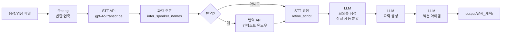
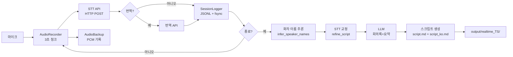
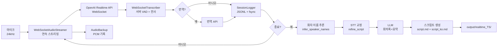

# 🎙️ Meeting Minutes Generator v2.1

음성/영상 파일에서 자동으로 **스크립트 + 기록문서 + 요약본**을 생성합니다.
실시간 마이크 녹취(`realtime_transcription.py`)와 파일 배치 처리(`meeting_minutes.py`) 모두 지원합니다.
**웹 UI**(`run_ui.bat`)로도 동일한 기능을 브라우저에서 사용할 수 있습니다.

---

## 빠른 시작 (5분)

### 1. 패키지 설치

```bash
pip install -r requirements.txt
```

ffmpeg 미설치 시: <https://www.gyan.dev/ffmpeg/builds/> 에서 다운로드 → PATH 추가

### 2. config.json 생성

```bash
copy config.example.json config.json   # Windows
cp   config.example.json config.json   # Mac/Linux
```

`config.json`을 열어 OpenAI API 키(`openai_api_key`)를 입력합니다.

### 3. 배치 처리 (파일 → 회의록)

```bash
python meeting_minutes.py meeting.mp4
```

→ `output/2025-02-20_meeting/` 폴더에 회의록·요약본 자동 저장

### 4. 실시간 녹취 (Windows)

`run_realtime.bat` 더블클릭 → 메뉴에서 모드 선택 → Enter 키로 종료

또는:

```bash
python realtime_transcription.py --language ko   # 한국어 회의
python realtime_transcription.py --translate     # 영어 → 한국어 실시간 번역
```

---

## 웹 UI (run_ui.bat)

CLI와 동일한 기능을 브라우저에서 사용할 수 있는 웹 인터페이스입니다.

### 시작

```bash
# Windows — 더블클릭
run_ui.bat

# 또는 직접 실행
python run_ui.py                    # 프로덕션 모드 (http://localhost:8501)
python run_ui.py --dev              # 개발 모드 (Vite + FastAPI)
python run_ui.py --port 9000        # 포트 변경
```

> 최초 실행 시 `fastapi`, `uvicorn`, `python-multipart` 및 프론트엔드 의존성이 자동 설치됩니다.

### 기능

| 페이지 | 기능 |
| --- | --- |
| **Dashboard** | 세션 목록, 검색/필터, 상태 배지, CLI로 생성한 세션도 자동 표시 |
| **Recorder** | 브라우저 마이크 → 실시간 STT (OpenAI Realtime WebSocket API), 라이브 트랜스크립트, 볼륨 시각화 |
| **File Upload** | 드래그앤드롭 파일 업로드 → 배치 처리 (7가지 모드 지원) |
| **Text Analysis** | 텍스트 붙여넣기 → AI 분석 |
| **Settings** | STT/GPT/Claude 모델 설정, 실시간 녹음 설정 (VAD, 노이즈), 프로파일 CRUD |
| **Session Detail** | 멀티탭 문서 뷰어 (회의록/요약/스크립트/액션아이템), 복사/다운로드, 세그먼트 타임라인 |

### CLI ↔ 웹 동기화

- CLI(`run_batch.bat`, `run_realtime.bat`)로 생성한 결과는 웹 Dashboard에 자동 표시
- 웹에서 생성한 결과도 `./output/` 폴더에 파일로 저장
- 서버 시작 시 `session_scanner.py`가 `./output/` 폴더를 스캔하여 DB에 임포트

### 실시간 녹음 아키텍처 (웹)

```text
브라우저 마이크 → ScriptProcessorNode (PCM16 24kHz)
    → WebSocket → FastAPI 서버
        → OpenAI Realtime WebSocket API (서버 VAD + 전사)
            → 실시간 트랜스크립트 → 브라우저에 표시
    종료 시 → 회의록/요약/액션아이템 자동 생성
```

WebSocket 연결 실패 시 HTTP STT 폴백 (5초 청크 단위)이 자동 활성화됩니다.

### 기술 스택

- **백엔드**: FastAPI + SQLite (기존 Python 모듈 직접 import)
- **프론트엔드**: React 19 + Vite 6 + TypeScript + Tailwind CSS 4 + Motion

---

## iOS 모바일 앱 (Capacitor)

동일한 React 웹 UI를 Capacitor로 감싸서 **iPhone/iPad 네이티브 앱**으로 빌드할 수 있습니다.
PC 백엔드(FastAPI) 없이 **완전 독립형(Serverless)** 으로 동작하며, 앱에서 직접 OpenAI API와 통신합니다.

- **실시간 녹음**: OpenAI Realtime WebSocket API 직결 (WebSocket 끊김 시 자동 재연결)
- **백그라운드 녹음**: 화면 잠금/앱 전환 시에도 오디오 세션 유지
- **대용량 파일 업로드**: 25MB 초과 파일 자동 청크 분할 STT
- **로컬 저장**: 모든 데이터는 기기 내 IndexedDB에만 저장 (완벽한 프라이버시)

> 상세 내용: [`ios_app/README.md`](ios_app/README.md) | 빌드 가이드: [`ios_app/BuildGuide.md`](ios_app/BuildGuide.md)

---

## 아키텍처

### 배치 처리 흐름 (meeting_minutes.py)



> 액션 아이템 추출은 `--type meeting` (기본값)일 때만 실행됩니다.
> STT 교정(`refine_script`)은 회의록 생성 **이전**에 실행되어 교정본이 회의록 입력으로 사용됩니다.

### 실시간 녹취 흐름 — HTTP 모드 (기본)



### 실시간 녹취 흐름 — WebSocket 모드 (`--mode ws`)



> **HTTP vs WebSocket**: HTTP 모드는 3~6초 청크 단위로 전송 (지연 ~5초). WebSocket 모드는 오디오를 연속 스트리밍하고 서버가 발화를 감지해 즉시 전사 (지연 ~1초). WebSocket은 비용이 ~3배이지만 체감 속도가 크게 빠릅니다.

---

## 주요 기능

| 기능 | 설명 |
| --- | --- |
| **다중 파일 배치** | `*.webm` 글로빙, 여러 파일 한번에 처리 |
| **3가지 문서 타입** | 회의록 / 세미나 기록 / 강의 노트 |
| **영→한 번역** | `--translate` 로 영어 음성 → 한국어 문서 |
| **GPT + Claude 폴백** | GPT-4o 실패 시 Claude 자동 전환 |
| **자동 재시도** | API 에러 시 3회 자동 재시도 |
| **이어서 처리** | `--resume` 으로 STT 건너뛰고 문서만 재생성 |
| **화자 사후 수정** | `--edit-speakers` 로 화자명 변경 → 재생성 |
| **화자 이름 자동 추론** | "Speaker A/B" → LLM이 발화 내용 분석해 실명 추론 (`infer_speaker_names`) |
| **화자 캐시** | 이전 화자 매핑 자동 저장·재사용 (`speaker_cache.py`) |
| **명명 프로필** | 자주 쓰는 옵션 조합을 이름으로 저장 (`profiles.py`) |
| **비용 사전 추정** | `--estimate-cost` 로 실행 전 API 비용 확인 |
| **알림** | Email / Slack / Teams 완료 알림 (`notifier.py`) |
| **폴더 감시** | 파일 들어오면 자동 처리 (`watcher.py`) |
| **실시간 녹취** | 마이크 → 실시간 전사 → 회의록 (`realtime_transcription.py`) |
| **WebSocket 스트리밍** | `--mode ws` 로 ~1초 지연 실시간 전사 (서버 VAD + 노이즈 리덕션 내장) |
| **회의 주제 입력** | 실행 시 주제를 입력하면 번역·회의록·요약 프롬프트에 맥락으로 반영 |
| **화자 구분 스크립트** | 실시간 녹취 종료 후 화자별로 정리된 `*_script.md` 자동 생성 (번역 시 `*_script_ko.md` 추가) |
| **실시간 화자 분리** | diarize 모델 사용 시 실시간 콘솔 출력·transcript에 화자 레이블 포함 |
| **CJK 환각 필터** | STT 결과에서 중국어·일본어 환각 텍스트 자동 감지·제거 |
| **STT 교정 (개선)** | 세션 종료 후 회의록 생성 **이전에** 맥락·주제 기반으로 오탈자·고유명사 교정 (`*_refined_script.txt`) |
| **상세 회의록 프롬프트** | 스크립트 1분 분량당 200~400자 이상 기준 적용, 맥락 제거 금지 |
| **긴 스크립트 자동 분할** | `MAX_LLM_CHARS` 초과 시 타임스탬프 기준 청크 분할 + 오버랩 처리 후 통합 |
| **날짜 자동 추출** | 파일명의 날짜 패턴(YYYYMMDD)을 회의록 헤더에 자동 기재 |
| **번역 컨텍스트 윈도우** | 앞 5개 세그먼트를 힌트로 제공해 번역 용어 일관성 향상 |
| **고정 헤더 UI** | 실시간 녹취 중 제목·경과시간·예상비용이 상단 2줄에 항상 표시 |
| **스크롤 잠금** | `s+Enter` 로 화면 고정 — 이전 대화를 위로 스크롤하여 확인 가능 |
| **요약 TXT 저장** | 요약본을 `.md`와 `.txt` 두 형식으로 저장, 이메일에 `.txt` 첨부 |
| **크래시 복구** | JSONL + os.fsync + 오디오 PCM 백업으로 세션 보호 |
| **디버그 로그** | `--debug` 시 `output/debug.log` 생성 / 실시간 런처는 `run_py.log` 항상 생성 |
| **설정 파일** | `config.json` 으로 반복 옵션 저장 |
| **SSL 우회** | 회사/학교 네트워크 지원 |
| **대용량 처리** | 170MB+ 영상도 자동 압축·분할 |
| **액션 아이템** | 회의록에서 담당자·업무·기한을 자동 추출 (JSON + 마크다운 표) |

---

## 출력 파일

회의마다 별도 서브폴더에 저장됩니다.

```text
output/
├── 2025-02-20_Q1정기회의/           # 회의별 서브폴더 (날짜_제목)
│   ├── script.md                    # 스크립트
│   ├── script_ko.md                 # 한국어 번역 스크립트 (--translate-script)
│   ├── refined_script.txt           # STT 교정 스크립트 (맥락·주제 기반 보정)
│   ├── minutes.md                   # 기록 문서 (회의록/세미나/강의)
│   ├── summary.md                   # 요약본
│   ├── actions.json                 # 액션 아이템 JSON (meeting 전용)
│   ├── actions.md                   # 액션 아이템 마크다운 표 (meeting 전용)
│   ├── segments.json                # STT 원본 (재사용/디버깅)
│   └── segments_translated.json     # 번역 세그먼트 (있을 경우)
└── debug.log                        # 디버그 로그 (--debug 시에만 생성)
```

다중 파일에 `--title` 지정 시 한 폴더에 번호 접두어로 묶입니다:

```text
output/
└── 2025-02-20_시리즈강의/
    ├── 01_part1_script.md
    ├── 01_part1_minutes.md
    ├── 01_part1_summary.md
    ├── 02_part2_script.md
    ├── 02_part2_minutes.md
    └── 02_part2_summary.md
```

---

## 설치

**Python 3.9 이상** 필요 (3.10+ 권장)

```bash
pip install -r requirements.txt
```

주요 의존성: `openai`, `anthropic`, `requests`, `sounddevice`, `numpy`, `watchdog`, `websockets`

ffmpeg 설치:

- **Windows**: <https://www.gyan.dev/ffmpeg/builds/> → PATH에 추가
- **macOS**: `brew install ffmpeg`
- **Linux**: `sudo apt install ffmpeg`

---

## 설정 (config.json)

모든 비밀값(API 키, 이메일 비밀번호 등)은 `config.json`에 저장합니다.
`config.json`은 `.gitignore`에 포함되어 git에 올라가지 않습니다.

```bash
# 예시 파일을 복사해서 편집
copy config.example.json config.json   # Windows
cp   config.example.json config.json   # Mac/Linux
```

**config.json 구조:**

```jsonc
{
  "api": {
    "openai_api_key":    "sk-proj-...",   // 필수
    "anthropic_api_key": "sk-ant-..."     // 선택 (Claude 폴백 사용 시)
  },
  "ssl": {
    "verify": false    // 회사/학교 SSL 오류 시 false
  },
  "models": {
    "stt":             "gpt-4o-transcribe",  // STT 기본 모델 (고품질)
    "llm":             "gpt",                // gpt | claude
    "gpt_model":       "gpt-4o",
    "minutes_model":   "gpt-4o",             // 회의록 생성 모델 (기본: gpt-4o)
    "summary_model":   "gpt-4o",             // 요약본 생성 모델 (기본: gpt-4o)
    "claude_model":    "claude-sonnet-4-6",  // Claude 폴백 모델 ( claude-opus-4-6 ) 
    "translate_model": "gpt-4o-mini"
  },
  "realtime": {
    "language":           "ko",           // 실시간 기본 언어 (ko / en)
    "chunk_duration":     3.0,            // 청크 길이(초) — HTTP 모드 전용
    "audio_backup":       true,           // PCM 오디오 백업 (크래시 복구용)
    "mode":               "http",         // http | ws | auto
    "ws_vad_type":        "server_vad",   // server_vad | semantic_vad
    "ws_vad_eagerness":   "medium",       // low | medium | high | auto (semantic_vad 전용)
    "ws_noise_reduction": "near_field"    // near_field | far_field | null
  },
  "email": {
    "sender":    "sender@naver.com",
    "password":  "앱 비밀번호",
    "recipient": "recipient@company.com"
  },
  "notify": {
    "slack": { "webhook_url": "https://hooks.slack.com/services/..." },
    "teams": { "webhook_url": "https://...webhook.office.com/..." }
  },
  "output_dir": "./output"
}
```

환경변수도 지원합니다 (환경변수 > config.json 순으로 우선):

```bash
# Windows PowerShell
$env:OPENAI_API_KEY    = "sk-proj-..."
$env:ANTHROPIC_API_KEY = "sk-ant-..."
$env:EMAIL_SENDER      = "sender@naver.com"
$env:EMAIL_PASSWORD    = "앱 비밀번호"
$env:EMAIL_RECIPIENT   = "recipient@company.com"

# Mac/Linux
export OPENAI_API_KEY="sk-proj-..."
```

> **Gmail 앱 비밀번호** 발급: <https://myaccount.google.com/apppasswords> (2단계 인증 먼저 활성화)
> **Naver 앱 비밀번호** 발급: 메일 설정 → POP3/SMTP 사용 → 비밀번호 발급

**.gitignore 적용 항목** (자동으로 git 추적 제외):

| 파일/폴더 | 이유 |
| --- | --- |
| `config.json` | API 키·비밀번호 포함 |
| `output/` | 생성 결과물 (대용량) |
| `*.pcm` | 오디오 백업 (최대 ~115MB/hr) |
| `__pycache__/`, `*.pyc` | Python 캐시 |

> `profiles.json` (커스텀 프로필)은 추적됩니다. 민감 정보를 넣지 마세요.

---

## 사용법 (meeting_minutes.py)

### 기본

```bash
python meeting_minutes.py meeting.mp4
```

### 제목 지정

```bash
python meeting_minutes.py meeting.mp4 --title "2025 Q1 정기회의"
```

### 문서 타입

```bash
python meeting_minutes.py seminar.webm --type seminar     # 세미나
python meeting_minutes.py lecture.mp4  --type lecture     # 강의
```

### 다중 파일

```bash
python meeting_minutes.py file1.mp4 file2.webm file3.mp3
python meeting_minutes.py *.webm --type seminar
python meeting_minutes.py *.mp4 --title "시리즈강의"       # → 시리즈강의_01_xxx, ...
```

### 영어 → 한국어

```bash
python meeting_minutes.py talk_en.mp4 --translate
python meeting_minutes.py talk_en.mp4 --translate --translate-script   # 스크립트도
```

### 프로필 적용

```bash
python meeting_minutes.py meeting.mp4 --profile meeting_ko      # 한국어 회의
python meeting_minutes.py seminar.webm --profile seminar         # 세미나 (영→한)
python meeting_minutes.py lecture.mp4  --profile lecture         # 강의 (영→한)
python profiles.py list                                          # 프로필 목록
```

### 화자 수정 (캐시 연동)

```bash
# 1차 실행 후 화자명 변경 → 자동 저장
python meeting_minutes.py meeting.mp4 --edit-speakers
# 동일 회의 재실행 시 저장된 매핑 자동 재사용
python meeting_minutes.py meeting.mp4 --reuse-speakers
```

### 메모 반영

```bash
python meeting_minutes.py meeting.mp4 --memo notes.txt
```

### LLM에 추가 지시

```bash
python meeting_minutes.py seminar.webm --type seminar --custom-prompt "NVIDIA GPU 기술 중심으로 정리"
```

### 완료 알림

```bash
python meeting_minutes.py meeting.mp4 --notify email    # 이메일
python meeting_minutes.py meeting.mp4 --notify slack    # Slack
python meeting_minutes.py meeting.mp4 --notify teams    # Teams
```

### 비용 추정 (실행 안 함)

```bash
python meeting_minutes.py big_file.mp4 --estimate-cost
```

### 이어서 처리 (STT 건너뜀)

```bash
# STT는 완료됐는데 LLM 단계에서 실패한 경우
python meeting_minutes.py meeting.mp4 --resume
```

### SSL 문제 (회사/학교)

```bash
python meeting_minutes.py meeting.mp4 --ssl-no-verify
# 또는 config.json: "ssl": { "verify": false }
```

### 디버그 (콘솔 상세 출력)

```bash
python meeting_minutes.py meeting.mp4 --debug
# --debug 시 output/debug.log 생성 (상세 로그 + 중간 파일 저장)
```

---

## 전체 옵션 (meeting_minutes.py)

| 옵션 | 설명 | 기본값 |
| --- | --- | --- |
| `input` | 파일 경로 (여러 개, glob 가능) | - |
| `--title` | 제목 (출력 폴더명·문서 제목) | 원본 파일명 |
| `--type` | meeting / seminar / lecture | meeting |
| `--profile` | 저장된 프로필 이름 적용 | - |
| `--model` | STT 모델 | gpt-4o-mini-transcribe |
| `--llm` | gpt / claude | gpt |
| `--language` | STT 언어 (ko, en) | ko |
| `--translate` | 영→한 번역 | OFF |
| `--translate-script` | 스크립트 번역본도 생성 | OFF |
| `--memo` | 메모 파일 | - |
| `--speakers` | 화자 이름 (쉼표구분) | 자동 |
| `--custom-prompt` | LLM 추가 지시 | - |
| `--resume` | 기존 STT 재사용 | OFF |
| `--edit-speakers` | 화자 수정 모드 (캐시 저장) | OFF |
| `--reuse-speakers` | 화자 캐시 자동 적용 | OFF |
| `--estimate-cost` | 비용 추정만 | OFF |
| `--notify` | email / slack / teams 완료 알림 | - |
| `--output-dir` | 출력 디렉토리 | ./output |
| `--ssl-no-verify` | SSL 우회 | OFF |
| `--debug` | 콘솔 상세 출력 | OFF |

---

## 명명 프로필 (profiles.py)

자주 쓰는 옵션 조합을 이름으로 저장해 재사용합니다.

**내장 프로필:**

| 프로필 | STT 모델 | 설명 |
| --- | --- | --- |
| `meeting_ko` | `gpt-4o-transcribe-diarize` | 한국어 회의 → 한국어 회의록 (화자 분리) |
| `meeting_en2ko` | `gpt-4o-transcribe-diarize` | 영어 회의 → 한국어 번역 회의록 (화자 분리) |
| `seminar` | `gpt-4o-transcribe-diarize` | 영어 세미나 → 한국어 세미나 기록 (화자 분리) |
| `lecture` | `gpt-4o-transcribe` | 영어 강의 → 한국어 강의 노트 |

> `meeting_ko` / `meeting_en2ko` / `seminar` 프로필은 `gpt-4o-transcribe-diarize` 모델을 사용하여 화자 분리 품질을 높입니다.

```bash
python profiles.py list                    # 전체 프로필 목록
python profiles.py show meeting_ko         # 프로필 상세
python profiles.py create my_profile      # 대화형 생성
python profiles.py delete my_profile      # 삭제
```

커스텀 프로필은 `profiles.json`에 저장됩니다.
CLI 옵션이 프로필보다 항상 우선합니다.

---

## 화자 캐시 (speaker_cache.py)

`--edit-speakers` 로 입력한 화자 이름 매핑을 자동 저장하고,
같은 회의 재실행 시 제목 기반 퍼지 매칭으로 불러옵니다.

```bash
python speaker_cache.py list               # 저장된 매핑 목록
python speaker_cache.py delete "주간회의"   # 특정 매핑 삭제
```

매핑 파일 위치: `output/speaker_map.json`

**동작 순서:**

1. `--edit-speakers` 실행 → 화자명 입력
2. 매핑이 회의 제목 키로 `speaker_map.json`에 저장
3. 같은 제목의 회의 재실행 시 `--reuse-speakers` 로 자동 적용

**화자 이름 자동 추론 (`infer_speaker_names`):**

`gpt-4o-transcribe-diarize` 모델로 전사 시 화자가 "Speaker A", "Speaker B" 등으로 표기되는 경우,
LLM이 발화 내용·맥락을 분석해 실명 또는 역할명으로 자동 변환합니다.
명확하게 추론 불가능한 화자는 "화자 A" 등 한국어 임시명을 유지합니다.

---

## 알림 설정 (notifier.py)

회의록 생성 완료 후 Email / Slack / Teams 로 자동 공유합니다.

### 이메일

`config.json`에 설정:

```json
"email": {
  "sender":    "sender@naver.com",
  "password":  "앱 비밀번호",
  "recipient": "recipient@company.com"
}
```

또는 환경변수:

```bash
EMAIL_SENDER     = sender@naver.com
EMAIL_PASSWORD   = 앱비밀번호
EMAIL_RECIPIENT  = recipient@company.com
```

### Slack / Teams

```bash
SLACK_WEBHOOK_URL = https://hooks.slack.com/services/...
TEAMS_WEBHOOK_URL = https://...webhook.office.com/...
```

또는 `config.json`:

```json
"notify": {
  "slack": { "webhook_url": "https://hooks.slack.com/..." },
  "teams": { "webhook_url": "https://...webhook.office.com/..." }
}
```

```bash
# 단독 테스트
python notifier.py
```

---

## 폴더 자동 감시 (watcher.py)

지정 폴더에 음성/영상 파일이 들어오면 자동으로 `meeting_minutes.py`를 실행합니다.

```bash
pip install watchdog        # 최초 1회

python watcher.py ./recordings                           # 기본 감시
python watcher.py ./recordings --profile seminar         # 프로필 적용
python watcher.py ./recordings --notify slack            # 완료 시 Slack 알림
python watcher.py ./recordings --no-move                 # 처리 후 파일 이동 안 함
python watcher.py ./recordings --type seminar            # 문서 타입 지정
python watcher.py ./recordings --translate               # 영→한 번역 활성화
python watcher.py ./recordings --ssl-no-verify           # SSL 우회
```

**전체 옵션:**

| 옵션 | 설명 | 기본값 |
| --- | --- | --- |
| `folder` | 감시할 폴더 경로 | - |
| `--profile` | 저장된 프로필 이름 적용 | - |
| `--notify` | email / slack / teams 완료 알림 | - |
| `--no-move` | 처리 후 파일 이동 안 함 | OFF |
| `--type` | meeting / seminar / lecture | meeting |
| `--translate` | 영→한 번역 | OFF |
| `--ssl-no-verify` | SSL 우회 | OFF |
| `--script` | meeting_minutes.py 경로 | 자동 탐색 |

**동작:**

- 새 파일 감지 → 5초 안정화 대기 (대용량 복사 완료 대기) → `meeting_minutes.py` 실행
- 처리 완료 파일은 `_processed/` 하위 폴더로 이동
- 실패 시 `파일명.error.txt` 생성
- 시작 시 기존 미처리 파일도 일괄 처리 여부 선택 가능

---

## 실시간 녹취 (realtime_transcription.py)

마이크 입력을 실시간으로 전사하고 완료 후 자동으로 회의록을 생성합니다.

### 터미널 UI 레이아웃

녹음 중 화면은 3개 영역으로 고정 배치됩니다:

```text
┌─────────────────────────────────────────────────────────────────┐  ← Row 1 [고정]
│  🤝 실시간 회의록 녹취   ⬤ 03:21  │  ~$0.032  │  gpt-4o-transcribe  │
├─────────────────────────────────────────────────────────────────┤  ← Row 2 [고정]
│                                                                 │
│  [00:04] Good morning everyone, let's get started.             │
│  [00:04] 안녕하세요, 시작하겠습니다.                              │
│  [00:18] Today we'll review Q1 results and discuss strategy.   │  ← 중간 [스크롤]
│  [00:18] 오늘은 Q1 실적을 검토하고 전략을 논의하겠습니다.           │
│  ...                                                           │
│                                                                 │
├─────────────────────────────────────────────────────────────────┤  ← Row N [고정]
│  ⠋ 녹음 중...  ▐████░░░░▌  q→종료   p→일시정지   s→스크롤잠금  │
└─────────────────────────────────────────────────────────────────┘
```

| 영역 | 내용 | 갱신 주기 |
| --- | --- | --- |
| **Row 1** | 제목 · 이모지 · 경과시간 · 예상비용 · STT 모델명 · 발화건수 | ~0.6초 |
| **Row 2** | 구분선 | 고정 |
| **Row 3~N-1** | 실시간 전사 텍스트 (스크롤 가능) | 발화 즉시 |
| **Row N** | 녹음 상태 · 오디오 레벨 바 · 명령어 안내 | ~0.12초 |

### 키보드 명령어

| 입력 | 동작 |
| --- | --- |
| `q` + Enter | 녹음 종료 → 회의록 생성 시작 |
| `p` + Enter | 녹음 일시정지 |
| `r` + Enter | 일시정지 해제 (재개) |
| `s` + Enter | **스크롤 잠금 토글** (아래 참고) |
| Ctrl+C | 강제 종료 (회의록 생성 시작) |

#### 스크롤 잠금 (`s` 명령어)

녹음 중 이전 대화를 확인하고 싶을 때 사용합니다.

1. `s` + Enter → 🔒 스크롤 잠금 활성화
   - 새 전사 텍스트가 화면에 출력되지 않고 내부 버퍼에 저장됩니다
   - 터미널 마우스 휠 또는 스크롤바로 위쪽 대화를 자유롭게 확인할 수 있습니다
   - 하단 인디케이터에 버퍼된 발화 건수가 표시됩니다
2. `s` + Enter → 🔓 스크롤 잠금 해제
   - 버퍼에 쌓인 텍스트가 한 번에 출력됩니다
   - 실시간 출력이 재개됩니다

### 클래스 구조

**공통 클래스** (`realtime_transcription.py`):

| 클래스 | 역할 |
| --- | --- |
| `AudioBackup` | 전체 세션 오디오를 PCM 파일로 연속 백업 (HTTP: 16kHz, WS: 24kHz) |
| `SessionLogger` | 세그먼트를 JSONL + os.fsync로 즉시 디스크 기록 |
| `RecordingIndicator` | 고정 헤더(2줄) + 스크롤 영역 + 하단 인디케이터 관리. 스크롤 잠금 지원 |
| `RealtimeSession` | 전체 흐름 조율 — HTTP/WS 모드 자동 분기 → 종료 시 STT 교정 → 회의록·요약본 생성 |

**HTTP 모드 전용** (`realtime_transcription.py`):

| 클래스 | 역할 |
| --- | --- |
| `AudioRecorder` | sounddevice로 마이크 캡처 → N초 단위 청크로 큐에 적재 |
| `VADAudioRecorder` | AudioRecorder + webrtcvad — 침묵 감지 즉시 전송 |
| `RealtimeTranscriber` | 청크 → STT API (HTTP POST) → 타임스탬프 출력 → 번역(선택). 스크롤 잠금 중 버퍼링 처리 |

**WebSocket 모드 전용** (`ws_transcriber.py`):

| 클래스 | 역할 |
| --- | --- |
| `WebSocketAudioStreamer` | 마이크 24kHz 캡처 → base64 → queue → sender 스레드 → WebSocket 전송 |
| `WebSocketTranscriber` | 서버 이벤트 루프 — 서버 VAD 기반 전사 delta/completed 처리 + 번역 |

### 사용법

```bash
pip install sounddevice numpy websockets    # 최초 1회

# 기본 실행 — HTTP 모드 (영어 → 영어 회의록)
python realtime_transcription.py

# 한국어 회의
python realtime_transcription.py --language ko

# 영어 → 한국어 실시간 번역 + 한국어 회의록
python realtime_transcription.py --translate

# ★ WebSocket 모드 — ~1초 지연 실시간 전사
python realtime_transcription.py --mode ws --translate

# WebSocket + 세미나 모드
python realtime_transcription.py --mode ws --type seminar --translate

# HTTP 모드 — 청크 5초 (API 호출 횟수 줄여 비용 절감)
python realtime_transcription.py --chunk-duration 5

# 이전 세션 이어서 (타임스탬프 자동 연속)
python realtime_transcription.py --prev-session output/session_20250220_143022.jsonl

# 이전 세션 로그로 회의록 재생성 (재녹음 없이)
python realtime_transcription.py --recover output/session_20250220_143022.jsonl

# 완료 후 이메일 발송
python realtime_transcription.py --email
```

### 실행 흐름 — HTTP 모드 (기본)

1. 마이크에서 N초(기본 3초) 단위로 오디오 캡처 (16kHz)
2. 동시에 세션 오디오 전체를 `session_TS_audio.pcm`으로 백업 (크래시 대비)
3. 각 청크를 STT API로 HTTP POST 전송 → 전사 텍스트 수신 (3회 재시도)
4. 스크롤 잠금 해제 상태면 즉시 출력, 잠금 상태면 버퍼에 저장
5. `--translate` 시: 즉시 한국어로 번역하여 아래 줄에 출력
6. 세그먼트마다 JSONL + os.fsync로 즉시 디스크 기록
7. q+Enter 또는 Ctrl+C → 녹음 종료
8. PCM 파일을 WAV로 변환 후 삭제
9. **CJK 환각 필터** — 중국어·일본어 텍스트가 포함된 세그먼트 자동 제거
10. **화자 이름 추론** — diarize 모델 사용 시 `infer_speaker_names()` 로 "Speaker A/B" → 실명/역할명 변환
11. **`refine_script()`** 로 전체 맥락·주제 기반 교정 스크립트 생성 (교정본이 회의록 입력으로 사용됨)
12. `generate_minutes()` / `generate_summary()` 로 회의록 + 요약 생성 (요약은 `.md` + `.txt` 이중 저장)
13. `build_script_md()` 로 화자 구분 정리 스크립트 생성 (`*_script.md`, 번역 시 `*_script_ko.md` 추가)

### 실행 흐름 — WebSocket 모드 (`--mode ws`)

1. OpenAI Realtime Transcription API에 WebSocket 연결
2. `transcription_session.update()`로 모델/언어/VAD/노이즈 리덕션 설정
3. 마이크에서 24kHz 오디오 연속 캡처 → base64 인코딩 → WebSocket으로 스트리밍
4. 동시에 `session_TS_audio.pcm`으로 백업
5. 서버 VAD가 발화를 감지하면 전사 이벤트 수신:
   - `speech_started` → 발화 시작 시간 기록
   - `transcription.delta` → 실시간 부분 텍스트를 즉시 화면에 스트리밍 출력
   - `transcription.completed` → 최종 텍스트 확정, 세그먼트 생성 (CJK 환각 자동 필터)
6. `--translate` 시: 확정된 영어 텍스트를 즉시 한국어로 번역하여 아래 줄에 출력
7. 세그먼트마다 JSONL + os.fsync로 즉시 디스크 기록
8. q+Enter 또는 Ctrl+C → 녹음 종료 → WebSocket 연결 종료
9. PCM 파일을 WAV로 변환 후 삭제
10. **화자 이름 추론** — diarize 모델 사용 시 `infer_speaker_names()` 실행
11. **`refine_script()`** 로 전체 맥락·주제 기반 교정 스크립트 생성 (교정본이 회의록 입력으로 사용됨)
12. `generate_minutes()` / `generate_summary()` 로 회의록 + 요약 생성 (요약은 `.md` + `.txt` 이중 저장)
13. `build_script_md()` 로 화자 구분 정리 스크립트 생성

> WebSocket 연결 실패 시 자동으로 HTTP 모드로 전환합니다.

### 출력 파일 (실시간)

세션마다 타임스탬프 서브폴더에 저장됩니다.

```text
output/
├── .active_session                         # 크래시 감지 마커 (bat 전용)
└── realtime_20250220_143022/               # 세션 서브폴더
    ├── session_20250220_143022.jsonl               # 세션 로그 (크래시 복구용)
    ├── realtime_20250220_143022_minutes.md         # 회의록
    ├── realtime_20250220_143022_summary.md         # 요약본 (마크다운)
    ├── realtime_20250220_143022_summary.txt        # 요약본 (텍스트 — 이메일 첨부용)
    ├── realtime_20250220_143022_script.md          # 화자 구분 정리 스크립트
    ├── realtime_20250220_143022_script_ko.md       # 번역 스크립트 (--translate 시)
    ├── realtime_20250220_143022_transcript.txt     # 화자 포함 타임스탬프 전사 원문
    ├── realtime_20250220_143022_refined_script.txt # 맥락 기반 교정 스크립트
    ├── realtime_20250220_143022_meta.json          # 세션 메타데이터 + 비용 추정
    └── session_20250220_143022_audio.wav           # 오디오 백업 (정상 종료 시)
```

> **응답 지연 (HTTP 모드)**: 청크 길이(기본 3초) + STT API 처리 시간(~2-3초) = 약 5-6초.
> `--chunk-duration 5` 로 늘리면 API 호출 횟수가 줄어들지만 응답이 느려집니다.
>
> **응답 지연 (WebSocket 모드)**: 서버 VAD가 발화 종료를 감지하면 즉시 전사 → ~1초 이내 텍스트 표시.
> delta 이벤트로 발화 중에도 부분 텍스트가 실시간 스트리밍됩니다.

### 전체 옵션

| 옵션 | 설명 | 기본값 |
| --- | --- | --- |
| `--language` | ko / en | ko |
| `--type` | meeting / seminar / lecture | meeting |
| `--topic` | 회의 주제 (번역·회의록·요약 프롬프트에 맥락으로 반영) | - |
| `--model` | STT 모델 (아래 표 참고) | gpt-4o-mini-transcribe |
| `--llm` | gpt / claude | gpt |
| `--translate` | 실시간 영→한 번역 | OFF |
| `--translate-model` | 번역 모델 (gpt-4o-mini / gpt-4o) | gpt-4o-mini |
| `--mode` | 전송 모드 (http / ws / auto) | config.json (기본: http) |
| `--chunk-duration` | 청크 길이, 초 — HTTP 모드 전용 | config.json (기본: 3.0) |
| `--vad` | VAD 동적 청크 — HTTP 모드 전용 (webrtcvad 필요) | OFF |
| `--memo` | 메모/노트 파일 (txt, md). 회의록·요약 생성 시 LLM에 반영 | - |
| `--email` | 완료 후 이메일 발송 | OFF |
| `--output-dir` | 출력 디렉토리 | ./output |
| `--recover` | JSONL로 회의록 재생성 | - |
| `--prev-session` | 이전 세션 이어붙이기 | - |
| `--ssl-no-verify` | SSL 우회 | OFF |

### 크래시 복구 (3중 보호)

| 보호 계층 | 저장 내용 | 복구 방법 |
| --- | --- | --- |
| **JSONL + fsync** | 전사 텍스트 (세그먼트 단위) | `--recover session_*.jsonl` |
| **`.active_session`** | 크래시 감지 마커 | bat 파일이 자동 감지 → 복구 메뉴 |
| **PCM 오디오 백업** | 전체 세션 원본 오디오 | ffmpeg 변환 → 재전사 가능 |

PCM 수동 변환:

```bash
# HTTP 모드 (16kHz)
ffmpeg -f s16le -ar 16000 -ac 1 -i output/session_TS_audio.pcm output/session_TS_audio.wav
# WebSocket 모드 (24kHz)
ffmpeg -f s16le -ar 24000 -ac 1 -i output/session_TS_audio.pcm output/session_TS_audio.wav
```

---

## run_batch.bat (Windows 전용)

더블클릭 또는 파일 드래그앤드롭으로 실행합니다. `run_batch.py`를 호출하는 래퍼입니다.

### 실행 방법

| 방법 | 설명 |
| --- | --- |
| 더블클릭 | 인터랙티브 메인 메뉴 → 파일 경로 직접 입력 |
| 파일 드래그앤드롭 | bat 파일 위에 미디어 파일을 끌어놓으면 자동 감지 |
| 커맨드라인 | `run_batch.bat file1.mp4 file2.webm` |

### 배치 메인 메뉴

```text
F  파일 경로 입력
     (또는 bat 위에 파일을 드래그)

D  폴더 선택  →  모든 미디어 파일 일괄 처리

W  감시 모드  →  폴더 모니터링 (자동 처리)

H  도움말
O  출력 폴더 열기
0  종료
```

### 처리 모드 선택 (파일/폴더 입력 후 표시)

```text
1  한국어 회의  →  한국어 회의록
2  영어 회의  →  한국어 회의록  (번역)  ★ 추천
3  영어 회의  →  영어 회의록
4  세미나  (영어 → 한국어 번역)
5  강의  (영어 → 한국어 번역)
6  한국어 세미나  →  한국어 기록
7  한국어 강의  →  한국어 강의 노트
0  취소
```

### 지원 파일 형식

음성: `.mp3` `.wav` `.m4a` `.ogg` `.flac` `.aac` `.wma`
영상: `.mp4` `.webm` `.mkv` `.avi` `.mov`

> 영상 파일은 오디오 트랙만 추출하여 처리합니다.

---

## run_realtime.bat (Windows 전용)

더블클릭으로 실행. 시작 시 크래시 상태를 자동 감지합니다.

### 시작 시 자동 감지

| 감지 항목 | 설명 |
| --- | --- |
| `.active_session` | 이전 세션이 비정상 종료됨 → 복구 메뉴 표시 |
| `session_*_audio.pcm` | 오디오 백업이 변환되지 않고 남아있음 → PCM 복구 메뉴 표시 |

### 크래시 복구 메뉴

```text
1  이어서 녹취 후 하나의 회의록으로 합치기  ← 권장
2  이전 세션만으로 회의록 생성 (복구)
3  이전 세션 무시하고 새로 시작
```

### PCM 오디오 복구 메뉴

```text
1  ffmpeg으로 자동 변환 (전체)
2  output 폴더 열기
3  건너뛰고 계속 (나중에 수동 변환)
```

### 메인 메뉴

```text
1  한국어 회의  →  한국어 회의록                    $0.43/hr
2  영어 회의    →  한국어 회의록  (실시간 번역)     $0.44/hr  ★ 권장
3  영어 회의    →  영어 회의록                      $0.43/hr
4  세미나 / 발표  (영어 → 한국어, 실시간 번역)      $0.44/hr
5  강의  (영어 → 한국어, 실시간 번역)               $0.44/hr
6  한국어 세미나 / 발표  →  한국어 기록             $0.43/hr
7  한국어 강의  →  한국어 강의 노트                 $0.43/hr
H  도움말 / 설치 가이드
R  이전 세션 복구
O  출력 폴더 열기
0  종료
```

### 녹음 방식 선택 (모드 선택 후 표시)

```text
1  Standard   —  3초 고정 청크 (안정적)
     지연: 영어 4~6초  |  한국어 5~7초
2  VAD        —  침묵 감지 즉시 전송 (빠름)
     지연: 짧은 응답 2~3초  |  긴 문장 4~5초
3  WebSocket  —  실시간 스트리밍 (가장 빠름)
     지연: ~1초  |  서버 VAD + 노이즈 리덕션 내장
     비용: STT ~$0.01/min (Standard의 ~3배)
```

### 회의 주제 입력 (녹음 방식 선택 후 표시)

```text
  주제를 입력하면 번역·회의록·요약 품질이 향상됩니다.
  Enter만 누르면 건너뜁니다.

  주제 >>
```

입력한 주제는 실시간 번역 시스템 프롬프트, 회의록 생성, 요약본 생성 모두에 맥락으로 자동 반영됩니다.
CLI에서 직접 실행 시에는 `--topic "주제"` 옵션으로 지정할 수 있습니다.

---

## STT 모델 비교

| 모델 | 화자 분리 | 타임스탬프 | 비용/분 | HTTP | WS | 참고 |
| --- | :---: | :---: | :---: | :--: | :-: | --- |
| `gpt-4o-transcribe-diarize` | ✅ | ✅ | $0.006 | ✅ | ❌ | 최고 품질, WS 미지원. 회의 프로필 기본값 |
| `gpt-4o-transcribe` | ❌ | ❌ | $0.006 | ✅ | ✅ | 고품질 |
| `gpt-4o-mini-transcribe` | ❌ | ❌ | $0.003 | ✅ | ✅ | **기본값** (가성비) |
| `whisper-1` | ❌ | ✅ | $0.006 | ✅ | ✅ | 타임스탬프 필요 시 |

> `gpt-4o-transcribe-diarize` (화자 분리 모델)은 WebSocket Realtime API에서 지원되지 않습니다.
> WS 모드에서 diarize 모델 지정 시 자동으로 HTTP 모드로 전환됩니다.
>
> 기본 STT 모델은 `gpt-4o-mini-transcribe` (가성비)입니다.
> 품질을 높이려면 `config.json`의 `models.stt`를 `"gpt-4o-transcribe"`로 변경하세요.

---

## API 비용

### 배치 처리 (meeting_minutes.py)

파일 길이와 LLM 사용량에 따라 다릅니다.
실행 전 `--estimate-cost` 로 사전 확인을 권장합니다.

### 실시간 녹취 (1시간 기준)

**HTTP 모드** (기본):

| 시나리오 | STT | 실시간 번역 | 회의록 생성 | 합계 |
| --- | --- | :---: | :---: | --- |
| gpt-4o-transcribe (STT만) | $0.36 | - | $0.06 | **~$0.42** |
| + 번역 gpt-4o-mini (권장) | $0.36 | ~$0.01 | $0.06 | **~$0.43** |
| gpt-4o-mini-transcribe (STT만) | $0.18 | - | $0.06 | **~$0.24** |
| gpt-4o-mini + 번역 gpt-4o-mini | $0.18 | ~$0.01 | $0.06 | **~$0.25** |

**WebSocket 모드** (`--mode ws`):

| 시나리오 | STT | 실시간 번역 | 회의록 생성 | 합계 |
| --- | --- | :---: | :---: | --- |
| gpt-4o-transcribe (STT만) | $0.60 | - | $0.06 | **~$0.66** |
| + 번역 gpt-4o-mini (권장) | $0.60 | ~$0.01 | $0.06 | **~$0.67** |
| gpt-4o-mini-transcribe (STT만) | $0.60 | - | $0.06 | **~$0.66** |

> WebSocket 모드는 gpt-4o-transcribe와 gpt-4o-mini-transcribe의 비용이 동일합니다 ($0.01/min).
> HTTP 모드 실시간 번역에 gpt-4o-mini를 쓰면 시간당 $0.01 추가. 사실상 무료이므로 켜두는 것을 권장합니다.

---

## 회의록 품질 개선 사항 (v2.1)

v2.1에서는 회의록·요약본 품질을 대폭 개선하였습니다.

### 1. STT 교정 파이프라인 재배치

기존에는 회의록 생성 **이후**에 교정 스크립트를 생성했으나,
v2.1부터 **회의록 생성 이전**에 `refine_script()`를 실행하고 교정본을 회의록 입력으로 사용합니다.

```text
[기존] STT → 회의록 생성 → STT 교정 (별도 저장만)
[v2.1] STT → STT 교정 → 회의록 생성 (교정본 사용) → 요약
```

### 2. 상세 회의록 프롬프트

- **분량 기준 명시**: 스크립트 1분 분량 → 회의록 200~400자 이상 (15분 회의 = 3,000자 이상)
- **맥락 제거 금지**: "발언 과정 생략"이 허용된 이전 프롬프트를 폐기. 수치·근거·반론을 반드시 포함
- **구조화된 출력**: 이슈별 `→ 반론:`, Q/A 형식, 미결 사항 `(미결)` 태그

### 3. 화자 이름 자동 추론 (`infer_speaker_names`)

`gpt-4o-transcribe-diarize` 모델 사용 시 "Speaker A/B" → 실명 또는 역할명으로 자동 변환.

### 4. MAX_LLM_CHARS 청크 분할

장시간 회의 스크립트가 LLM 컨텍스트를 초과할 경우:

- 타임스탬프 줄 기준으로 청크 분할 (2,000자 오버랩으로 맥락 유지)
- 각 청크별 회의록 생성 후 LLM이 통합하여 최종 문서 생성

### 5. 파일명에서 날짜 자동 추출

`YYYYMMDD_HHMMSS` 패턴 파일명에서 회의 일시를 자동 파싱:

```text
realtime_20260303_145540 → "2026년 03월 03일 14:55"
```

### 6. 번역 컨텍스트 윈도우

이전 5개 세그먼트를 번역 API의 힌트로 제공하여 고유명사·기술 용어 번역 일관성 향상.

---

## 트러블슈팅

| 증상 | 해결 |
| --- | --- |
| `Connection error` / `SSL CERTIFICATE` | `--ssl-no-verify` 추가 또는 config.json `ssl.verify: false` |
| `APIConnectionError` | 네트워크 확인, VPN 끄기 |
| `AuthenticationError` | API 키 확인 (config.json 또는 환경변수) |
| STT 후 LLM 실패 | `--resume` 으로 이어서 (STT 비용 절약) |
| 화자 이름이 틀림 | `--edit-speakers` 로 수정 (캐시에 저장됨) |
| 화자가 "Speaker A/B" 로 표기됨 | `gpt-4o-transcribe-diarize` 모델 사용 → `infer_speaker_names` 자동 실행 |
| 170MB+ 대용량 | 자동 mp3 압축 (별도 조치 불필요) |
| LLM 컨텍스트 초과 | 자동 청크 분할 처리 (별도 조치 불필요) |
| 회의록이 너무 짧음 | 프롬프트에 200~400자/분 기준 명시됨. `--debug` 로 입력 스크립트 길이 확인 |
| 에러 원인 모를 때 | `--debug` 추가 후 `output/debug.log` 확인 |
| 실시간 녹취 후 회의록 없음 | `output/session_*.jsonl` 확인 → `--recover` 사용 |
| 실시간 녹취 오디오 유실 | `output/session_*_audio.pcm` 있으면 ffmpeg로 WAV 변환 |
| 마이크 인식 안 됨 | `python -c "import sounddevice; print(sounddevice.query_devices())"` 으로 장치 확인 |
| Slack 알림 안 됨 | `SLACK_WEBHOOK_URL` 환경변수 또는 config.json 확인 |
| WS 모드 `websockets 미설치` | `pip install websockets` |
| WS 모드 연결 실패 | 자동으로 HTTP 모드로 전환됨. 네트워크/API 키 확인 |
| WS 모드 SSL 오류 | `--ssl-no-verify` 또는 config.json `ssl.verify: false` |
| WS 모드에서 diarize 모델 | 자동으로 HTTP 모드로 전환됨 (Realtime API 미지원) |
| STT에서 중국어/일본어 출력 | CJK 환각 필터가 자동 제거. `--language ko` 또는 `--language en` 명시 권장 |
| 녹음 중 이전 대화 보기 힘듦 | `s+Enter` 로 스크롤 잠금 → 위로 스크롤 → 다시 `s+Enter` 로 해제 |
| 터미널 UI 헤더가 안 보임 | ANSI 가상 터미널 지원 터미널 필요. Windows: cmd/PowerShell 모두 지원 |
