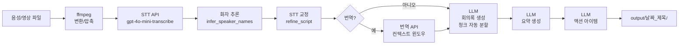
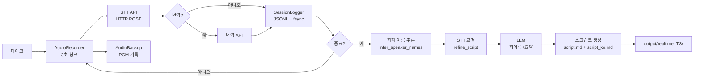
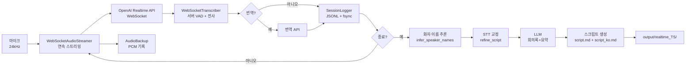

# 🎙️ Meeting Minutes Generator v2.1

음성/영상 파일에서 자동으로 **스크립트 + 회의록 + 요약본 + 노트 대조 + Wiki 업데이트 후보**를 생성하고,
누적된 회의록·결정사항·액션을 **지식그래프(Wiki Knowledge Graph)**로 정착시킵니다.
실시간 마이크 녹취와 파일 배치 처리를 모두 지원합니다. `pip install -e .` 설치 후에는 `meeting-minutes`
커맨드를, 설치 없이 저장소만 clone했다면 `run_meeting.bat` / `python run_meeting.py`를 씁니다(동일한 로직).
구현 모듈은 `meeting_minutes_app/`(common/wiki_core/meeting_pipeline 서브패키지) 아래에 있습니다.
**웹 UI**(`meeting-minutes web` 또는 `run_meeting.bat`)로도 동일한 기능을 브라우저에서 사용할 수 있습니다.

> 🆕 **Obsidian + Claude 연동**: 회의록을 Claude로 작성하고, 전문용어·인물·기업을 자동 검색해
> Obsidian 볼트에 정리한 뒤 메일로 발송합니다. → **쉬운 사용법: [`docs/GUIDE_Obsidian_Claude.md`](docs/GUIDE_Obsidian_Claude.md)**
>
> 🆕 **Wiki Knowledge Graph**: 회의/사람/조직/주제/결정/액션을 노드·엣지로 저장해(`data/wiki_graph.db`)
> 표기가 달라도(직함, 구분자) 같은 엔티티로 정규화하고, 회의록 생성 시 관련 인물/주제를 그래프로
> 1-hop 확장해 컨텍스트에 추가 주입할 수 있습니다. 웹 UI 세션 상세의 "Graph" 탭에서 확인,
> `python scripts/graph_backfill.py`로 기존 registry·vault를 백필. 자세한 구조는
> [`docs/ARCHITECTURE.md`](docs/ARCHITECTURE.md)의 "Wiki Knowledge Graph" 절 참고.
>
> 🆕 **Supermemory 팩트 메모리**: Obsidian에 회의록을 저장할 때 동시에 Supermemory에도 저장 → 다음 회의 컨텍스트 빌딩 및 노트 대조 시 이전 회의 기억을 자동 참조합니다. `config.supermemory.enabled: true` 로 활성화. 자체 호스팅 가능 (`npx supermemory local`, MIT 라이선스).
>
> 저장 경로와 요약/회의록 구분 기준은 [`docs/출력_구조_저장경로_요약회의록.md`](docs/출력_구조_저장경로_요약회의록.md)를 기준으로 합니다.
> 새 팀/새 PC 설치는 [`docs/SETUP_NEW_TEAM.md`](docs/SETUP_NEW_TEAM.md) 참고.

> ⚖️ **녹취 정책**: 이 도구는 참석자에게 고지된 회의를 기록하기 위한 것입니다. 은폐·탐지 회피
> (창 숨김, 프로세스 위장, 화면공유 회피) 기능은 **의도적으로 제공하지 않습니다** —
> 근거는 [`docs/기술검토_Natively_20260730.md`](docs/기술검토_Natively_20260730.md).
> 그 반대 증거로, 생성되는 회의록에는 녹취 방식·처리 시각·실제 사용 모델·도구 버전이
> **자동으로 기록**됩니다(사용자 입력 0개). 사용 수칙은
> [`docs/USER_GUIDE.md` §8](docs/USER_GUIDE.md), 구조 설명은
> [`docs/참조아키텍처_로컬BYOK_회의록자동화.md`](docs/참조아키텍처_로컬BYOK_회의록자동화.md).

---

## 빠른 시작 (5분)

새 팀/새 PC에 처음 설치하는 경우 자세한 절차는 [`docs/SETUP_NEW_TEAM.md`](docs/SETUP_NEW_TEAM.md)를 참고하세요.
아래는 요약입니다.

### 1. 패키지 설치

```bash
pip install -e .
```

(pyproject.toml 기반 설치 — `meeting-minutes` 커맨드가 PATH에 등록됩니다. 개발 중이 아니라면
`pip install .`도 가능합니다. 예전 방식인 `pip install -r requirements.txt`도 여전히 동작합니다.)

ffmpeg 미설치 시: <https://www.gyan.dev/ffmpeg/builds/> 에서 다운로드 → PATH 추가

### 2. config.json 생성

```bash
meeting-minutes init
```

Obsidian vault 경로, API 키 등 핵심 항목만 물어보고 `config.json`을 생성한 뒤 연결 상태를 확인합니다.
이미 `config.json`이 있으면 건드리지 않습니다(재설정하려면 `meeting-minutes init --force`).
수동으로 하려면:

```bash
copy config.example.json config.json   # Windows
cp   config.example.json config.json   # Mac/Linux
```

`config.json`을 열어 OpenAI API 키(`openai_api_key`)를 입력합니다.

### 3. 통합 런처

```bash
run_meeting.bat
```

메뉴에서 실시간 녹취, 파일 배치 처리, Obsidian 임베드 녹음 처리, Vault Q&A, 웹 UI를 한곳에서 실행합니다.

### 4. 직접 명령 실행

`pip install -e .` 이후에는 `meeting-minutes`, 설치 없이 저장소만 clone했다면
`python run_meeting.py`를 동일하게 사용할 수 있습니다(둘 다 같은 로직).

```bash
meeting-minutes batch meeting.mp4                              # 파일 → 회의록
meeting-minutes realtime                                       # 실시간 녹취
meeting-minutes ingest meeting.m4a --no-email
meeting-minutes prep-brief --title "회의 제목" --topic "주제"  # 회의 준비 브리프
```

→ `output/날짜_제목/` 폴더에 회의록·요약본 자동 저장

기존 `scripts/windows/run_batch.bat`, `scripts/windows/run_realtime.bat`, `scripts/windows/run_ingest.bat`, `scripts/windows/run_vault_audio_email.bat`는 호환용으로 유지되며 내부적으로 `run_meeting.py`에 위임합니다.

### 5. 실시간 녹취 (Windows)

```bash
python run_meeting.py realtime-raw --language ko   # 한국어 회의
python run_meeting.py realtime-raw --translate     # 영어 → 한국어 실시간 번역
```

### 6. 테스트 실행 (개발자)

```bash
pip install -e ".[dev]"     # pytest 포함 개발 의존성
python -m pytest            # 전체 회귀 테스트 (LLM/네트워크 없이 mock 기반)
python -m pytest tests/test_wiki_core.py -q   # 특정 모듈만
```

테스트는 실제 API·볼트를 건드리지 않도록 mock되어 있어 키 없이도 실행됩니다. 원격 MCP(`/mcp`)용
`fastmcp`가 설치돼 있지 않으면 `tests/test_mcp_server.py`만 자동 skip되고 나머지는 정상 수집됩니다.

---

## 웹 UI (run_meeting.bat)

CLI와 동일한 기능을 브라우저에서 사용할 수 있는 웹 인터페이스입니다.

### 시작

`run_meeting.bat`(더블클릭)은 **통합 런처 터미널 메뉴**를 엽니다 — 웹은 그 메뉴에서 선택하거나, 아래처럼 직접 실행합니다. (비개발자 배포는 웹이 바로 열리는 **포터블 배포판**(`MeetingMinutesPortable.zip` → 압축 해제 후 `MeetingMinutes.bat`)을 쓰세요 → `docs/USER_GUIDE.md`)

```bash
# 통합 런처 메뉴 (Windows, 더블클릭) — 메뉴에서 '웹 UI' 선택
run_meeting.bat

# 웹을 직접 실행
python run_meeting.py web                    # 프로덕션 모드 (기본 http://localhost:8501)
python run_meeting.py web --dev              # 개발 모드 (Vite + FastAPI)
python run_meeting.py web --port 9000        # 포트 변경
```

> **포트·바인딩** (소스 실행·포터블 배포판 공통 규칙 — `common/server_launch.py`):
> 8501이 사용 중이면 자동으로 다른 빈 포트를 선택하므로 주소가 8501이 아닐 수 있습니다
> (콘솔에 주소가 표시되고, 브라우저는 서버가 응답한 뒤 자동으로 열립니다). 기본 바인딩은
> **이 PC 전용(127.0.0.1)** 이고, `server.lan_access=true` 일 때만 `0.0.0.0`으로 열어 같은
> WiFi의 모바일 앱이 접속할 수 있습니다. `--dev` 모드는 Vite 프록시가 8501을 가리키므로
> 포트를 바꾸지 않고 실패합니다.
>
> **데이터 폴더가 실행 방식마다 다릅니다**: 소스 실행(`webUI_실행.bat`·`run_meeting.py web`)은
> 저장소 루트를, 포터블 배포판(`MeetingMinutes.bat`)은 자기 폴더의 `MeetingMinutesData/`를
> 씁니다 — 설정·회의록이 서로 별개입니다(현재 화면이 어느 쪽인지는 [설정] → Obsidian 전체
> 진단의 "데이터 폴더" 항목에서 확인).

> 최초 실행 시 `fastapi`, `uvicorn`, `python-multipart` 및 프론트엔드 의존성이 자동 설치됩니다.

### 기능

| 페이지 | 기능 |
| --- | --- |
| **Dashboard** | 세션 목록, 검색/필터, 상태 배지, CLI로 생성한 세션도 자동 표시 |
| **Recorder** | 브라우저 마이크 → 실시간 STT, 라이브 트랜스크립트, 볼륨 시각화 |
| **File Upload** | 드래그앤드롭 파일 업로드 → 배치 처리 (7가지 모드 지원) |
| **Text Analysis** | 텍스트 붙여넣기 → AI 분석 |
| **Settings** | STT/GPT/Claude 모델 설정, 실시간 녹음 설정 (VAD, 노이즈), 프로파일 CRUD |
| **Session Detail** | 멀티탭 문서 뷰어 (회의록/요약/노트 대조/Wiki Context/Wiki Proposal/스크립트/액션아이템), 복사/다운로드, 세그먼트 타임라인 |

### CLI ↔ 웹 동기화

- CLI(`scripts/windows/run_batch.bat`, `scripts/windows/run_realtime.bat`)로 생성한 결과는 웹 Dashboard에 자동 표시
- 웹에서 생성한 결과도 `./output/` 폴더에 파일로 저장
- 서버 시작 시 `session_scanner.py`가 `./output/` 폴더를 스캔하여 DB에 임포트

### 실시간 녹음 아키텍처 (웹)

```text
현재 구현:
브라우저/모바일 마이크 → OpenAI Realtime API 직접 연결
    → 실시간 트랜스크립트 → 브라우저에 표시
    → 종료 시 로컬 세션 저장 및 회의록/요약/액션아이템 생성

목표 보안 구조:
브라우저/모바일 → FastAPI 임시 토큰 발급
    → OpenAI Realtime API 직접 연결
    → FastAPI는 세션 저장, Obsidian 저장, 알림, audit log 담당

서버 프록시 옵션:
브라우저/서버 오디오 파이프라인 → FastAPI /ws/realtime
    → OpenAI Realtime API WebSocket
    → 중앙 로깅/회사망 통제용. 기본 웹 Recorder 경로는 아님.
```

현재 프론트 구현은 `web/frontend/src/lib/api.ts`의 `createRealtimeWS()`가 OpenAI Realtime API에 직접 WebSocket으로 연결합니다. 이 standalone/mobile 경로는 지연은 낮지만 서버의 Obsidian/Wiki/노트 대조 파이프라인을 우회합니다. 서버 기반 운영 품질이 필요하면 FastAPI `/ws/realtime` 경로를 사용해야 하며, 이 경로는 종료 시 회의록·요약·액션·노트 대조·Wiki Context·Wiki Proposal을 DB와 output에 남깁니다. 공식 권장 목표는 브라우저/모바일에서 WebRTC + ephemeral credential을 사용하는 구조입니다.

> 보안 TODO: 프론트엔드에 장기 OpenAI API Key를 저장하지 않고, 브라우저/모바일은 FastAPI가 발급한 ephemeral credential을 사용하도록 전환합니다.

### 웹 오디오 입력 안정성

현재 웹 Recorder는 `ScriptProcessorNode` 기반으로 PCM16 24kHz 오디오를 생성합니다. `ScriptProcessorNode`는 deprecated API이며 메인 스레드 처리로 지연, jank, audio glitch 위험이 있습니다.

개선 목표:

```text
Browser mic → AudioWorkletProcessor
    → RingBuffer/SharedArrayBuffer optional
    → PCM16 24kHz
    → OpenAI Realtime API 또는 FastAPI /ws/realtime
```

### 기술 스택

- **백엔드**: FastAPI + SQLite (`meeting_minutes_app/` 구현 모듈 import)
- **프론트엔드**: React 19 + Vite 6 + TypeScript + Tailwind CSS 4 + Motion

---

## iOS 모바일 앱 (Capacitor)

동일한 React 웹 UI를 Capacitor로 감싸서 **iPhone/iPad 네이티브 앱**으로 빌드할 수 있습니다.
프로젝트는 `web/frontend/ios`에 있으며 Swift Package Manager 기반입니다(CocoaPods 아님).
**빌드는 macOS + Xcode에서만 가능**합니다. 앱은 두 가지 모드를 지원하며 [설정]에서 전환합니다:

- **단독 모드**: 앱에 OpenAI API 키를 넣고 OpenAI에 직접 연결. 데이터는 기기 내 IndexedDB에만 저장(프라이버시). 파일 업로드 전사·텍스트→회의록·요약이 견고.
- **PC 연결 모드(권장)**: 같은 WiFi의 PC에서 포터블 배포판(`MeetingMinutes.bat`, MCP 대체 빌드에선 `MeetingMinutes.exe`)을 켜고 앱 [설정] → "PC 서버 연결"에 그 주소를 입력하면, PC 서버와 **동일한 고품질 파이프라인**(2단계 보정·위키·그래프)을 아이폰에서 그대로 사용. 두 빌드 모두 같은 FastAPI 서버(`/api/*`, `/ws/realtime`)를 띄웁니다. PC에서 `server.lan_access`를 켜야 합니다(아래 설정 참고).

기타: 대용량 파일 자동 청크 분할, 백그라운드 녹음(오디오 세션 유지), 네이티브 공유 시트.

> **빌드·사용 상세 가이드**: [`scripts/build/iOS_빌드_사용법.md`](scripts/build/iOS_빌드_사용법.md)
> (Mac에서 `cd web/frontend && npm install && npm run ios:build` 후 Xcode에서 서명·실행)

---

## 아키텍처

### 전체 프로세스 지도

```text
입력
  ├─ 파일 업로드/배치: run_meeting.py batch/process
  ├─ 마이크 실시간: run_meeting.py realtime/record
  ├─ Obsidian 임베드 녹음: run_meeting.py vault-audio
  └─ 폴더 자동 감시: run_meeting.py watch → ingestion_pipeline.py

공통 처리
  오디오 준비(ffmpeg) → STT → 화자 추론/교정 → 회의록/요약/액션 생성
  → 관련 노트 검색/사전 리서치 반영 → Obsidian 발행 또는 output/ fallback
  → 이메일/Slack/Teams 알림(경로별 지원 범위 상이)

회의 생애주기
  prep(계획 노트 사전 리서치) → record/process/ingest/vault-audio
  → schedule/status(일정·충돌·병합 대기) → merge(확인 후 계획 노트 병합)
  → reindex/ask(Vault 지식 검색)
```

| 진입점 | 목적 | 저장/병합 기준 |
| --- | --- | --- |
| `run_meeting.bat` / `run_meeting.py` | 권장 통합 실행 메뉴 | 기존 배치/실시간/ingest/web 명령으로 안전하게 위임 |
| `batch` / `process` | 기존 배치 처리 | `output/` 저장, 설정 시 Obsidian 발행 및 계획 매칭 |
| `realtime` / `record` | 마이크 실시간 녹취 | 종료 시 회의록/요약/노트 대조/Wiki Context/Proposal 생성, 설정 시 Obsidian/메일 |
| `vault-audio` | Obsidian 노트에 임베드된 녹음 처리 | 해당 노트에 `## 회의 기록`으로 직접 병합 |
| `ingest` / `watch` | 자동 수집용 오디오 처리 | 관련 노트 링크 포함 recording note 생성, 실패 시 `output/` 저장 |
| `prep` / `schedule` / `merge` | 계획 회의 운영 | 계획 노트 사전 리서치, 충돌 점검, 병합 대기 처리 |
| `reindex` / `ask` | Vault 지식 검색 | `data/vault_index.json` 기반 Q&A와 관련 노트 검색 |

### Wiki 지식 순환 (prep-brief)

`prep-brief` 명령은 회의 **전**에 관련 Vault 노트·Registry 기반 준비 브리프를 LLM 없이 생성합니다.

```bash
python run_meeting.py prep-brief --title "Q3 계획 회의" --topic "OKR 점검"
python run_meeting.py prep-brief --title "AI 세미나 준비" --no-email
python run_meeting.py prep-brief --title "주간 회의" --reindex
```

- `output/{yymmdd} {제목} 준비브리프.md` 저장 (항상)
- `obsidian.planning_path`(기본: `Planning/Prep Briefs`) 에 Obsidian 저장 (선택)
- `notify.on_finish` 채널로 이메일/Slack/Teams 발송 (선택)
- `data/action_registry.json` / `data/decision_registry.json` — 첫 실행 시 자동 생성, git 미포함
- meeting 처리 후 `output/{날짜_제목}/wiki_context.json` 생성 (회의록 생성에 주입된 관련 노트·레지스트리 기록)
- meeting 처리 후 `output/{yymmdd} {제목} wiki_proposal.json/.md` 생성 (관련 노트 있을 때, 수동 검토용)
- 논문·학술자료는 별도 섹션(`## 관련 논문·학술자료`)으로 분리 출력

| 옵션 | 설명 |
|---|---|
| `--title` | 회의 제목 (필수) |
| `--topic` | 회의 주제 (선택, 관련 노트 검색 정확도 향상) |
| `--no-obsidian` | Obsidian 저장 건너뜀 |
| `--no-email` | 이메일/알림 발송 건너뜀 |
| `--reindex` | 완료 후 Vault 인덱스 강제 재빌드 |
| `--limit` | 관련 노트 최대 개수 (기본: 5) |

### Obsidian Wiki 컨텍스트

- 배치 처리와 자동 수집은 STT 세그먼트 내용으로 Vault 인덱스와 Obsidian REST 검색을 수행합니다.
- **회의록 본문은 기본적으로 이번 녹음 내용만으로 작성됩니다**(`analysis.minutes_vault_context=false`). 관련 노트는 링크 목록(`🔗 관련 노트`)으로만 남고 생성 프롬프트에 주입되지 않습니다 — 이전 회의 내용이 이번 회의록 문장으로 새어 들던 경로를 끊은 것입니다. 배경 맥락까지 넣고 싶으면 이 값을 켜세요(다뤄지지 않은 내용이 섞일 수 있습니다).
- CLI 실시간과 서버 `/ws/realtime`은 종료 후 누적 세그먼트를 기준으로 같은 컨텍스트를 한 번 주입합니다. 웹 standalone/mobile direct OpenAI 경로는 Vault/Wiki/노트 대조을 우회하므로 운영 기록용 기본 경로로 보지 않습니다.
- Obsidian은 로컬 Wiki입니다. 최신 인터넷 정보는 `wiki.online_search_enabled`가 켜진 경우 별도 웹 리서치 memo로 보완합니다.
- 녹음 **중**에는 `wiki.realtime_vault_search`(기본 켜짐)가 발화별로 관련 노트를 찾아 화면에 조용히 표시합니다. **내부자료 우선** — 노트 인덱스(TF-IDF+임베딩 RRF)로 순위를 정하고, 논문/이론 폴더(`wiki.realtime_paper_dirs`)를 따로 검색해 로컬 논문이 후보에서 빠지지 않게 하며, 찾은 노트 안에서 관련 섹션(`#헤딩`)까지 짚어 근거로 보여줍니다. 인덱스·노트 폴더가 없으면 사유가 배지로 표시됩니다. 랭킹 설계 근거는 `docs/검색랭킹_이론과근거.md`.
  - 논문/이론 폴더는 **폴더 이름만 맞으면 볼트 하위에 있어도** 찾습니다(예: `Archive/양자아카이브/02_이론_학습`). 폴더 소속으로 순위를 올려주지는 않습니다 — 실측에서 관련도가 나빠졌습니다.
  - 검색은 별도 스레드에서 돌아 전사에 영향을 주지 않습니다(1회 0.3~0.5초, 기본 3세그먼트마다).
- 실시간 **웹** 보완(`wiki.realtime_web_search_interval`>0)은 **웹 UI 녹음 전용**이며 내부에서 못 찾은 구간에서만 동작합니다. 터미널 CLI 실시간 녹음은 내부 노트 검색만 합니다.
- 종료 후 관련 노트는 근거(관련도·섹션경로·snippet·발화)와 함께 남아 회의 상세의 **참조된 관련 노트**에서 다시 볼 수 있고, 회의록 말미 `## 🔗 관련 노트`에 자동 삽입됩니다. 라이브 확인 절차는 `docs/SMOKE_실시간_관련노트.md`.
- `wiki.claim_verify=true`이면 회의록 생성 후 노트와 대조해 `## 노트 대조 (자동 · 사람 확인 필요)` 섹션을 추가합니다. 판정·신뢰도·대조 노트가 포함되며, 노트 검색이 관련 자료를 놓칠 수 있으므로 **확정된 노트 대조이 아닌 참고 자료**입니다(근거: `docs/검색랭킹_이론과근거.md` §2.2.1).
- 용어·배경 enrichment가 신뢰할 만한 설명을 찾지 못하면 챗봇식 사과문을 싣지 않고 `확인 불가`로 표시합니다.
- 처리 결과 폴더의 `wiki_context.json`에는 회의 날짜, 원본 파일명, STT 재사용 여부, 관련 노트, 추출 용어/엔티티, 레지스트리 액션이 함께 저장됩니다.
- Obsidian 연결 실패는 치명 오류가 아니며, 파일 출력은 계속 생성됩니다.

### Wiki Q&A (wiki-ask)

Obsidian 볼트에 쌓인 지식에 직접 질문합니다. 관련 노트/섹션을 근거로 모아 LLM이 답변하고,
반드시 근거 링크와 함께 아래 고정 포맷으로 답합니다.

```bash
python run_meeting.py wiki-ask --question "M365 백업 검토 현황 알려줘"
python run_meeting.py wiki-ask --question "지난 회의에서 결정된 사항만 정리해줘" --show-sources
```

답변 예시:

```md
## 요약 답변
PoC 후보로 Veeam, Rubrik, AvePoint 3개 제품이 선정되었습니다.

## 상세 답변
260701 M365 백업 검토 회의에서... [출처: [[260701 M365 백업 검토 회의#주요 결정사항]]]

## 근거
- [[260701 M365 백업 검토 회의#주요 결정사항]]
- [[M365 백업 솔루션 검토]]

## 확실한 내용
PoC 후보 3개 제품명은 회의록에 명시됨.

## 불확실한 내용
국내 구축 사례는 확인 불가.

## 다음 액션 또는 업데이트 후보
국내 구축 사례 확인 필요 — 담당자 배정 안 됨.
```

`indexing.enabled=true` + `wiki_knowledge.section_index_enabled=true`(기본값)일 때
`## 근거`가 노트 전체가 아닌 `[[노트#헤딩]]` 단위로 표시됩니다. 새 노트를 추가했다면
`python run_meeting.py reindex`로 먼저 인덱스를 갱신하세요.

### 배치 처리 흐름 (`run_meeting.py batch`)


```mermaid
flowchart LR
    A[음성/영상 파일] --> B[ffmpeg\n변환/압축]
    B --> C[STT API\ngpt-4o-mini-transcribe]
    C --> D[화자 추론\ninfer_speaker_names]
    D --> G[STT 교정\nrefine_script]
    G --> E{번역?}
    E -- 예 --> F[번역 API\n컨텍스트 윈도우]
    E -- 아니오 --> H
    F --> H[LLM\n회의록 생성\n청크 자동 분할]
    H --> I[LLM\n요약 생성]
    I --> J[LLM\n액션 아이템]
    J --> K[output/날짜_제목/]
```

> 액션 아이템 추출은 `--type meeting` (기본값)일 때만 실행됩니다.
> STT 교정(`refine_script`)은 회의록 생성 **이전**에 실행되어 교정본이 회의록 입력으로 사용됩니다.

### 실시간 녹취 흐름 — HTTP 모드 (기본)


```mermaid
flowchart LR
    A[마이크] --> B[AudioRecorder\n3초 청크]
    B --> C[STT API\nHTTP POST]
    B --> D[AudioBackup\nPCM 기록]
    C --> E{번역?}
    E -- 예 --> F[번역 API]
    E -- 아니오 --> G[SessionLogger\nJSONL + fsync]
    F --> G
    G --> H{종료?}
    H -- 아니오 --> B
    H -- 예 --> I[화자 이름 추론\ninfer_speaker_names]
    I --> J[STT 교정\nrefine_script]
    J --> K[LLM\n회의록+요약]
    K --> L[스크립트 생성\nscript.md + script_ko.md]
    L --> M[output/realtime_TS/]
```

### 실시간 녹취 흐름 — WebSocket 모드 (`--mode ws`)


```mermaid
flowchart LR
    A[마이크\n24kHz] --> B[WebSocketAudioStreamer\n연속 스트리밍]
    B --> C[OpenAI Realtime API\nWebSocket]
    B --> D[AudioBackup\nPCM 기록]
    C --> E[WebSocketTranscriber\n서버 VAD + 전사]
    E --> F{번역?}
    F -- 예 --> G[번역 API]
    F -- 아니오 --> H[SessionLogger\nJSONL + fsync]
    G --> H
    H --> I{종료?}
    I -- 아니오 --> B
    I -- 예 --> J[화자 이름 추론\ninfer_speaker_names]
    J --> K[STT 교정\nrefine_script]
    K --> L[LLM\n회의록+요약]
    L --> M[스크립트 생성\nscript.md + script_ko.md]
    M --> N[output/realtime_TS/]
```

> **HTTP vs WebSocket**: HTTP 모드는 3~6초 청크 단위로 전송 (지연 ~5초). WebSocket 모드는 오디오를 연속 스트리밍하고 서버가 발화를 감지해 즉시 전사 (지연 ~1초). WebSocket은 비용이 ~3배이지만 체감 속도가 크게 빠릅니다.

---

## 주요 기능

| 기능 | 설명 |
| --- | --- |
| **다중 파일 배치** | `*.webm` 글로빙, 여러 파일 한번에 처리 |
| **3가지 문서 타입** | 회의록 / 세미나 기록 / 강의 노트 |
| **영→한 번역** | `--translate` 로 영어 음성 → 한국어 문서 |
| **GPT + Claude 폴백** | GPT-4o 실패 시 Claude 자동 전환 |
| **자동 재시도** | API 에러 시 3회 자동 재시도 |
| **이어서 처리** | `--resume` 으로 기존 `segments.json`/`transcript.md`가 있을 때만 STT를 건너뛰고 문서만 재생성 |
| **STT 강제 재실행** | `--force-stt` 로 기존 STT 결과가 있어도 새로 전사 |
| **화자 사후 수정** | `--edit-speakers` 로 화자명 변경 → 재생성 |
| **화자 이름 자동 추론** | "Speaker A/B" → LLM이 발화 내용 분석해 실명 추론 (`infer_speaker_names`) |
| **화자 캐시** | 이전 화자 매핑 자동 저장·재사용 (`speaker_cache.py`) |
| **명명 프로필** | 자주 쓰는 옵션 조합을 이름으로 저장 (`profiles.py`) |
| **비용 사전 추정** | `--estimate-cost` 로 실행 전 API 비용 확인 |
| **알림** | Email / Slack / Teams 완료 알림 (`notifier.py`) |
| **폴더 감시** | 파일 들어오면 자동 처리 (`watcher.py`) |
| **실시간 녹취** | 마이크 → 실시간 전사 → 회의록 (`realtime_transcription.py`) |
| **WebSocket 스트리밍** | `--mode ws` 로 ~1초 지연 실시간 전사 (서버 VAD + 노이즈 리덕션 내장) |
| **회의 주제 입력** | 실행 시 주제를 입력하면 번역·회의록·요약 프롬프트에 맥락으로 반영 |
| **화자 구분 스크립트** | 실시간 녹취 종료 후 화자별로 정리된 `*_script.md` 자동 생성 (번역 시 `*_script_ko.md` 추가) |
| **실시간 화자 보강** | Realtime 모드는 기본 화자분리 없음. 종료 후 발화 패턴 기반 화자 추론 또는 pyannote/WhisperX 후처리로 보강 |
| **환각·반복 필터** | 무음 구간은 전사하지 않고, 되풀이 문장은 1회로 축약, 회의 언어에 없는 이질 문자(중국어·일본어·키릴 등)는 `[불명]` 표시 (`common/text_filters.py`) |
| **STT 교정 (개선)** | 세션 종료 후 회의록 생성 **이전에** 맥락·주제 기반으로 오탈자·고유명사 교정 (`*_refined_script.txt`) |
| **상세 회의록 프롬프트** | 스크립트 1분 분량당 200~400자 이상 기준 적용, 맥락 제거 금지 |
| **긴 스크립트 자동 분할** | `MAX_LLM_CHARS` 초과 시 타임스탬프 기준 청크 분할 + 오버랩 처리 후 통합 |
| **날짜 자동 추출** | 파일명의 `YYMMDD`, `YYYYMMDD`, `YYYY-MM-DD HH.MM` 패턴을 회의 날짜로 자동 기재 |
| **Obsidian yymmdd 파일명** | 회의록/전사 노트를 `260627 제목.md`처럼 회의 날짜 prefix로 저장 |
| **Vault 노트 대조** | 회의록 주장과 Vault 노트를 비교해 일치/충돌/확인불가 및 신뢰도 표시 (자동 대조 · 사람 확인 필요) |
| **Wiki Context 기록** | 관련 노트·레지스트리·STT 품질 메타데이터를 `wiki_context.json`에 저장 |
| **Supermemory 팩트 메모리** | Obsidian 저장 시 동시에 Supermemory에 팩트 카드 저장 → 다음 회의 컨텍스트·노트 대조 시 자동 참조 (`supermemory.enabled: true`, 자체 호스팅 지원) |
| **번역 컨텍스트 윈도우** | 앞 5개 세그먼트를 힌트로 제공해 번역 용어 일관성 향상 |
| **고정 헤더 UI** | 실시간 녹취 중 제목·경과시간·예상비용이 상단 2줄에 항상 표시 |
| **스크롤 잠금** | `s+Enter` 로 화면 고정 — 이전 대화를 위로 스크롤하여 확인 가능 |
| **요약 저장/첨부** | 배치는 요약본을 `summary.md`로 저장(실시간 녹취 경로는 `summary.txt`도 별도 생성). 이메일에는 요약을 `.txt`로 변환해 첨부 |
| **크래시 복구** | JSONL + os.fsync + 오디오 PCM 백업으로 세션 보호 |
| **디버그 로그** | `--debug` 시 `output/debug.log` 생성 / 런처 로그는 `data/logs/run_py.log`에 저장 |
| **설정 파일** | `config.json` 으로 반복 옵션 저장 |
| **SSL 우회** | 회사/학교 네트워크 지원 |
| **대용량 처리** | 170MB+ 영상도 자동 압축·분할 |
| **액션 아이템** | 회의록에서 담당자·업무·기한을 자동 추출 (JSON + 마크다운 표) |

---

## 출력 파일

회의마다 별도 서브폴더에 저장됩니다.

```text
output/
├── 2025-02-20_Q1정기회의/           # 회의별 서브폴더 (날짜_제목)
│   ├── script.md                    # 스크립트
│   ├── script_ko.md                 # 한국어 번역 스크립트 (--translate-script)
│   ├── script_refined.txt           # STT 교정 스크립트 (맥락·주제 기반 보정) — 실시간 경로는 refined_script.txt
│   ├── minutes.md                   # 기록 문서 (회의록/세미나/강의)
│   ├── summary.md                   # 요약본
│   ├── actions.json                 # 액션 아이템 JSON (meeting 전용)
│   ├── actions.md                   # 액션 아이템 마크다운 표 (meeting 전용)
│   ├── segments.json                # STT 원본 (재사용/디버깅)
│   └── segments_translated.json     # 번역 세그먼트 (있을 경우)
└── debug.log                        # 디버그 로그 (--debug 시에만 생성)
```

다중 파일에 `--title` 지정 시 한 폴더에 번호 접두어로 묶입니다:

```text
output/
└── 2025-02-20_시리즈강의/
    ├── 01_part1_script.md
    ├── 01_part1_minutes.md
    ├── 01_part1_summary.md
    ├── 02_part2_script.md
    ├── 02_part2_minutes.md
    └── 02_part2_summary.md
```

---

## 설치

**Python 3.10 이상** 필요

```bash
pip install -e .
```

`pyproject.toml` 기반 설치로 `meeting-minutes` 콘솔 커맨드가 등록됩니다(개발 모드가 아니면 `pip install .`).
저장소만 clone해서 설치 없이 쓰려면 `pip install -r requirements.txt` + `python run_meeting.py ...`도
여전히 동작합니다. 새 팀/새 PC 설치 절차는 [`docs/SETUP_NEW_TEAM.md`](docs/SETUP_NEW_TEAM.md) 참고.

주요 의존성: `openai`, `anthropic`, `requests`, `sounddevice`, `numpy`, `watchdog`, `websockets`, `fastapi`

ffmpeg 설치:

- **Windows**: <https://www.gyan.dev/ffmpeg/builds/> → PATH에 추가
- **macOS**: `brew install ffmpeg`
- **Linux**: `sudo apt install ffmpeg`

---

## 설정 (config.json)

모든 비밀값(API 키, 이메일 비밀번호 등)은 `config.json`에 저장합니다.
`config.json`은 `.gitignore`에 포함되어 git에 올라가지 않으며, `data/`(registry·인덱스 등)와
함께 이 설치에만 속합니다 — 다른 팀/설치와 공유되지 않습니다.

```bash
meeting-minutes init          # 대화형 마법사 (권장) — 핵심 항목만 물어보고 연결까지 확인
# 또는 수동으로:
copy config.example.json config.json   # Windows
cp   config.example.json config.json   # Mac/Linux
```

**config.json 구조:**

```jsonc
{
  "api": {
    "openai_api_key":    "sk-proj-...",   // 필수
    "anthropic_api_key": "sk-ant-...",    // 선택 (Claude 폴백 사용 시)
    "groq_api_key":      "gsk_..."        // 선택 (STT 2차 폴백 — OpenAI STT 장애 시 자동 전환)
  },
  "ssl": {
    "verify": true     // 기본 true(권장). 회사/학교망 SSL 오류 시에만 false (MITM 위험)
  },
  "models": {
    "stt":             "gpt-4o-mini-transcribe",     // 기본값. 화자 분리는 "gpt-4o-transcribe-diarize"
    "stt_fallback":    "gpt-4o-transcribe",          // STT 1차 폴백(같은 OpenAI 내 재시도)
    "stt_groq":        "whisper-large-v3-turbo",     // STT 2차 폴백(Groq — groq_api_key 필요)
    "stt_local":       "base",                       // STT 최종 백업(로컬 faster-whisper) 크기
                                                     //   ※ stt.local_fallback=true 만으로는 안 되고 가중치 준비가 필요합니다:
                                                     //     python run_meeting.py prepare-local-stt  (--status 로 상태 확인)
    "llm":             "gpt",                // 기본 gpt(OpenAI 키만 필요) | claude(Anthropic 키 별도)
    "gpt_model":       "gpt-4o-mini",
    "minutes_model":   "gpt-4o",             // 회의록 생성 모델 (기본: gpt-4o)
    "summary_model":   "gpt-4o",             // 요약본 생성 모델 (기본: gpt-4o)
    "claude_model":    "claude-opus-4-8",    // llm=claude 일 때 사용 (opus-4-8 / sonnet-5 / haiku-4-5)
    "translate_model": "gpt-4o-mini"
  },
  "realtime": {
    "language":           "ko",           // 실시간 기본 언어 (ko / en). auto 는 조각마다 언어를 재판정해 비권장
    "mode":               "http",         // http(안정·저비용, 기본) | auto(WS 우선·저지연) | ws
    "two_pass":           true,           // 2단계 전사 보정 — 조각을 구간마다 재전사해 문장으로 교체
    "revise_window_sec":  25,             // 보정 구간 길이(초)
    "revise_model":       "gpt-4o-transcribe",  // 보정 전사 모델(최종 품질 결정)
    "fast_max_chunk_sec": 5.0,            // 무음 없어도 이 길이에서 잘라 표시
    "silence_rms":        300,            // HTTP 무음 판정 임계값 — 마이크 작으면 낮추고 시끄러우면 올림
    "drop_silent_chunks": true,           // 발화 없는 구간은 STT 로 보내지 않음(환각 차단)
    "prompt_context":     "static",       // 청크 STT 문맥: static(주제·참석자만) | tail(직전 문장까지) | off
    "hallucination_filter": true,          // 반복 축약 + 이질 문자 [불명] 표시
    "stt_concurrency":    2,              // HTTP 빠른 패스 STT 동시 호출 수(1~4, 지연 누적 방지)
    "chunk_duration":     3.0,            // 청크 길이(초) — CLI 전용
    "audio_backup":       true,           // PCM 오디오 백업 (크래시 복구용)
    "diarize_postprocess": false,         // 종료 후 diarize 재전사로 화자 라벨 채움(비용·메모리↑)
    "ws_vad_type":        "server_vad",   // server_vad | semantic_vad
    "ws_vad_eagerness":   "medium",       // low | medium | high | auto (semantic_vad 전용)
    "ws_noise_reduction": "near_field"    // near_field | far_field | null
  },
  "email": {
    "sender":    "sender@naver.com",
    "password":  "앱 비밀번호",
    "recipient": "recipient@company.com",
    "markdown_attachment": "txt"
  },
  "notify": {
    "on_finish": "none",   // 기본 none(끔). 알림을 쓰려면 email/slack/teams + 해당 설정
    "slack": { "webhook_url": "https://hooks.slack.com/services/..." },
    "teams": { "webhook_url": "https://...webhook.office.com/..." }
  },
  "obsidian": {
    "enabled": false,
    "api_url": "https://127.0.0.1:27124",
    "api_key": "",
    "vault_path": "",
    "notes_subdir": "00_Meetings",
    "meetings_path": "",
    "transcript_mode": "separate",
    "refs_subdir": "01_References"
  },
  "vault_watcher": {
    "watch_folders": [],
    "processed_state_path": "data/processed_audio.json"
  },
  "indexing": {
    "index_path": "data/vault_index.json",
    "vault_path": "",
    "auto_reindex_after_write": true
  },
  "wiki": {
    "enabled": true,
    "vault_enrich": true,
    "claim_verify": true,
    "claim_verify_max": 8,
    "context_max_chars": 6000,
    "online_search_enabled": false,
    "claim_web_verify": false,
    "realtime_vault_search": true,
    "realtime_search_interval": 3,
    "realtime_note_candidates": 10,
    "realtime_paper_candidates": 4,
    "realtime_display_count": 3,
    "realtime_paper_dirs": ["02_이론_학습", "01_References", "원문추출"],
    "realtime_query_chars": 180,
    "realtime_search_backend": "auto",
    "related_notes_max_rank": 0,
    "realtime_web_search_interval": 0,
    "realtime_web_only_if_no_vault_hit": true
  },
  "wiki_knowledge": {
    "enabled": true,
    "update_proposals_enabled": true,
    "section_index_enabled": true,
    "proposal_llm_enabled": false,
    "auto_apply_updates": false,
    "graph_enabled": true,
    "graph_retrieval_expand_enabled": true
  },
  "output_dir": "./output"
}
```

| 설정 영역 | 쓰는 곳 |
| --- | --- |
| `api`, `models`, `ssl` | STT, 번역, 회의록/요약 생성, SSL 검증 |
| `server` | `server.lan_access`=true 면 PC 서버(`MeetingMinutes.bat`/exe)가 0.0.0.0에 바인딩해 같은 WiFi의 iOS/태블릿 앱이 접속(PC 연결 모드). 기본 false(localhost 전용) |
| `realtime` | `realtime_transcription.py`, `run_realtime.py`, 웹 Recorder |
| `email`, `notify` | 배치/실시간/자동 처리 완료 알림. `notify.on_finish`가 있으면 기본 알림으로 사용 |
| `obsidian` | Local REST API 발행, 계획 노트 매칭/병합, Vault 폴더 경로 |
| `supermemory` | 회의록 저장 시 팩트 카드 동시 저장 + 다음 회의 컨텍스트·노트 대조에 자동 참조 (`supermemory_client.py`) |
| `vault_watcher` | `run_meeting.py watch`, `run_meeting.py audio-watcher`, 자동 처리 상태 파일 |
| `indexing`, `wiki` | `vault_indexer.py`, `wiki_ask.py`, 관련 노트 검색과 Q&A |
| `wiki_knowledge.graph_enabled`/`graph_retrieval_expand_enabled` | Wiki Knowledge Graph 동기화(`graph_db.py`/`graph_sync.py`) + 회의록 생성 시 그래프 기반 검색 확장 |
| `analysis` | `prompts/` 템플릿 기반 문서 유형별 분석 |

### Obsidian 저장 경로 기준

- `obsidian.vault_path`는 실제 Obsidian 볼트 루트입니다. Local REST API가 보고 있는 열린 볼트와 같아야 합니다.
- `indexing.vault_path`도 같은 루트를 봐야 관련 노트 검색과 실제 저장 위치가 어긋나지 않습니다.
- `obsidian.meetings_path`가 있으면 새 회의록은 `notes_subdir`이 아니라 그 볼트 상대경로에 저장됩니다.
- 예시는 다음입니다(`auto_route_enabled: true`면 `--project` 없이도 제목/내용으로 도메인 자동 결정).

```jsonc
"obsidian": {
  "vault_path": "D:\\Obsidian\\MyVault",
  "meetings_path": "{project}/01_회의_세미나/회의별/{year}",
  "project_domains": { "양자": "Archive/도메인_아카이브" },
  "auto_route_enabled": true,
  "meeting_categories": {
    "양자": { "mode": "domain", "keywords": ["양자", "퀀텀"] },
    "팀회의": { "mode": "folder", "folder": "00_Meetings/팀회의", "keywords": ["팀회의"] }
  }
},
"indexing": {
  "vault_path": "D:\\Obsidian\\MyVault"
}
```

현재 실제 경로는 다음 명령으로 확인합니다.

```bash
python run_meeting.py obsidian --where
```

### 요약과 회의록의 차이

- `한눈에 보는 요약`: 결론, 결정/합의, 리스크/주의, 다음 액션만 짧게 보여주는 빠른 판단용입니다.
- `회의록`: 안건별 상세 논의, 근거, 수치, 상충 의견, 미정 사항을 남기는 업무 기록입니다.
- 같은 내용을 두 섹션에 길게 반복하면 잘못된 출력입니다. 요약은 회의록의 대체물이 아닙니다.

### 전체 STT와 메일 첨부

- `obsidian.transcript_mode = "separate"`이면 전체 STT는 회의록 본문에 붙지 않고 `yymmdd 제목 - 전사.md` 별도 노트로 저장됩니다.
- `append`로 바꾸면 전체 STT를 회의록 본문 끝에 포함하고, `off`로 바꾸면 저장하지 않습니다.
- 배치/실시간 완료 메일에는 기본적으로 상세 회의록, 요약본, 액션, STT 원본(`script.md`/`transcript.md`/`segments.json`), STT 교정본, `wiki_context.json`, `wiki_proposal.md/json`, 노트 대조 파일을 가능한 한 모두 첨부합니다.
- `email.markdown_attachment = "txt"`가 기본입니다. `.md` 첨부 한글 깨짐을 피하기 위해 UTF-8 `.txt`로 변환해 보냅니다.

환경변수도 지원합니다 (환경변수 > config.json 순으로 우선):

```bash
# Windows PowerShell
$env:OPENAI_API_KEY    = "sk-proj-..."
$env:ANTHROPIC_API_KEY = "sk-ant-..."
$env:EMAIL_SENDER      = "sender@naver.com"
$env:EMAIL_PASSWORD    = "앱 비밀번호"
$env:EMAIL_RECIPIENTS  = "recipient@company.com"   # 쉼표로 여러 명 (실시간 녹취는 단수 EMAIL_RECIPIENT도 허용)

# Mac/Linux
export OPENAI_API_KEY="sk-proj-..."
```

> **Gmail 앱 비밀번호** 발급: <https://myaccount.google.com/apppasswords> (2단계 인증 먼저 활성화)
> **Naver 앱 비밀번호** 발급: 메일 설정 → POP3/SMTP 사용 → 비밀번호 발급

**.gitignore 적용 항목** (자동으로 git 추적 제외):

| 파일/폴더 | 이유 |
| --- | --- |
| `config.json` | API 키·비밀번호 포함 |
| `output/` | 생성 결과물 (대용량) |
| `*.pcm` | 오디오 백업 (최대 ~115MB/hr) |
| `__pycache__/`, `*.pyc` | Python 캐시 |

> `profiles.json` (커스텀 프로필)은 추적됩니다. 민감 정보를 넣지 마세요.

---

## 사용법 (`run_meeting.py batch`)

### 기본

```bash
python run_meeting.py batch meeting.mp4
```

### 제목 지정

```bash
python run_meeting.py batch meeting.mp4 --title "2025 Q1 정기회의"
```

### 문서 타입

```bash
python run_meeting.py batch seminar.webm --type seminar     # 세미나
python run_meeting.py batch lecture.mp4  --type lecture     # 강의
```

### 다중 파일

```bash
python run_meeting.py batch file1.mp4 file2.webm file3.mp3
python run_meeting.py batch *.webm --type seminar
python run_meeting.py batch *.mp4 --title "시리즈강의"       # → 시리즈강의_01_xxx, ...
```

### 영어 → 한국어

```bash
python run_meeting.py batch talk_en.mp4 --translate
python run_meeting.py batch talk_en.mp4 --translate --translate-script   # 스크립트도
```

### 프로필 적용

```bash
python run_meeting.py batch meeting.mp4 --profile meeting_ko      # 한국어 회의
python run_meeting.py batch seminar.webm --profile seminar         # 세미나 (영→한)
python run_meeting.py batch lecture.mp4  --profile lecture         # 강의 (영→한)
python run_meeting.py profiles list                                          # 프로필 목록
```

### 화자 수정 (캐시 연동)

```bash
# 1차 실행 후 화자명 변경 → 자동 저장
python run_meeting.py batch meeting.mp4 --edit-speakers
# 동일 회의 재실행 시 저장된 매핑 자동 재사용
python run_meeting.py batch meeting.mp4 --reuse-speakers
```

### 메모 반영

```bash
python run_meeting.py batch meeting.mp4 --memo notes.txt
```

### LLM에 추가 지시

```bash
python run_meeting.py batch seminar.webm --type seminar --custom-prompt "NVIDIA GPU 기술 중심으로 정리"
```

### 완료 알림

```bash
python run_meeting.py batch meeting.mp4 --notify email    # 이메일
python run_meeting.py batch meeting.mp4 --notify slack    # Slack
python run_meeting.py batch meeting.mp4 --notify teams    # Teams
```

### 비용 추정 (실행 안 함)

```bash
python run_meeting.py batch big_file.mp4 --estimate-cost
```

### 이어서 처리 (STT 건너뜀)

```bash
# STT는 완료됐는데 LLM 단계에서 실패한 경우
python run_meeting.py batch meeting.mp4 --resume
```

`--resume`은 기존 출력 폴더에서 `segments.json` 또는 `transcript.md`를 찾은 경우에만 STT를 건너뜁니다.
기존 STT가 없으면 새 STT를 몰래 실행하지 않고 중단합니다. 새 전사가 필요하면 명시적으로 실행합니다.

```bash
python run_meeting.py batch meeting.mp4 --force-stt
```

### SSL 문제 (회사/학교)

```bash
python run_meeting.py batch meeting.mp4 --ssl-no-verify
# 또는 config.json: "ssl": { "verify": false }
```

### 디버그 (콘솔 상세 출력)

```bash
python run_meeting.py batch meeting.mp4 --debug
# --debug 시 output/debug.log 생성 (상세 로그 + 중간 파일 저장)
```

---

## 전체 옵션 (meeting_minutes.py)

| 옵션 | 설명 | 기본값 |
| --- | --- | --- |
| `input` | 파일 경로 (여러 개, glob 가능) | - |
| `--title` | 제목 (출력 폴더명·문서 제목) | 원본 파일명 |
| `--type` | meeting / seminar / lecture | meeting |
| `--profile` | 저장된 프로필 이름 적용 | - |
| `--model` | STT 모델 | config `models.stt` 값 (코드 fallback: gpt-4o-mini-transcribe) |
| `--llm` | gpt / claude | gpt |
| `--language` | STT 언어 (ko, en) | ko |
| `--translate` | 영→한 번역 | OFF |
| `--translate-script` | 스크립트 번역본도 생성 | OFF |
| `--memo` | 메모 파일 | - |
| `--topic` | 회의 주제/맥락. 관련 노트 검색과 회의록 생성에 반영 | - |
| `--speakers` | 화자 이름 (쉼표구분) | 자동 |
| `--custom-prompt` | LLM 추가 지시 | - |
| `--resume` | 기존 `segments.json`/`transcript.md`가 있을 때만 STT 재사용 | OFF |
| `--force-stt` | 기존 STT/전사 결과가 있어도 새 STT 수행 | OFF |
| `--edit-speakers` | 화자 수정 모드 (캐시 저장) | OFF |
| `--reuse-speakers` | 화자 캐시 자동 적용 | OFF |
| `--estimate-cost` | 비용 추정만 | OFF |
| `--notify` | email / slack / teams 완료 알림 | - |
| `--no-notify` | config 자동 알림까지 포함해 이번 실행 알림 생략 | OFF |
| `--output-dir` | 출력 디렉토리 | ./output |
| `--ssl-no-verify` | SSL 우회 | OFF |
| `--debug` | 콘솔 상세 출력 | OFF |

---

## 명명 프로필 (profiles.py)

자주 쓰는 옵션 조합을 이름으로 저장해 재사용합니다.

**내장 프로필:**

| 프로필 | STT 모델 | 설명 |
| --- | --- | --- |
| `meeting_ko` | `gpt-4o-transcribe-diarize` | 한국어 회의 → 한국어 회의록 (배치 화자 분리) |
| `meeting_en2ko` | `gpt-4o-transcribe-diarize` | 영어 회의 → 한국어 번역 회의록 (배치 화자 분리) |
| `seminar` | `gpt-4o-transcribe-diarize` | 영어 세미나 → 한국어 세미나 기록 (배치 화자 분리) |
| `lecture` | `gpt-4o-transcribe` | 영어 강의 → 한국어 강의 노트 |

> `meeting_ko` / `meeting_en2ko` / `seminar` 프로필은 배치 파일 전사에서 `gpt-4o-transcribe-diarize` 모델을 사용하여 화자 분리 품질을 높입니다. Realtime 모드는 기본 화자분리 없음입니다.

```bash
python run_meeting.py profiles list                    # 전체 프로필 목록
python run_meeting.py profiles show meeting_ko         # 프로필 상세
python run_meeting.py profiles create my_profile      # 대화형 생성
python run_meeting.py profiles delete my_profile      # 삭제
```

커스텀 프로필은 `profiles.json`에 저장됩니다.
CLI 옵션이 프로필보다 항상 우선합니다.

---

## 화자 캐시 (speaker_cache.py)

`--edit-speakers` 로 입력한 화자 이름 매핑을 자동 저장하고,
같은 회의 재실행 시 제목 기반 퍼지 매칭으로 불러옵니다.

```bash
python run_meeting.py speaker-cache list               # 저장된 매핑 목록
python run_meeting.py speaker-cache delete "주간회의"   # 특정 매핑 삭제
```

매핑 파일 위치: `output/speaker_map.json`

**동작 순서:**

1. `--edit-speakers` 실행 → 화자명 입력
2. 매핑이 회의 제목 키로 `speaker_map.json`에 저장
3. 같은 제목의 회의 재실행 시 `--reuse-speakers` 로 자동 적용

**화자 이름 자동 추론 (`infer_speaker_names`):**

`gpt-4o-transcribe-diarize` 모델로 전사 시 화자가 "Speaker A", "Speaker B" 등으로 표기되는 경우,
LLM이 발화 내용·맥락을 분석해 실명 또는 역할명으로 자동 변환합니다.
명확하게 추론 불가능한 화자는 "화자 A" 등 한국어 임시명을 유지합니다.

---

## 알림 설정 (notifier.py)

회의록 생성 완료 후 Email / Slack / Teams 로 자동 공유합니다.

### 이메일

`config.json`에 설정:

```json
"email": {
  "sender":    "sender@naver.com",
  "password":  "앱 비밀번호",
  "recipient": "recipient@company.com"
}
```

또는 환경변수:

```bash
EMAIL_SENDER     = sender@naver.com
EMAIL_PASSWORD   = 앱비밀번호
EMAIL_RECIPIENTS = recipient@company.com   # 쉼표로 여러 명 가능
```

### Slack / Teams

```bash
SLACK_WEBHOOK_URL = https://hooks.slack.com/services/...
TEAMS_WEBHOOK_URL = https://...webhook.office.com/...
```

또는 `config.json`:

```json
"notify": {
  "slack": { "webhook_url": "https://hooks.slack.com/..." },
  "teams": { "webhook_url": "https://...webhook.office.com/..." }
}
```

```bash
# 단독 테스트
python run_meeting.py notifier
```

---

## 폴더 자동 감시 (watcher.py)

지정 폴더에 음성/영상 파일이 들어오면 자동으로 `meeting_minutes.py`를 실행합니다.

```bash
pip install watchdog        # 최초 1회

python run_meeting.py legacy-watcher ./recordings                           # 기본 감시
python run_meeting.py legacy-watcher ./recordings --profile seminar         # 프로필 적용
python run_meeting.py legacy-watcher ./recordings --notify slack            # 완료 시 Slack 알림
python run_meeting.py legacy-watcher ./recordings --no-move                 # 처리 후 파일 이동 안 함
python run_meeting.py legacy-watcher ./recordings --type seminar            # 문서 타입 지정
python run_meeting.py legacy-watcher ./recordings --translate               # 영→한 번역 활성화
python run_meeting.py legacy-watcher ./recordings --ssl-no-verify           # SSL 우회
```

**전체 옵션:**

| 옵션 | 설명 | 기본값 |
| --- | --- | --- |
| `folder` | 감시할 폴더 경로 | - |
| `--profile` | 저장된 프로필 이름 적용 | - |
| `--notify` | email / slack / teams 완료 알림 | - |
| `--no-move` | 처리 후 파일 이동 안 함 | OFF |
| `--type` | meeting / seminar / lecture | meeting |
| `--translate` | 영→한 번역 | OFF |
| `--ssl-no-verify` | SSL 우회 | OFF |
| `--script` | 내부 배치 처리 스크립트 경로 | 자동 탐색 |

**동작:**

- 새 파일 감지 → 5초 안정화 대기 (대용량 복사 완료 대기) → `meeting_minutes.py` 실행
- 처리 완료 파일은 `_processed/` 하위 폴더로 이동
- 실패 시 `파일명.error.txt` 생성
- 시작 시 기존 미처리 파일도 일괄 처리 여부 선택 가능

---

## 실시간 녹취 (realtime_transcription.py)

마이크 입력을 실시간으로 전사하고 완료 후 자동으로 회의록을 생성합니다.

### 터미널 UI 레이아웃

녹음 중 화면은 3개 영역으로 고정 배치됩니다:

```text
┌─────────────────────────────────────────────────────────────────┐  ← Row 1 [고정]
│  🤝 실시간 회의록 녹취   ⬤ 03:21  │  ~$0.032  │  gpt-4o-transcribe  │
├─────────────────────────────────────────────────────────────────┤  ← Row 2 [고정]
│                                                                 │
│  [00:04] Good morning everyone, let's get started.             │
│  [00:04] 안녕하세요, 시작하겠습니다.                              │
│  [00:18] Today we'll review Q1 results and discuss strategy.   │  ← 중간 [스크롤]
│  [00:18] 오늘은 Q1 실적을 검토하고 전략을 논의하겠습니다.           │
│  ...                                                           │
│                                                                 │
├─────────────────────────────────────────────────────────────────┤  ← Row N [고정]
│  ⠋ 녹음 중...  ▐████░░░░▌  q→종료   p→일시정지   s→스크롤잠금  │
└─────────────────────────────────────────────────────────────────┘
```

| 영역 | 내용 | 갱신 주기 |
| --- | --- | --- |
| **Row 1** | 제목 · 이모지 · 경과시간 · 예상비용 · STT 모델명 · 발화건수 | ~0.6초 |
| **Row 2** | 구분선 | 고정 |
| **Row 3~N-1** | 실시간 전사 텍스트 (스크롤 가능) | 발화 즉시 |
| **Row N** | 녹음 상태 · 오디오 레벨 바 · 명령어 안내 | ~0.12초 |

### 키보드 명령어

| 입력 | 동작 |
| --- | --- |
| `q` + Enter | 녹음 종료 → 회의록 생성 시작 |
| `p` + Enter | 녹음 일시정지 |
| `r` + Enter | 일시정지 해제 (재개) |
| `s` + Enter | **스크롤 잠금 토글** (아래 참고) |
| Ctrl+C | 강제 종료 (회의록 생성 시작) |

#### 스크롤 잠금 (`s` 명령어)

녹음 중 이전 대화를 확인하고 싶을 때 사용합니다.

1. `s` + Enter → 🔒 스크롤 잠금 활성화
   - 새 전사 텍스트가 화면에 출력되지 않고 내부 버퍼에 저장됩니다
   - 터미널 마우스 휠 또는 스크롤바로 위쪽 대화를 자유롭게 확인할 수 있습니다
   - 하단 인디케이터에 버퍼된 발화 건수가 표시됩니다
2. `s` + Enter → 🔓 스크롤 잠금 해제
   - 버퍼에 쌓인 텍스트가 한 번에 출력됩니다
   - 실시간 출력이 재개됩니다

### 클래스 구조

**공통 클래스** (`realtime_transcription.py`):

| 클래스 | 역할 |
| --- | --- |
| `AudioBackup` | 전체 세션 오디오를 PCM 파일로 연속 백업 (HTTP: 16kHz, WS: 24kHz) |
| `SessionLogger` | 세그먼트를 JSONL + os.fsync로 즉시 디스크 기록 |
| `RecordingIndicator` | 고정 헤더(2줄) + 스크롤 영역 + 하단 인디케이터 관리. 스크롤 잠금 지원 |
| `RealtimeSession` | 전체 흐름 조율 — HTTP/WS 모드 자동 분기 → 종료 시 STT 교정 → 회의록·요약본 생성 |

**HTTP 모드 전용** (`realtime_transcription.py`):

| 클래스 | 역할 |
| --- | --- |
| `AudioRecorder` | sounddevice로 마이크 캡처 → N초 단위 청크로 큐에 적재 |
| `VADAudioRecorder` | AudioRecorder + webrtcvad — 침묵 감지 즉시 전송 |
| `RealtimeTranscriber` | 청크 → STT API (HTTP POST) → 타임스탬프 출력 → 번역(선택). 스크롤 잠금 중 버퍼링 처리 |

**WebSocket 모드 전용** (`ws_transcriber.py`):

| 클래스 | 역할 |
| --- | --- |
| `WebSocketAudioStreamer` | 마이크 24kHz 캡처 → base64 → queue → sender 스레드 → WebSocket 전송 |
| `WebSocketTranscriber` | 서버 이벤트 루프 — 서버 VAD 기반 전사 delta/completed 처리 + 번역 |

### 사용법

```bash
pip install sounddevice numpy websockets    # 최초 1회

# 기본 실행 — HTTP 모드 (영어 → 영어 회의록)
python run_meeting.py realtime-raw

# 한국어 회의
python run_meeting.py realtime-raw --language ko

# 영어 → 한국어 실시간 번역 + 한국어 회의록
python run_meeting.py realtime-raw --translate

# ★ WebSocket 모드 — ~1초 지연 실시간 전사
python run_meeting.py realtime-raw --mode ws --translate

# WebSocket + 세미나 모드
python run_meeting.py realtime-raw --mode ws --type seminar --translate

# HTTP 모드 — 청크 5초 (API 호출 횟수 줄여 비용 절감)
python run_meeting.py realtime-raw --chunk-duration 5

# 이전 세션 이어서 (타임스탬프 자동 연속)
python run_meeting.py realtime-raw --prev-session output/session_20250220_143022.jsonl

# 이전 세션 로그로 회의록 재생성 (재녹음 없이)
python run_meeting.py realtime-raw --recover output/session_20250220_143022.jsonl

# 완료 후 이메일 발송
python run_meeting.py realtime-raw --email
```

### 실행 흐름 — HTTP 모드 (기본)

1. 마이크에서 N초(기본 3초) 단위로 오디오 캡처 (16kHz)
2. 동시에 세션 오디오 전체를 `session_TS_audio.pcm`으로 백업 (크래시 대비)
3. 각 청크를 STT API로 HTTP POST 전송 → 전사 텍스트 수신 (3회 재시도)
4. 스크롤 잠금 해제 상태면 즉시 출력, 잠금 상태면 버퍼에 저장
5. `--translate` 시: 즉시 한국어로 번역하여 아래 줄에 출력
6. 세그먼트마다 JSONL + os.fsync로 즉시 디스크 기록
7. q+Enter 또는 Ctrl+C → 녹음 종료
8. PCM 파일을 WAV로 변환 후 삭제
9. **환각·반복 정화** — `text_filters.sanitize_transcript()`: 되풀이 축약·중복 제거 +
   이질 문자(중국어·일본어·키릴 등) `[불명]` 표시. 모든 경로가 거치는
   `finalize.run_post_session()` 진입부에서 1회 적용
10. **화자 이름 추론** — diarize 모델 사용 시 `infer_speaker_names()` 로 "Speaker A/B" → 실명/역할명 변환
11. **`refine_script()`** 로 전체 맥락·주제 기반 교정 스크립트 생성 (교정본이 회의록 입력으로 사용됨)
12. `generate_minutes()` / `generate_summary()` 로 회의록 + 요약 생성 (요약은 `.md` + `.txt` 이중 저장)
13. `build_script_md()` 로 화자 구분 정리 스크립트 생성 (`*_script.md`, 번역 시 `*_script_ko.md` 추가)

### 실행 흐름 — WebSocket 모드 (`--mode ws`)

1. OpenAI Realtime Transcription API에 WebSocket 연결
2. `transcription_session.update()`로 모델/언어/VAD/노이즈 리덕션 설정
3. 마이크에서 24kHz 오디오 연속 캡처 → base64 인코딩 → WebSocket으로 스트리밍
4. 동시에 `session_TS_audio.pcm`으로 백업
5. 서버 VAD가 발화를 감지하면 전사 이벤트 수신:
   - `speech_started` → 발화 시작 시간 기록
   - `transcription.delta` → 실시간 부분 텍스트를 즉시 화면에 스트리밍 출력
   - `transcription.completed` → 최종 텍스트 확정, 세그먼트 생성 (환각·반복 자동 필터)
6. `--translate` 시: 확정된 영어 텍스트를 즉시 한국어로 번역하여 아래 줄에 출력
7. 세그먼트마다 JSONL + os.fsync로 즉시 디스크 기록
8. q+Enter 또는 Ctrl+C → 녹음 종료 → WebSocket 연결 종료
9. PCM 파일을 WAV로 변환 후 삭제
10. **화자 이름 추론** — diarize 모델 사용 시 `infer_speaker_names()` 실행
11. **`refine_script()`** 로 전체 맥락·주제 기반 교정 스크립트 생성 (교정본이 회의록 입력으로 사용됨)
12. `generate_minutes()` / `generate_summary()` 로 회의록 + 요약 생성 (요약은 `.md` + `.txt` 이중 저장)
13. `build_script_md()` 로 화자 구분 정리 스크립트 생성

> WebSocket 연결 실패 시 자동으로 HTTP 모드로 전환합니다.

### 출력 파일 (실시간)

세션마다 타임스탬프 서브폴더에 저장됩니다.

```text
output/
├── .active_session                         # 크래시 감지 마커 (bat 전용)
└── realtime_20250220_143022/               # 세션 서브폴더
    ├── session_20250220_143022.jsonl               # 세션 로그 (크래시 복구용)
    ├── realtime_20250220_143022_minutes.md         # 회의록
    ├── realtime_20250220_143022_summary.md         # 요약본 (마크다운)
    ├── realtime_20250220_143022_summary.txt        # 요약본 (텍스트 — 이메일 첨부용)
    ├── realtime_20250220_143022_script.md          # 화자 구분 정리 스크립트
    ├── realtime_20250220_143022_script_ko.md       # 번역 스크립트 (--translate 시)
    ├── realtime_20250220_143022_transcript.txt     # 화자 포함 타임스탬프 전사 원문
    ├── realtime_20250220_143022_refined_script.txt # 맥락 기반 교정 스크립트
    ├── realtime_20250220_143022_meta.json          # 세션 메타데이터 + 비용 추정
    └── session_20250220_143022_audio.wav           # 오디오 백업 (정상 종료 시)
```

> **응답 지연 (HTTP 모드)**: 청크 길이(기본 3초) + STT API 처리 시간(~2-3초) = 약 5-6초.
> `--chunk-duration 5` 로 늘리면 API 호출 횟수가 줄어들지만 응답이 느려집니다.
>
> **응답 지연 (WebSocket 모드)**: 서버 VAD가 발화 종료를 감지하면 즉시 전사 → ~1초 이내 텍스트 표시.
> delta 이벤트로 발화 중에도 부분 텍스트가 실시간 스트리밍됩니다.

### 전체 옵션

| 옵션 | 설명 | 기본값 |
| --- | --- | --- |
| `--language` | ko / en / auto | 설정 `realtime.language`(기본 ko) |
| `--type` | meeting / seminar / lecture | meeting |
| `--topic` | 회의 주제 (번역·회의록·요약 프롬프트에 맥락으로 반영) | - |
| `--model` | STT 모델 (아래 표 참고) | config `models.stt` 값 |
| `--llm` | gpt / claude | gpt |
| `--translate` | 실시간 영→한 번역 | OFF |
| `--translate-model` | 번역 모델 (gpt-4o-mini / gpt-4o) | gpt-4o-mini |
| `--mode` | 전송 모드 (http / ws / auto) | config.json (기본: http) |
| `--chunk-duration` | 청크 길이, 초 — HTTP 모드 전용 | config.json (기본: 3.0) |
| `--vad` | VAD 동적 청크 — HTTP 모드 전용 (webrtcvad 필요) | OFF |
| `--memo` | 메모/노트 파일 (txt, md). 회의록·요약 생성 시 LLM에 반영 | - |
| `--email` | 완료 후 이메일 발송 | OFF |
| `--output-dir` | 출력 디렉토리 | ./output |
| `--recover` | JSONL로 회의록 재생성 | - |
| `--prev-session` | 이전 세션 이어붙이기 | - |
| `--ssl-no-verify` | SSL 우회 | OFF |

### 크래시 복구 (3중 보호)

| 보호 계층 | 저장 내용 | 복구 방법 |
| --- | --- | --- |
| **JSONL + fsync** | 전사 텍스트 (세그먼트 단위) | `--recover session_*.jsonl` |
| **`.active_session`** | 크래시 감지 마커 | bat 파일이 자동 감지 → 복구 메뉴 |
| **PCM 오디오 백업** | 전체 세션 원본 오디오 | ffmpeg 변환 → 재전사 가능 |

PCM 수동 변환:

```bash
# HTTP 모드 (16kHz)
ffmpeg -f s16le -ar 16000 -ac 1 -i output/session_TS_audio.pcm output/session_TS_audio.wav
# WebSocket 모드 (24kHz)
ffmpeg -f s16le -ar 24000 -ac 1 -i output/session_TS_audio.pcm output/session_TS_audio.wav
```

---

## scripts/windows/run_batch.bat (Windows 전용)

더블클릭 또는 파일 드래그앤드롭으로 실행합니다. 인자가 있으면 `run_meeting.py batch %*`를 통해
`meeting_minutes.py`에 바로 위임하고, 인자 없이 실행하면 기존 `run_batch.py` 인터랙티브 메뉴를 엽니다.
따라서 `--resume`, `--force-stt`, `--topic`, `--no-notify` 같은 batch 옵션을 그대로 사용할 수 있습니다.

### 실행 방법

| 방법 | 설명 |
| --- | --- |
| 더블클릭 | 인터랙티브 메인 메뉴 → 파일 경로 직접 입력 |
| 파일 드래그앤드롭 | bat 파일 위에 미디어 파일을 끌어놓으면 자동 감지 |
| 커맨드라인 | `scripts/windows/run_batch.bat file1.mp4 file2.webm` |

### 배치 메인 메뉴

```text
F  파일 경로 입력
     (또는 bat 위에 파일을 드래그)

D  폴더 선택  →  모든 미디어 파일 일괄 처리

W  감시 모드  →  폴더 모니터링 (자동 처리)

H  도움말
O  출력 폴더 열기
0  종료
```

### 처리 모드 선택 (파일/폴더 입력 후 표시)

```text
1  한국어 회의  →  한국어 회의록
2  영어 회의  →  한국어 회의록  (번역)  ★ 추천
3  영어 회의  →  영어 회의록
4  세미나  (영어 → 한국어 번역)
5  강의  (영어 → 한국어 번역)
6  한국어 세미나  →  한국어 기록
7  한국어 강의  →  한국어 강의 노트
0  취소
```

### 지원 파일 형식

음성: `.mp3` `.wav` `.m4a` `.ogg` `.flac` `.aac` `.wma`
영상: `.mp4` `.webm` `.mkv` `.avi` `.mov`

> 영상 파일은 오디오 트랙만 추출하여 처리합니다.

---

## scripts/windows/run_realtime.bat (Windows 전용)

더블클릭으로 실행. 시작 시 크래시 상태를 자동 감지합니다.

### 시작 시 자동 감지

| 감지 항목 | 설명 |
| --- | --- |
| `.active_session` | 이전 세션이 비정상 종료됨 → 복구 메뉴 표시 |
| `session_*_audio.pcm` | 오디오 백업이 변환되지 않고 남아있음 → PCM 복구 메뉴 표시 |

### 크래시 복구 메뉴

```text
1  이어서 녹취 후 하나의 회의록으로 합치기  ← 권장
2  이전 세션만으로 회의록 생성 (복구)
3  이전 세션 무시하고 새로 시작
```

### PCM 오디오 복구 메뉴

```text
1  ffmpeg으로 자동 변환 (전체)
2  output 폴더 열기
3  건너뛰고 계속 (나중에 수동 변환)
```

### 메인 메뉴

```text
1  한국어 회의  →  한국어 회의록                    $0.43/hr
2  영어 회의    →  한국어 회의록  (실시간 번역)     $0.44/hr  ★ 권장
3  영어 회의    →  영어 회의록                      $0.43/hr
4  세미나 / 발표  (영어 → 한국어, 실시간 번역)      $0.44/hr
5  강의  (영어 → 한국어, 실시간 번역)               $0.44/hr
6  한국어 세미나 / 발표  →  한국어 기록             $0.43/hr
7  한국어 강의  →  한국어 강의 노트                 $0.43/hr
H  도움말 / 설치 가이드
R  이전 세션 복구
O  출력 폴더 열기
0  종료
```

### 녹음 방식 선택 (모드 선택 후 표시)

```text
1  Standard   —  3초 고정 청크 (안정적)
     지연: 영어 4~6초  |  한국어 5~7초
2  VAD        —  침묵 감지 즉시 전송 (빠름)
     지연: 짧은 응답 2~3초  |  긴 문장 4~5초
3  WebSocket  —  실시간 스트리밍 (가장 빠름)
     지연: ~1초  |  서버 VAD + 노이즈 리덕션 내장
     비용: STT ~$0.01/min (Standard의 ~3배)
```

### 회의 주제 입력 (녹음 방식 선택 후 표시)

```text
  주제를 입력하면 번역·회의록·요약 품질이 향상됩니다.
  Enter만 누르면 건너뜁니다.

  주제 >>
```

입력한 주제는 실시간 번역 시스템 프롬프트, 회의록 생성, 요약본 생성 모두에 맥락으로 자동 반영됩니다.
CLI에서 직접 실행 시에는 `--topic "주제"` 옵션으로 지정할 수 있습니다.

---

## STT 모델 비교

| 모델 | 화자 분리 | 타임스탬프 | 비용/분 | 배치 HTTP | Realtime | 참고 |
| --- | :---: | :---: | :---: | :--: | :-: | --- |
| `gpt-4o-transcribe-diarize` | ✅ | ✅ | $0.006 | ✅ | ❌ | `/v1/audio/transcriptions` 전용. `diarized_json` + `chunking_strategy` 우선 검증 |
| `gpt-4o-transcribe` | ❌ | ❌ | $0.006 | ✅ | ✅ | 배치/실시간 고품질 전사 |
| `gpt-4o-mini-transcribe` | ❌ | ❌ | $0.003 | ✅ | 제한적 | 코드 fallback (가성비) |
| `whisper-1` | ❌ | ✅ | $0.006 | ✅ | ❌ | 레거시 파일 전사, 타임스탬프 필요 시 |

> **단가 기준일 2026-07.** 이 표는 사람이 읽기 위한 사본이고 **계산의 정본은
> `meeting_minutes_app/common/pricing.py`** 다. 단가가 바뀌면 그 파일을 먼저 고치고 이 표를
> 맞춘다(반대로 하면 표시와 청구가 갈린다).
>
> **실시간 녹음의 실제 분당 비용은 위 표의 2배다.** `realtime.two_pass`(기본 켜짐)가 1차 전사
> 뒤 `realtime.revise_model`(기본 `gpt-4o-transcribe` $0.006)로 다시 전사해 문장을 확정하기
> 때문이다. 기본 조합은 `$0.003 + $0.006 = $0.009/분`이다.

> `gpt-4o-transcribe-diarize`는 OpenAI `/v1/audio/transcriptions` 배치 전사용 모델이며 Realtime API에서는 지원되지 않습니다.
> 30초 초과 오디오는 `chunking_strategy` 적용 가능성을 우선 검증하고, 실패 또는 품질 저하 시 `gpt-4o-transcribe`로 fallback합니다.
>
> STT 기본값은 `config.json`의 `models.stt`가 우선입니다. 설정 파일이 없으면 코드 fallback은 `gpt-4o-mini-transcribe`입니다.
> 배치 파일에서 화자 분리가 필요하면 `models.stt`를 `"gpt-4o-transcribe-diarize"`로 설정하세요. 실시간 모드는 기본적으로 화자분리 없음이며, 종료 후 화자 추론 또는 로컬 diarization 후처리로 보강합니다.

### 화자분리와 known speaker

- 배치 파일 STT는 `gpt-4o-transcribe-diarize` + `diarized_json` + `chunking_strategy`를 우선 검증합니다.
- 대용량 파일에서 diarization 품질이 불안정하거나 화자 연속성이 깨지면 `gpt-4o-transcribe`로 fallback하고 화자는 미정 처리합니다.
- 반복 회의 참석자는 OpenAI known speaker reference 또는 `speaker_cache.py`/People 노트 기반 실명 매핑 고도화를 검토합니다.
- 안정적인 후처리 화자분리는 provider 방식으로 분리합니다: OpenAI batch diarize, pyannote/WhisperX, Deepgram/AssemblyAI.

---

## API 비용

### 배치 처리 (meeting_minutes.py)

파일 길이와 LLM 사용량에 따라 다릅니다.
실행 전 `--estimate-cost` 로 사전 확인을 권장합니다.

### 실시간 녹취 (1시간 기준)

**HTTP 모드** (기본):

| 시나리오 | STT | 실시간 번역 | 회의록 생성 | 합계 |
| --- | --- | :---: | :---: | --- |
| gpt-4o-transcribe (STT만) | $0.36 | - | $0.06 | **~$0.42** |
| + 번역 gpt-4o-mini (권장) | $0.36 | ~$0.01 | $0.06 | **~$0.43** |
| gpt-4o-mini-transcribe (STT만) | $0.18 | - | $0.06 | **~$0.24** |
| gpt-4o-mini + 번역 gpt-4o-mini | $0.18 | ~$0.01 | $0.06 | **~$0.25** |

**WebSocket 모드** (`--mode ws`):

| 시나리오 | STT | 실시간 번역 | 회의록 생성 | 합계 |
| --- | --- | :---: | :---: | --- |
| gpt-4o-transcribe (STT만) | $0.60 | - | $0.06 | **~$0.66** |
| + 번역 gpt-4o-mini (권장) | $0.60 | ~$0.01 | $0.06 | **~$0.67** |
| gpt-4o-mini-transcribe (STT만) | $0.60 | - | $0.06 | **~$0.66** |

> WebSocket 모드는 gpt-4o-transcribe와 gpt-4o-mini-transcribe의 비용이 동일합니다 ($0.01/min).
> HTTP 모드 실시간 번역에 gpt-4o-mini를 쓰면 시간당 $0.01 추가. 사실상 무료이므로 켜두는 것을 권장합니다.

---

## 회의록 품질 개선 사항 (v2.1)

v2.1에서는 회의록·요약본 품질을 대폭 개선하였습니다.

### 1. STT 교정 파이프라인 재배치

기존에는 회의록 생성 **이후**에 교정 스크립트를 생성했으나,
v2.1부터 **회의록 생성 이전**에 `refine_script()`를 실행하고 교정본을 회의록 입력으로 사용합니다.

```text
[기존] STT → 회의록 생성 → STT 교정 (별도 저장만)
[v2.1] STT → STT 교정 → 회의록 생성 (교정본 사용) → 요약
```

### 2. 상세 회의록 프롬프트

- **분량 기준 명시**: 스크립트 1분 분량 → 회의록 200~400자 이상 (15분 회의 = 3,000자 이상)
- **맥락 제거 금지**: "발언 과정 생략"이 허용된 이전 프롬프트를 폐기. 수치·근거·반론을 반드시 포함
- **구조화된 출력**: 이슈별 `→ 반론:`, Q/A 형식, 미결 사항 `(미결)` 태그

### 3. 화자 이름 자동 추론 (`infer_speaker_names`)

배치 diarize 결과가 "Speaker A/B"로 반환되면 실명 또는 역할명으로 자동 변환합니다. Realtime 세션은 종료 후 화자 추론 또는 로컬 diarization 후처리로 보강합니다.

### 4. MAX_LLM_CHARS 청크 분할

장시간 회의 스크립트가 LLM 컨텍스트를 초과할 경우:

- 타임스탬프 줄 기준으로 청크 분할 (2,000자 오버랩으로 맥락 유지)
- 각 청크별 회의록 생성 후 LLM이 통합하여 최종 문서 생성

### 5. 파일명에서 날짜 자동 추출

파일명에서 회의 일시를 자동 파싱합니다. 지원 패턴:
- `YYMMDD` 예: `260627_5.m4a` → `2026년 06월 27일`
- `YYYYMMDD_HHMMSS` 예: `20260303_145540`
- `YYYY-MM-DD 14.10` 예: `2026-06-29 14.10_남우진교수.webm`

```text
realtime_20260303_145540 → "2026년 03월 03일 14:55"
```

### 6. 번역 컨텍스트 윈도우

이전 5개 세그먼트를 번역 API의 힌트로 제공하여 고유명사·기술 용어 번역 일관성 향상.

---

## 트러블슈팅

| 증상 | 해결 |
| --- | --- |
| `Connection error` / `SSL CERTIFICATE` | `--ssl-no-verify` 추가 또는 config.json `ssl.verify: false` |
| `APIConnectionError` | 네트워크 확인, VPN 끄기 |
| `AuthenticationError` | API 키 확인 (config.json 또는 환경변수) |
| STT 후 LLM 실패 | `--resume` 으로 이어서 처리. 기존 STT가 없으면 중단되며 새 전사는 `--force-stt` 사용 |
| 화자 이름이 틀림 | `--edit-speakers` 로 수정 (캐시에 저장됨) |
| 화자가 "Speaker A/B" 로 표기됨 | 배치 diarize 결과는 `infer_speaker_names` 또는 `--edit-speakers`로 보정. 실시간 모드는 기본 화자분리 없음 |
| 170MB+ 대용량 | 자동 mp3 압축 (별도 조치 불필요) |
| LLM 컨텍스트 초과 | 자동 청크 분할 처리 (별도 조치 불필요) |
| 회의록이 너무 짧음 | 프롬프트에 200~400자/분 기준 명시됨. `--debug` 로 입력 스크립트 길이 확인 |
| 에러 원인 모를 때 | `--debug` 추가 후 `output/debug.log` 확인 |
| 실시간 녹취 후 회의록 없음 | `output/session_*.jsonl` 확인 → `--recover` 사용 |
| 실시간 녹취 오디오 유실 | `output/session_*_audio.pcm` 있으면 ffmpeg로 WAV 변환 |
| 마이크 인식 안 됨 | `python -c "import sounddevice; print(sounddevice.query_devices())"` 으로 장치 확인 |
| Slack 알림 안 됨 | `SLACK_WEBHOOK_URL` 환경변수 또는 config.json 확인 |
| WS 모드 `websockets 미설치` | `pip install websockets` |
| WS 모드 연결 실패 | 자동으로 HTTP 모드로 전환됨. 네트워크/API 키 확인 |
| WS 모드 SSL 오류 | `--ssl-no-verify` 또는 config.json `ssl.verify: false` |
| WS/Realtime 모드에서 diarize 모델 | Realtime API는 diarize 미지원. 실시간은 화자분리 없이 전사하고 종료 후 추론/로컬 diarization으로 보강 |
| STT에 엉뚱한 외국어(러시아어 등)·같은 문장 반복 | 무음/잡음 구간 환각이 원인. `realtime.drop_silent_chunks`(기본 on)·`prompt_context=static`(기본)·`hallucination_filter`(기본 on)를 켠 채 두고, `realtime.language`를 회의 언어로 **고정**(auto 금지). 마이크가 멀면 근본 개선이 어려움 |
| 녹음 중 이전 대화 보기 힘듦 | `s+Enter` 로 스크롤 잠금 → 위로 스크롤 → 다시 `s+Enter` 로 해제 |
| 터미널 UI 헤더가 안 보임 | ANSI 가상 터미널 지원 터미널 필요. Windows: cmd/PowerShell 모두 지원 |
