# Meeting Minutes System — Architecture

> 코드 기반 정확한 참조 문서 · 2026-07-08  
> `meeting_minutes_app/` · `web/backend/api/realtime.py` 분석

---

## 진입점 (Entry Points)

여러 실행 경로가 있으며, 모두 동일한 핵심 모듈(`meeting_minutes`, `meeting_workflow`)을 공유한다.

| 명령 / 엔드포인트 | 모듈 | 설명 |
|---|---|---|
| `python run_meeting.py realtime` (`record`) | `run_realtime.py` · `realtime_transcription.py` | 로컬 마이크 실시간 녹취 → 전사 → 회의록 |
| `python run_meeting.py ingest <file>` | `ingestion_pipeline.py` | 오디오 파일 → Obsidian 노트 + 이메일 |
| `python run_meeting.py batch <file>` | `meeting_minutes.py` | STT → 회의록 → `output/` 저장 + 설정 시 Obsidian 발행 |
| `WebSocket /ws/realtime` | `web/backend/api/realtime.py` | 서버 프록시형 실시간 전사 옵션 → 스트리밍 전사 → 회의록 |
| `python run_meeting.py vault-audio [args]` | `vault_audio.py` | Obsidian 노트 임베드 오디오 처리 |
| `python run_meeting.py vault-indexer --build` | `vault_indexer.py` | TF-IDF 인덱스 빌드 (오프라인 검색용) |
| `python run_meeting.py prep-brief --title "..."` | `wiki_knowledge.py` | 회의 준비 브리프 생성 — LLM 없이 Vault 검색 + Registry |

> **웹/모바일 프론트엔드 아키텍처 주의**  
> `web/frontend/`는 Capacitor 기반 모바일 앱(iOS, SPM)이며 두 가지 모드로 동작한다.  
> - **단독 모드**: 앱이 `FastAPI`를 거치지 않고 **OpenAI Realtime API에 직접 연결**한다  
>   (`web/frontend/src/lib/api.ts` — `wss://api.openai.com/v1/realtime`). 키는 기기에만 저장.  
> - **PC 연결 모드**: 앱 [설정]에서 PC 서버 주소를 지정하면 `api.ts`의 `apiFetch`/WS가  
>   그 백엔드(`/api/*`, `/ws/realtime`)로 향해 **서버 파이프라인(2-pass·위키·그래프)**을 그대로 쓴다.  
>   PC 서버는 `server.lan_access=true`일 때만 0.0.0.0에 바인딩한다(`run_ui_exe.py`).  
>   기본 배포는 포터블 bat 빌드(`MeetingMinutes.bat`)가 이 서버를 띄우며, exe는 MCP(`/mcp`) 서빙용 대체 빌드다.  
> 장기 보안 목표는 프론트엔드 장기 API Key 저장을 제거하고, FastAPI가 ephemeral credential을 발급한 뒤 WebRTC로 직접 연결하는 구조다.

---

## 메인 파이프라인 — 공유 오케스트레이터(`finalize.run_post_session()`)

2026-07 통합: 배치(`pipeline.process_single`) · CLI 실시간/recover(`realtime_transcription.py`) ·
웹(`web/backend/api/realtime.py`) · ingest(`ingestion_pipeline.IngestionPipeline.ingest()`) 4개
진입점이 **전부** `finalize.run_post_session()` 하나로 수렴한다. 과거엔 이 흐름이 4곳에 손으로
복사돼 있었고 ingest만 스키마 차이로 부분 채택(축소판 enrichment, 재인덱싱/그래프 동기화 누락)
상태였으나, 지금은 완전히 동일한 코드 경로를 탄다. 호출자별 차이는 `FinalizeOptions`(무엇을
실행할지)로 흡수한다.

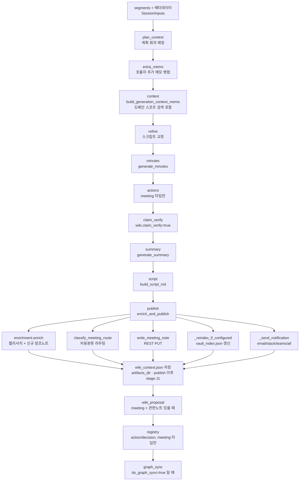

각 스테이지는 독립 try/except라 부가 스테이지 실패가 회의록 생성 자체를 막지 않는다
(`res.errors`에 (stage, message)로 남음).

### ingest 전용 전처리 (STT 특화, finalize 호출 전)

`ingestion_pipeline.IngestionPipeline.ingest()`만 갖는 오디오 특화 단계 — 나머지는 위 공유
흐름과 동일하다.

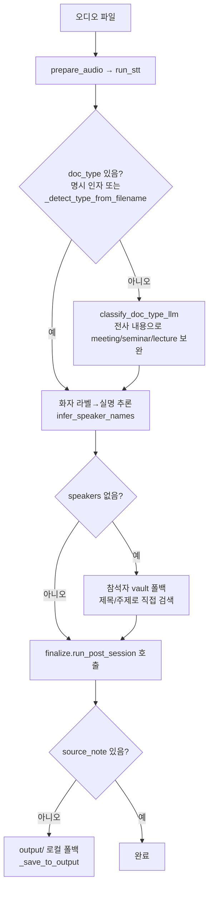

### 단계별 함수 참조

| 단계 | 함수 | 모듈 |
|---|---|---|
| 오디오 변환 | `prepare_audio()` · `split_audio()` | `stt.py` |
| STT | `run_stt()` / `_transcribe_chunk_via_chain()` / `_transcribe_chunk_checked()` | `stt.py` |
| 날짜 파싱 | `parse_session_dt_from_path()` · `parse_iso_date_from_text()` | `date_utils.py` |
| 문서 유형 판별(파일명) | `_detect_type_from_filename()` | `ingestion_pipeline.py` |
| 문서 유형 판별(내용 보완) | `classify_doc_type_llm()` | `meeting_workflow.py` |
| 생성 전 vault 주입 | `build_generation_context_memo()` | `meeting_workflow.py` |
| Wiki Context 저장 | `build_wiki_context_package()` · `save_wiki_context_package()` | `wiki_knowledge.py` |
| 회의록 생성 | `generate_minutes()` | `minutes_generation.py` |
| 요약 생성 | `generate_summary()` | `minutes_generation.py` |
| 액션 아이템 | `extract_action_items()` | `minutes_generation.py` |
| 용어/인물/기업 보완(신규 노트 생성 포함) | `enrich()` | `enrichment.py` |
| 사실 검증 | `claim_verify()` | `meeting_workflow.py` |
| 자동 분류 라우팅 | `classify_meeting_route()` | `meeting_workflow.py` |
| Obsidian 저장 | `write_meeting_note()` | `obsidian.py` |
| 재인덱싱 | `_reindex_if_configured()` | `wiki_knowledge.py` |
| 알림 발송 | `_send_notification()` | `publish.py` → `notifier.py` |
| 액션/결정 Registry 갱신 | `update_action_registry_from_actions()` · `update_decision_registry_from_minutes()` | `wiki_knowledge.py` |
| Wiki Update Proposal | `build_wiki_update_proposal()` · `save_wiki_update_proposal()` | `wiki_knowledge.py` |
| 그래프 동기화 | `sync_session_graph()` | `graph_sync.py` |
| 오케스트레이터 본체 | `run_post_session()` | `finalize.py` |

---

## Vault 검색 2단계 (생성 전)

`build_generation_context_memo()`는 LLM 호출 없이 두 번의 vault 검색으로 생성 전 최대 10개 노트를 주입한다.

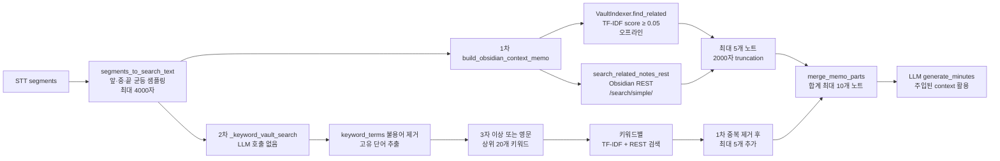

**핵심**: 2차 검색은 LLM 추가 호출 없이 `keyword_terms()`(순수 파이썬)만 사용하므로 비용 없이 컨텍스트 2배 확보.

---

## 사실 검증 (Claim Verify) — 상세

회의록에서 기존 vault 지식과 비교 가능한 사실적 주장을 추출해 검증한다. `current_title`로 자기참조를 방지한다.

용어·배경 enrichment는 사실 검증과 별도 단계다. 외부 검색/LLM 리서치가 신뢰 가능한 설명을 주지 못하거나 "죄송합니다/찾을 수 없습니다" 류의 응답을 반환하면, 해당 문장을 그대로 출력하지 않고 `확인 불가: 외부 검색에서 신뢰할 만한 설명을 찾지 못했습니다.`로 정규화한다. 인물 항목은 동명이인 오염을 피하기 위해 정보 없음 응답이면 제외한다.

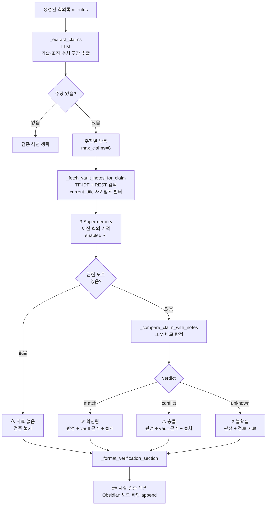

### 판정 기호 의미

| 기호 | 판정 | 표시 내용 |
|---|---|---|
| ✅ `[확인됨]` | vault 지식과 일치 | 판정 한 문장 + vault 근거 원문 + 출처 노트 |
| ⚠️ `[충돌]` | vault 지식과 충돌 | 무엇이 다른지 + vault 근거 원문 + 출처 노트 |
| ❓ `[불확실]` | vault 검토했으나 불확실 | 왜 불확실한지 + 검토한 노트 목록 |
| 🔍 `[자료 없음]` | 관련 자료 자체 없음 | vault 미검색 (검증 불가) |

### `_extract_claims` 추출 기준

**포함** (vault로 검증 가능):
- 기술/제품의 기능·특성 — 예: "Classiq는 양자회로 자동화 플랫폼"
- 조직·회사 역할·관계 — 예: "메가존은 AWS 파트너"
- 이전 합의/체결 사항 — 예: "NDA를 한빛솔루션와 체결"
- 구체적 수치·규모 — 예: "참가팀 30팀", "예산 1억"

**제외** (vault로 검증 불가):
- 이 회의의 날짜·장소
- 이번 회의 신규 결정사항
- 순수 의견·계획·미래 목표

### 자기참조 방지

`current_title` 파라미터로 현재 생성 중인 노트를 검색 결과에서 제외한다.  
`norm_title()` 정규화(공백·특수문자 제거, 소문자)로 제목 변형도 필터링한다.

### 향후: 웹 전문가 의견 검색

`wiki.claim_web_verify=true` (기본값 false)로 활성화하면, 불확실·충돌 주장에 대해 외부 전문가 의견을 추가 검색한다.

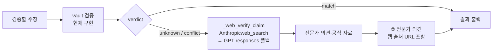

---

## 실시간 파이프라인 (Realtime)

웹/모바일 단독 모드는 `web/frontend/src/lib/api.ts`가 OpenAI Realtime API에 직접 연결한다(직접 WebSocket, 목표 구조는 WebRTC + ephemeral credential). `web/backend/api/realtime.py · BrowserRealtimeSession`은 서버 경로이며, exe가 프런트를 서빙할 때(PC 브라우저)와 **모바일 PC 연결 모드**에서 사용된다 — 기본 전사 방식은 config `realtime.mode`(기본 `http`, 2단계 보정 포함)를 따르고, `auto`/`ws`면 OpenAI Realtime WS로 포워딩 후 실패 시 http로 폴백한다.

### 환각·반복 방어 (2026-07-28)

한국어 회의 전사에 러시아어 조각이 섞이고 같은 문장이 수십 번 반복된 사고의 대책. 네 겹으로 막는다.

| 겹 | 위치 | 내용 |
|---|---|---|
| 입력 | `_run_http_fallback._flush_chunk` / `_revise_worker` | 발화 에너지(RMS)가 없는 청크·보정 윈도는 **STT를 호출하지 않는다**(`realtime.drop_silent_chunks`). 타임라인(`audio_pos_sec`)은 전진시켜 PCM 슬라이싱 정합을 유지 |
| 문맥 | `_chunk_prompt()` | 직전 전사 꼬리를 prompt 로 되먹이지 않는다. 기본은 세션 내내 불변인 정적 힌트(주제·참석자) — `realtime.prompt_context` = `static`(기본)/`tail`/`off`. `tail` 은 꼬리 120자 + 환각 미표시 텍스트만 |
| 언어 | `realtime_ws_session.resolve_session_language()` | `auto` 를 세션 언어 하나로 확정해 전 청크·보정·WS 세션에 동일 값 전달(청크별 언어 재판정 차단). 기본 `ko` |
| 출력 | `common/text_filters.sanitize_transcript()` | 되풀이 축약(`collapse_repetitions`)·중복 제거(`dedupe_segments`)·이질 문자 `[불명]` 표시(`is_script_mismatch`). **모든 진입점이 수렴하는 `finalize.run_post_session()` 진입부**와 `stt.run_stt()`에서 적용 → 배치·CLI·웹·워처가 같은 정화본으로 회의록을 만든다 |

정책은 보수적이다 — 지우는 것은 되풀이뿐이고, 환각 의심은 표시만 남긴다(회의록/교정 프롬프트가 `[불명]`을 무시하도록 지시). 전체 스위치는 `realtime.hallucination_filter`.

> ⚠ `text_filters._CJK_RANGES` 는 반드시 `\uXXXX` 이스케이프로 적는다. 리터럴 한자를 쓰면 편집 중 U+F900 이 U+8C48 로 바뀌어 **한글(U+AC00~)까지 CJK 환각으로 판정**된다(회귀 테스트 `tests/test_text_filters.py::TestScriptRanges`).

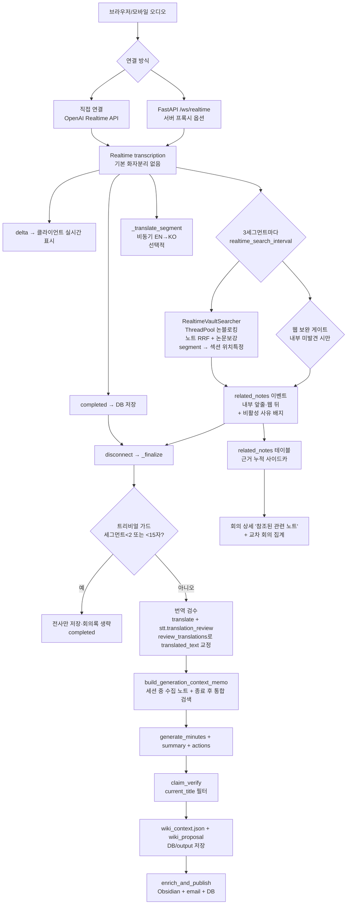

### 배치 vs 실시간 비교

| 항목 | 배치 ingestion | 실시간 WebSocket |
|---|---|---|
| STT | `gpt-4o-transcribe-diarize` 우선 (`/v1/audio/transcriptions`) | Realtime transcription, 기본 화자분리 없음 |
| vault 검색 | 세션 완료 후 2패스 | 세그먼트마다 비동기(내부자료 우선: 노트 RRF + 논문폴더 보강, 후보 안에서 섹션 위치특정) + 세션 종료 후 통합 |
| 실시간 웹 보완 | 해당 없음 | 웹 UI 녹음 전용(`online_search_enabled`+`realtime_web_search_interval`>0), 내부 미발견 시만. **CLI 실시간엔 없음** |
| 회의록 생성 | 전체 전사 후 1회 | 세션 종료 후 1회 |
| 사실 검증 | ✅ (current_title 필터) | ✅ CLI/서버 WebSocket, ❌ standalone/mobile direct |
| Wiki Context/Proposal | ✅ | ✅ CLI/서버 WebSocket, ❌ standalone/mobile direct |
| Supermemory 저장 | ✅ `write_meeting_note()` 성공 시(`finalize.run_post_session()` 경유) | ✅ CLI/서버 WebSocket의 `enrich_and_publish()` 성공 시 |

### 실시간 관련 노트 (내부자료 우선 · 누적)

공용 모듈은 `wiki_core/realtime_search.py`의 `RealtimeVaultSearcher` 한 곳이고, UI별 분기는
호출자(CLI `realtime_transcription`, 웹 `api/realtime.py`)에 둔다. `offer_segment()`는 STT
핫패스에서 호출되므로 **논블로킹·예외 무전파**가 계약이다.

**검색 순서(내부자료 우선).** ① `search()` 노트 인덱스(TF-IDF+임베딩 RRF) — 랭킹의 주축이자
영↔한 교차언어 회수 담당 → ② 논문/이론 폴더(`wiki.realtime_paper_dirs`) 한정 노트 검색 —
로컬 논문이 상한에 밀려 후보에서 빠지는 것을 막는 보강 arm → ③ `sections_in_notes()` 로
**후보 노트 안에서만** 섹션을 채점해 "어느 대목이 근거인가"를 특정(랭킹에는 관여하지 않음).
순위는 ① 랭킹 순서이고 ②에서만 나온 논문 후보가 그 뒤에 붙는다 — **논문은 점수도 순위도
우대하지 않는다.** 후보는 넉넉히(기본 노트 10 + 논문 4) 모아 **전량 누적**하고 **표시만
상위 3개**, 나머지는 종료 후 누적 검토에서 본다. 같은 제목의 다른 노트를 하나로 합치는
것은 **표시·회의록 단계**에서만 한다(누적은 경로로 구분해 전부 남긴다).
웹 검색은 이 모듈이 하지 않는다 — 항상 보완재로 호출자(웹 UI)에서만, 그리고 내부에서
못 찾은 구간에서만(`wiki.realtime_web_only_if_no_vault_hit`).

②의 폴더 매칭은 **경로 중간 일치**(`VaultIndexer.path_matcher(..., "segment")`)다 —
`02_이론_학습` 처럼 볼트 하위(`Archive/…/02_이론_학습`)에 있는 폴더도 잡는다. 배지·출처
판정(`_is_paper_path`)과 **같은 헬퍼**를 쓴다. 규칙이 갈라져 있던 동안 하위 폴더 논문
83노트가 이 arm 에서 영구히 0건이었다(`docs/검색랭킹_이론과근거.md` §5.7).

이 구조는 실측으로 고른 것이다(472노트·3,744섹션 볼트, 합성 쿼리 24건): 논문 폴더 점수 1.2배
가산은 MRR 을 0.920→0.713 으로 떨어뜨렸고(폴더 소속은 관련도의 근거가 아니다), 볼트 전체 섹션
검색을 랭킹 arm 으로 융합해도 회수 이득 없이 로컬 지연만 2.7배(89ms→240ms) 늘었다. 반대로 섹션을
아예 안 쓰면 근거 섹션 정확도가 0 이 된다 — 그래서 **역할 분리**(노트=무엇을, 섹션=어디를)다.
지연 수치는 **로컬 계산만**이며 기본 설정에선 쿼리 임베딩 API 왕복(~270ms)이 더해져 실사용
1회는 0.3~0.5초다(전용 워커 스레드 — 전사 스트림 무영향).
수치·측정 한계·재현 방법은 `docs/검색랭킹_이론과근거.md`(+ `scripts/bench_realtime_ranking.py`).
주의: 낡은 인덱스로 재면 숫자가 통째로 달라진다 — 측정 전 `reindex` 필수.

**비활성 사유 노출.** 인덱스/Obsidian이 모두 없으면 과거처럼 조용히 no-op 하지 않고 사유
(`off`/`no_vault`/`index_missing`/`obsidian_unreachable`/`no_backend`)를 `status()`로 알린다.
웹은 `related_notes` 이벤트의 `status` 필드 → Recorder 상태 배지, CLI는 1회 안내 줄.
`warmup()`이 세션 시작 직후 백엔드를 미리 확인하므로 첫 발화를 기다리지 않는다.

**표시 정책(비방해).** 녹음 중에는 고정 높이 얇은 바를 상시 유지해 결과가 새로 들어와도 전사
본문이 밀리지 않는다(자동 리플로우 0, 팝업·포커스 이동·소리 없음). 내부(📄 노트/🎓 논문)를
웹(🌐)보다 앞줄에 두고, 근거(섹션경로·score·snippet·발화)는 사용자가 '근거 보기'를 눌렀을
때만 펼친다. 녹음 중 노트로 이동하지 않는다 — Recorder 언마운트는 녹음 중단이므로, 노트 이동은
종료 후 회의 상세에서 제공한다.

**누적(사이드카).** 종료 시 `collected_evidence()`(노트별 최고 근거 + 참조 횟수)를 웹 SQLite
`related_notes` 테이블에 upsert 하고, 회의 상세의 "참조된 관련 노트"와 교차 회의 집계
(`related_notes_cross_sessions()`)로 다시 열람한다. 동시에 `finalize`가 근거를 생성 memo에 주입하고
회의록 말미에 `## 🔗 관련 노트` 섹션을 LLM 없이 결정적으로 덧붙인다(사실검증 블록 뒤 → 검증 섹션
재작성에 지워지지 않음). vault 원본은 불변 — 관련정보는 전부 사이드카에 쌓인다.

라이브 스모크 절차는 `docs/SMOKE_실시간_관련노트.md` 참고.

---

## STT 제공자 폴백 체인 (벤더 장애 대비)

전사가 실패하면 회의 기록 자체가 남지 않는다. 그래서 STT는 **한 벤더에 묶이지 않는 체인**으로
동작한다 — OpenAI 두 모델은 같은 벤더라 계정·엔드포인트 장애 시 함께 죽으므로, 진짜 백업은
그 다음 두 단계다.

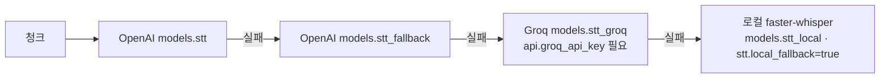

| 경로 | 함수 | 어디까지 폴백하나 |
|---|---|---|
| 업로드·배치·watcher·finalize | `run_stt()` → `_build_stt_provider_chain()` → `_transcribe_chunk_via_chain()` (`stt.py`) | **로컬까지 전부** |
| 실시간 라이브 청크 (웹) | `_run_http_fallback._transcribe_chunk_bytes` (`web/backend/api/realtime.py`) | **Groq까지** (`fallback_provider` 이벤트로 화면에 1회 알림) |
| 실시간 라이브 청크 (CLI) | `RealtimeTranscriber._run_stt` → `_call_stt` (`realtime_transcription.py`) | **Groq까지** (OpenAI 3회 재시도 후) |
| 2-pass 보정(revise) | `_revise_worker` | 폴백 없음 — 실패 시 빠른 패스 결과 유지(그 자체가 이미 Groq로 백업됨) |

라이브 청크에 로컬을 쓰지 않는 이유는 CPU 전사가 실시간을 못 따라가 지연이 세션 내내 누적되기
때문이다. 오프라인에서도 확정 전사·회의록은 종료 후 finalize의 `run_stt`(체인 전체)가 만든다.

**Groq 호출 시 주의점**(`groq_fallback()`이 공용 규칙): 모델명이 `whisper-*`라 `transcribe_chunk`가
자동으로 `verbose_json` 경로를 타고, 화자분리는 없다(`speaker=""`). Whisper 계열 `prompt`는
224토큰 제한이라 실시간 정적 힌트(최대 800자)를 그대로 넘기면 요청이 거절될 수 있어 **Groq
단계에서는 prompt를 생략**한다.

**로컬 단계의 가중치 정책**: `_get_local_model()`은 `local_files_only=True`로만 로딩한다 —
전사 도중 수백 MB 다운로드가 시작돼 처리가 몇 분 멈추는 일을 막기 위함이다. 준비가 안 됐으면
"설정에서 [로컬 백업 모델 준비]를 누르세요" 안내로 **즉시** 실패한다. 다운로드는 웹 [설정] →
오디오 전처리 → `[로컬 백업 모델 준비]`(`POST /api/local-stt/prepare` → `prepare_local_model()`)
에서만 일어나고, 가중치는 `MeetingMinutesData/data/models/`에 저장된다(폴더째 옮겨도 따라간다).
포터블 배포본에는 라이브러리(`faster-whisper`)가 포함되지만 가중치는 포함되지 않는다.

비용 추정(`pricing.STT_PRICE_PER_MIN`)은 **기본 모델 기준**이다. Groq/로컬 단가도 표에 있지만
(폴백 세션의 사후 계산용) 사전 추정은 폴백 여부를 모르므로 실제 청구액과 다를 수 있다.

---

## STT 화자분리 제한 및 개선 계획

### 현재 제한

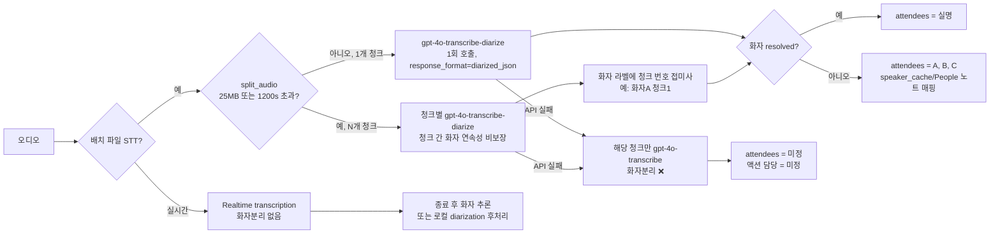

**핵심 제약**: `gpt-4o-transcribe-diarize`는 `/v1/audio/transcriptions` 배치 전사용이며 Realtime API에서는 지원되지 않는다.
`split_audio()`(`stt.py`)는 파일 크기(`MAX_FILE_SIZE_MB=25`) 또는 길이(`MAX_CHUNK_DURATION_SEC=1200s` —
gpt-4o-transcribe 계열 API 자체 한도 ~1400s에 안전 마진을 둔 값) 초과 시 ffmpeg로 미리 청크를
나눈다 — OpenAI `chunking_strategy` 파라미터로 API가 알아서 나누게 하는 방식이 아니라, 호출 전에
직접 분할한다. **2026-07 수정 이전에는** 청크가 2개 이상 필요하면 diarize 모델을 아예 포기하고
전체를 비화자분리 모델로 전사했다(화자 라벨이 청크 경계에서 끊겨 무의미해진다는 이유) — 즉 20분이
넘는 녹음은 화자분리가 원천적으로 불가능했다. **지금은** 청크별로 diarize 모델을 그대로 유지하고
라벨에 청크 번호를 붙여(`화자A (청크1)`) 청크 간 오인 병합만 방지한다 — 청크 내부(~20분)에서는
화자가 정확히 구분되지만, 청크 경계를 넘어 같은 사람이 같은 라벨로 이어진다는 보장은 없다(완전한
해결책은 아래 로컬 diarization 후처리).
**실전에서 확인된 추가 위험**: 사내망 프록시가 `diarize` 엔드포인트 호출 자체를 네트워크 오류
(tcp_error)로 계속 실패시켜, 코드가 정상이어도 매 청크가 비화자분리 모델로 폴백하는 사례가
관측됐다 — 화자분리가 안 될 때는 코드 버그보다 이 가능성부터 로그(`청크 N/M 처리 중` 다음 줄의
`WARNING ... 실패`)로 확인할 것.

### provider 분리 방향

| provider | 용도 | 화자분리 | 비고 |
|---|---|---|---|
| OpenAI file STT | 배치 파일 전사 | `gpt-4o-transcribe-diarize` | `diarized_json`, `chunking_strategy`, known speaker reference 검토 |
| OpenAI Realtime | 낮은 지연 실시간 전사 | 기본 없음 | 종료 후 화자 추론/후처리로 보강 |
| pyannote/WhisperX | 로컬 후처리 | 가능 | 회사 음성 외부 전송 최소화 |
| Deepgram/AssemblyAI | 외부 managed STT | 가능 | 데이터 거버넌스 확인 필요 |

반복 회의 참석자는 known speaker reference와 `speaker_cache.py`/People 노트 기반 실명 매핑을 함께 검토한다.

### 개선 선택지

#### A. 로컬 오픈소스 — pyannote.audio (+ WhisperX) ★프라이버시 우선

- **장점**: 무료, 오디오가 회사 PC 밖으로 나가지 않음 (회사 회의에 적합)
- **단점**: HuggingFace 토큰 + 모델 라이선스 동의 필요, `torch`·`pyannote.audio` 의존성 (수 GB)
- **연동 방식**: diarization으로 `(시작~끝, 화자)` 구간 추출 → 기존 OpenAI 전사 세그먼트에 타임스탬프로 화자 라벨 부여

#### B. 클라우드 API — Deepgram / AssemblyAI ★도입 난이도 낮음

- **장점**: 오디오 한 번 업로드로 전사+화자 라벨 동시 획득, 코드 최소화
- **단점**: 분당 과금, **회사 회의 음성 외부 전송** → 데이터 거버넌스 확인 필수
- **연동 방식**: STT 자체를 이 API로 교체 (전사+화자 동시 획득)

**권장**: 회사 회의는 **A(로컬 pyannote)** 권장. 빠른 파일럿이 필요하면 허용 범위 내에서 B로 시작 후 A 정착.

---

## 노트 저장 구조 (Obsidian)

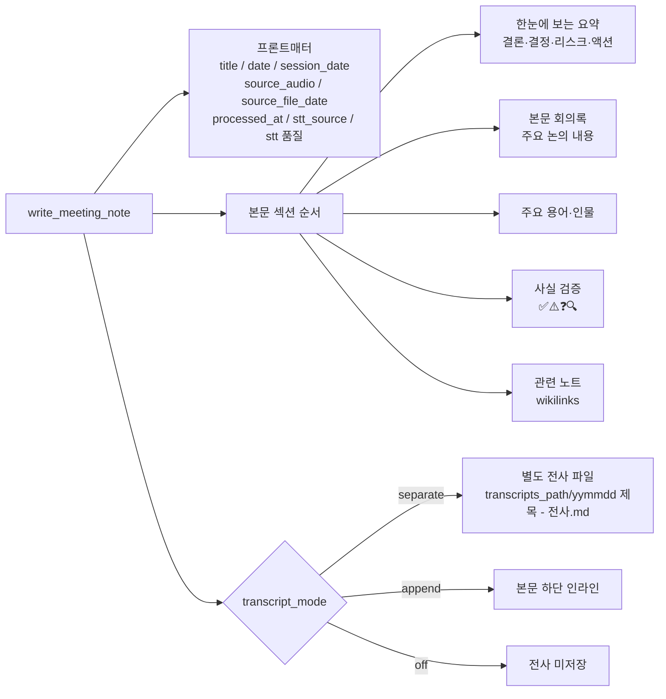

### 요약 vs 회의록 역할

| 항목 | 한눈에 보는 요약 | 회의록 본문 |
|---|---|---|
| 목적 | 빠른 판단 (30~60초) | 업무 기록·근거 보관 |
| 포함 | 결론, 결정/합의, 리스크, 액션 | 안건별 상세 논의, 근거와 수치, 미정 사항 |
| 제외 | 상세 발언 흐름, 수치 근거 | (전사는 별도 파일) |

요약과 회의록이 같은 불릿을 반복하면 실패한 출력이다.

---

## 참조 노트 자동 보강 (Reference Note Enrichment)

`enrichment.enrich()`(용어·인물·기업 설명)와 `meeting_workflow._save_out_domain_fact_note()`(도메인 외 사실검증)가
공통으로 쓰는 `obsidian.ObsidianClient.create_reference_note()`는, 과거엔 동일 이름 노트가 이미 있으면
무조건 스킵하고 아무것도 갱신하지 않았다 — 같은 인물/용어가 열 번째 회의에서 언급돼도 노트는
최초 생성 시점 그대로 멈춰 있었고, 웹 검색은 매번 새로 수행되고도 결과가 버려지는 낭비가 있었다.

지금은 기존 노트를 찾으면 다음을 수행한다:

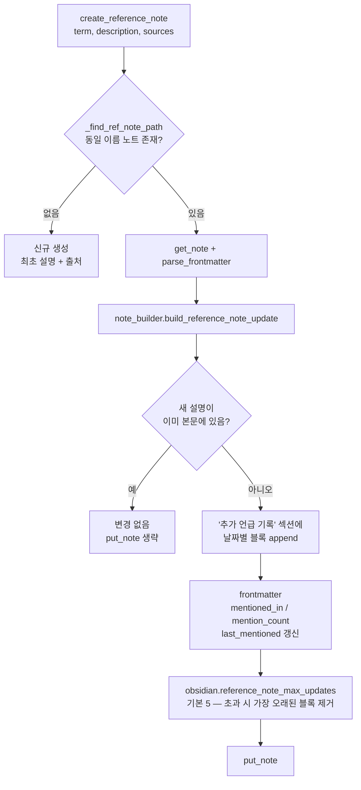

`mentioned_by`(회의/세션 제목)는 `enrich()`/`_save_out_domain_fact_note()` 양쪽에서 스레딩되어
frontmatter `mentioned_in` 목록에 누적된다. 순수 병합 로직(`build_reference_note_update()`)은
`note_builder.py`에 있어 HTTP 의존성 없이 단위 테스트 가능하다.

---

## 본문 자동 위키링크 (autolink_entities)

`enrichment.enrich()`의 엔티티 추출 결과는 과거엔 글로서리 섹션("용어·배경")에만 반영되고,
회의록 본문 텍스트 안에서 그 엔티티가 언급된 지점에는 링크가 걸리지 않았다. `enrich()`는 이제
`entity_links: {표시명: 참조노트 basename}`을 함께 반환하고, `publish.enrich_and_publish()`가
`enrichment.autolink_entities(minutes_md, entity_links)`를 발행 직전에 적용한다.

각 엔티티명의 **첫 등장 위치만** `[[노트]]`(표시명이 다르면 `[[노트|표시명]]`)로 감싸며,
헤딩 라인이나 이미 위키링크 안에 있는 등장은 건너뛰고 다음 등장을 계속 탐색한다(순수 함수,
`meeting_pipeline/enrichment.py`).

---

## Obsidian Markdown Knowledge Graph 운영 모델

본 시스템의 최종 목표는 회의록 자동 생성이 아니라, 회의·세미나·강의에서 발생하는 조직 지식을 Obsidian Markdown 기반 지식 그래프로 축적하고 다음 회의 준비, 실시간 보조, 회의 후 검증, Wiki 업데이트에 재사용하는 것이다.

### 노드 유형

| 노드 유형 | 예시 파일 | 설명 |
|---|---|---|
| Meeting | `회의별/2026/260701 Q3 전략회의.md` | 회의록 |
| Seminar | `세미나/260701 양자컴퓨팅 세미나.md` | 세미나 기록 |
| Transcript | `전사/2026/260701 Q3 전략회의 - 전사.md` | 원문 전사 |
| Person | `People/홍길동.md` | 참석자, 발표자, 담당자 |
| Organization | `Organizations/ABC Corp.md` | 고객사, 파트너, 벤더 |
| Project | `Projects/M365 백업 검토.md` | 프로젝트/업무 주제 |
| Topic | `Topics/양자컴퓨팅.md` | 기술/업무 주제 |
| Decision | `Decisions/260701 백업 솔루션 PoC 결정.md` | 결정사항 |
| Action | `Actions/260701 홍길동 자료조사.md` | 액션 아이템 |
| Reference | `References/논문명.md` | 논문, 기사, 외부 자료 |

### 링크 규칙

- 회의록은 관련 프로젝트, 참석자, 조직, 기술 주제를 wikilink로 연결한다.
- 결정사항과 액션 아이템은 registry와 함께 Markdown 노트 또는 섹션 anchor로 관리한다.
- 세미나 기록은 발표자, 기관, 논문, 기술 주제와 연결한다.
- 자동 생성된 링크는 `## 관련 노트`에 우선 배치하고, 원본 Wiki 수정은 `wiki_proposal.md` 검토 후 수동 반영한다.

권장 meeting frontmatter:

```yaml
---
type: meeting
title: "Q3 전략회의"
date: 2026-07-01
session_date: 2026-07-01
project:
  - "[[M365 백업 솔루션 검토]]"
people:
  - "[[홍길동]]"
organizations:
  - "[[한빛솔루션]]"
topics:
  - "[[M365 백업]]"
decisions:
  - "[[260701 PoC 후보 3개 선정]]"
actions:
  - "[[260701 홍길동 - 벤더별 기술요건 확인]]"
source_audio: "260701_Q3전략회의.m4a"
stt_model: "gpt-4o-transcribe-diarize"
llm_model: "claude"
run_id: "..."
review_status: pending
confidence: medium
source_type: generated
evidence:
  - "[[M365 백업 솔루션 검토#PoC 후보]]"
  - "[[260701 벤더 미팅 메모]]"
---
```

`review_status`/`confidence`/`source_type`/`evidence`는 `write_meeting_note()`가 매 실행마다 자동 기록하는 **Personal Wiki Schema** 필드다 (`obsidian.py`).
`review_status`는 항상 `pending`으로 시작하며, 사람이 노트를 검토한 뒤 Obsidian에서 직접 `reviewed`로 바꾼다 —
코드가 자동으로 `reviewed`/`curated`로 승격하지 않는다. `evidence`는 회의록 생성에 실제 주입된 근거를
`[[노트#헤딩]]`(섹션 인덱스 히트) 또는 `[[노트]]`(whole-note 히트) 형식으로 기록한 목록이며,
`build_generation_context_memo()`의 `flags["evidence"]`에서 그대로 파생된다.

실시간 중에는 서버 경로 기준으로 발화 → 기존 Obsidian 노드 매칭 → 관련 노트 표시 → 종료 후 `wiki_context.json`/`wiki_proposal` 저장으로 운영한다. 프론트 standalone/mobile direct OpenAI 경로는 로컬 기기 안에서 전사·요약만 수행하므로 Wiki 운영 기록으로 간주하지 않는다. 세미나 후에는 발표자/기관/논문/기술/제품/사례를 추출해 Topic/Reference 노트 업데이트 후보로 남긴다.

---

## 프로젝트 볼트 경로 설정

```jsonc
"obsidian": {
  "vault_path":        "D:\\Obsidian\\MyVault",
  "project":           "양자",
  "project_domains": {
    "양자": "Archive/도메인_아카이브"
  },
  "ref_domains": {
    "양자": "퀀텀",
    "백서온톨로지": "GraphDB-온톨로지"
  },
  "meetings_path":     "{project}/01_회의_세미나/회의별/{year}",
  "transcripts_path":  "{project}/01_회의_세미나/전사/{year}",
  "transcript_mode":   "separate",
  "auto_route_enabled": true,
  "auto_register_categories": true,
  "meeting_categories": {
    "양자": { "mode": "domain", "keywords": ["양자", "퀀텀", "..."] },
    "PhysicalAI": { "mode": "folder", "folder": "00_Meetings/PhysicalAI", "keywords": ["PhysicalAI", "..."] },
    "백서온톨로지": { "mode": "folder", "folder": "00_Meetings/백서온톨로지", "keywords": ["백서", "온톨로지", "..."] },
    "팀회의": { "mode": "folder", "folder": "00_Meetings/팀회의", "keywords": ["팀회의", "..."] }
  }
},
"indexing": {
  "vault_path": "D:\\Obsidian\\MyVault"
}
```

| 저장 위치 | 경로 |
|---|---|
| 회의록(mode:"domain" 도메인, 예: 양자) | `D:\Obsidian\MyVault\Archive\도메인_아카이브\01_회의_세미나\회의별\{year}\yymmdd 제목.md` |
| 전사 | `D:\Obsidian\MyVault\Archive\도메인_아카이브\01_회의_세미나\전사\{year}\yymmdd 제목 - 전사.md` |
| 회의록(mode:"folder" 카테고리) | `D:\Obsidian\MyVault\00_Meetings\{팀회의\|주간보고\|외부회의\|백서온톨로지\|기타}\yymmdd 제목.md` — meeting_categories의 `folder` 필드 그대로 |
| 참조노트(용어·기술) | `D:\Obsidian\MyVault\01_References\{ref_domains 매핑값, 없으면 project_domains 마지막 경로 조각}\` — `공통`은 project 미설정 시절 히스토리 유지용 |
| 로컬 폴백 (Obsidian 꺼짐) | `./output/YYYYMMDD_HHMMSS_제목/recording_note.md` |

**경로 토큰**: `{year}`, `{yyyy}`, `{yy}`, `{month}` — 회의 날짜 기준으로 치환. `{project}` —
`ObsidianClient._project_domain()`(project_domains 매핑 결과)로 치환.
파일명 prefix는 회의 날짜 기준 `yymmdd`입니다. `260627_5.m4a`, `20260627_*`, `2026-06-27 14.10_*` 같은 파일명에서 날짜를 추출합니다.

### 회의 자동 분류 라우팅 (`obsidian.auto_route_enabled`)

`--project` 플래그 없이도 제목/주제/스크립트로 저장 위치를 자동 결정한다.
`meeting_workflow.classify_meeting_route(title, topic, script_excerpt, llm)`가:

1. `obsidian.meeting_categories`로 키워드 매칭 — 매칭된 카테고리가 `mode:"domain"`이면
   도메인 아카이브 경로로(그 키는 `project_domains`에도 반드시 등록돼 있어야
   `meetings_path`의 `{project}` 토큰이 해석됨), `mode:"folder"`(기본값)면 그 카테고리의
   `folder` 필드를 그대로 저장 폴더로 쓴다. **카테고리 자신이 모드를 직접 선언**하므로
   `project_domains`에 그 키가 있는지로 모드를 추론하지 않는다(2026-07 재설계 — 예전엔
   `category_keywords`와 `project_domains` 두 딕셔너리를 손으로 동기화해야 했고, 하나를
   빠뜨리면 조용히 잘못된 경로로 샜다. 예: 백서온톨로지가 실수로 `project_domains`에도
   등록돼 있으면 기존 `00_Meetings/백서온톨로지` 대신 새 아카이브 경로로 갈 뻔했다).
2. 매칭 안 되면(전부 0점) LLM에게 기존 카테고리 중 하나를 고르거나, 반복될 만한 새 주제라고
   판단되면 새 카테고리(이름+키워드)를 제안하게 한다.
3. `obsidian.auto_register_categories=true`(기본)면 LLM이 발견한 새 카테고리를
   `config_loader.set_nested()`로 `config.json`의 `meeting_categories`에 `mode:"folder"`로
   즉시 등록 — 다음부터는 같은 주제가 LLM 호출 없이 키워드만으로 인식된다. 새 카테고리는
   항상 `00_Meetings/<이름>`으로만 생성되고, 양자처럼 전용 아카이브 구조(`mode:"domain"`)로
   승격하려면 `meeting_categories`와 `project_domains` 양쪽에 수동으로 등록해야 한다.
4. 전부 실패(매칭 없음 + LLM도 실패)하면 `00_Meetings/기타`로 폴백 — static `obsidian.project`
   기본값으로 조용히 흘러가지 않는다.

`publish.enrich_and_publish()`(배치/실시간/화자수정/웹)와 `ingestion_pipeline.ingest()`(watcher
자동처리) 양쪽 모두 이 분류기를 거친다. 참조노트 폴더(`_refs_subfolder()`)는 별도 매핑
`obsidian.ref_domains`를 먼저 보고(이미 수동으로 만들어둔 참조노트 폴더가 있을 때 새 폴더가
안 생기게), 없으면 `project_domains` 값의 마지막 경로 조각(아카이브 접두사 제외)으로 폴백한다 —
회의 저장 위치(`meeting_categories`)와 참조노트 폴더명은 서로 다른 관심사라 독립적으로 관리한다.

### 도메인 스코프 검색 (prep-brief / wiki-ask / 실시간 관련노트)

`vault_retrieval.detect_query_domain(text)`가 질문/메모/제목에서 카테고리를 감지하면
`domain_search_prefixes(category)`가 검색 범위를 좁힌다 — `mode:"domain"` 카테고리(양자)면
`[전용 아카이브 경로, "01_References"]`, `mode:"folder"` 카테고리(팀회의/외부회의 등)면
`[00_Meetings/<카테고리 폴더>, "01_References"]`. (2026-07 수정 — 과거엔 `project_domains`에 등록된
도메인 카테고리만 감지 대상이었고, 폴더형 카테고리는 전용 스코프가 없어 항상 볼트 전체 검색으로
빠졌다.) 아무 카테고리도 감지되지 않으면 필터 없이 볼트 전체를 검색한다(기존 동작). `wiki_ask.py`,
`wiki_knowledge.py`(prep-brief), 회의록 생성 컨텍스트(`vault_retrieval.build_obsidian_context_memo()`),
사실 검증(`meeting_workflow._fetch_vault_notes_for_claim()`) 네 곳에 연결돼 있다.

**도메인 아카이브 오염 방지 하드 게이트 (`is_domain_mismatched()`, 2026-07 추가)**: 실전에서
무관한 팀 회의 스크립트에 "양자컴퓨터"라는 말이 지나가듯 한 번 언급됐다는 이유만으로, 검색이
완전히 무관한 양자 아카이브 노트를 "관련 노트"로 끌어와 LLM이 그 내용을 회의록에 섞어버리는
컨텍스트 오염 사고가 실제로 발생했다. `is_domain_mismatched(note_path, query_text)`는 후보
노트의 `note_path`가 특정 도메인 전용 아카이브(`obsidian.project_domains`) 소속인데, 쿼리에
그 도메인 키워드(`meeting_categories[domain].keywords`)가 **서로 다른 것으로 2개 이상** 나오지
않으면 True(배제)를 반환한다 — 키워드 1개(예: "양자" 한 단어)만 우연히 겹치는 것은 신호로
인정하지 않는다. `note_domain_score(title, content, query, note_path)`는 내부적으로 이 게이트를
먼저 거쳐 걸리면 무조건 0점을 반환하고, `build_obsidian_context_memo()`(회의록 생성 컨텍스트)와
`_fetch_vault_notes_for_claim()`(사실 검증)가 이를 통해 후보를 채택/배제한다. relevance
재채점이 원래 없던 `wiki_knowledge._get_brief_related_notes()`(prep-brief)는 기존 TF-IDF 랭킹을
그대로 신뢰하되 `is_domain_mismatched()`만 직접 호출해 도메인 오염만 걸러낸다(전체 재채점을
끼얹으면 원래 신뢰하던 관련 결과까지 걸러지는 부작용이 있어 분리함). 세 경로 모두 REST 검색
결과의 path가 필요해 `search_related_notes_rest(..., return_paths=True)`로 path를 함께 반환하도록
확장했다. `build_related_notes_memo()`/`build_related_sections_memo()`가 조립하는 프롬프트에도
"주제가 스크립트와 명백히 무관하면 완전히 무시하라"는 지시를 추가해 LLM 쪽 방어선도 함께
강화했다.

### 다중 도메인 (같은 볼트, 두 번째 프로젝트 추가)

`meetings_path`/`transcripts_path`/`papers_path`에 `{project}` 토큰을 넣고 `project_domains`에
도메인을 여러 개 등록하면, 같은 볼트 안에서 도메인별로 완전히 다른 최상위 폴더에 저장된다
(그래프 `wiki_graph.db`와 TF-IDF 인덱스 `vault_index.json`은 도메인 무관 구조라 그대로 통합
검색됨 — 코드 수정 불필요). `auto_route_enabled=true`면 위 자동 분류가 우선 적용되고,
수동으로 세션 단위 오버라이드하려면 `ObsidianClient.from_config(project_override=...)` 또는
CLI `--project` 플래그(`prep-brief --project PhysicalAI`,
`python -m ...obsidian --project PhysicalAI --init-vault`)를 쓴다.

새 도메인 최초 등록 시 `python -m meeting_minutes_app.wiki_core.obsidian --project <도메인> --init-vault`로
`01_References/<도메인>/_index.md` 등 표준 참조 폴더를 스캐폴딩한다(기존 콘텐츠에 영향 없음, 멱등).

현재 설정 확인:
```bash
python run_meeting.py obsidian --where
python run_meeting.py obsidian --project PhysicalAI --where
```

---

## 모듈 요약

| 모듈 | 역할 | 주요 함수 | 외부 호출 |
|---|---|---|---|
| `meeting_pipeline/meeting_minutes.py` | 배치 CLI(`main()`) + 공용 상수/로깅/파일명·비용 유틸 | `main()`, `setup_logging()`, `estimate_cost()`, `find_existing_output_dir()`, `load_segments_from_transcript()` | — |
| `meeting_pipeline/stt.py` | 오디오 준비(전처리 필터 포함) + STT(OpenAI Transcription API) + 영→한 번역 + 번역 검수. `prepare_audio()`는 config `stt.preprocess_audio`(loudnorm, 기본 켜짐)·`stt.trim_silence`(silenceremove, 기본 꺼짐)로 ffmpeg `-af` 필터를 구성한다(필터 실패 시 원본/무필터 폴백). `review_translations()`는 (원문,번역) 쌍을 주제 맥락으로 대조해 오역·누락만 문장 단위로 교정 | `_audio_filters()`, `prepare_audio()`, `split_audio()`, `run_stt()`, `translate_segments()`, `review_translations()`, `review_translation_segments()` | OpenAI STT |
| `meeting_pipeline/script_formatting.py` | STT 세그먼트 → 스크립트(Transcript) 마크다운 변환 | `build_script_md()` | — |
| `meeting_pipeline/minutes_generation.py` | 회의록/세미나/강의 프롬프트 + 생성 (회의록·요약·액션아이템·스크립트 교정·화자 추론). 회의록 생성은 `_minutes_is_usable()` 품질 게이트로 필수 섹션 누락/과도한 축약을 감지해 1회 재시도하며, 액션 아이템 추출은 발췌 한도 초과 시 청크 분할 후 병합·dedup한다 | `generate_minutes()`, `generate_summary()`, `extract_action_items()`, `_minutes_is_usable()`, `refine_script()`, `infer_speaker_names()` | GPT-4o, Claude |
| `meeting_pipeline/publish.py` | 후처리 발행 — 알림 발송, 계획(planned) 노트 매칭/병합, Obsidian 기록 | `enrich_and_publish()`, `plan_context_memo()`, `_send_notification()` | Obsidian REST, SMTP/Webhooks |
| `meeting_pipeline/pipeline.py` | 단일 오디오 파일 전체 처리 오케스트레이션 (stt/script_formatting/minutes_generation/publish 통합). 순서는 **STT → 교정(원문 언어) → 번역 → 번역 검수 → finalize**: `refine_script()`를 번역 전 원문 세그먼트에 적용해 원문 STT 오류를 교정하고(교정본은 `finalize`에 `precomputed_refined`로 전달, 회의록은 한국어 출력), 번역은 그 뒤 별도로 수행한다(과거엔 번역→교정 순이라 refine이 원문을 못 봤다) | `process_single()` | 위 4개 모듈 |
| `common/llm_client.py` | LLM 클라이언트 (GPT-4o ↔ Claude 폴백) — `wiki_core`/`meeting_pipeline` 공용 | `LLMClient`, `make_openai_client()`, `make_anthropic_client()` | OpenAI, Anthropic |
| `meeting_pipeline/date_utils.py` | batch/ingest 날짜 파싱 (meeting_pipeline 전용) | `parse_session_dt_from_path()`, `parse_iso_date_from_text()`, `iso_to_yymmdd()` | 표준 라이브러리 |
| `meeting_pipeline/meeting_workflow.py` | 회의록 생성 컨텍스트 오케스트레이션, claim verify, 회의 자동분류/문서유형 판별. `_extract_claims()`는 발췌 한도 초과 시 청크 분할 후 청크 간 라운드로빈으로 `max_claims`를 채워 회의 뒷부분 주장 누락을 방지한다. `graph_expand_titles()`는 note/person/organization/topic 타입을 순서대로 조회한다 | `build_generation_context_memo()`, `_keyword_vault_search()`, `claim_verify()`, `_extract_claims()`, `_fetch_vault_notes_for_claim()`, `graph_expand_titles()`, `classify_meeting_route()`, `classify_doc_type_llm()` | VaultIndexer, Obsidian REST, LLM, Graph DB |
| `wiki_core/vault_retrieval.py` | 도메인 무관 vault/Obsidian 검색·메모 헬퍼, 도메인 스코프 검색 감지 | `load_vault_indexer()`, `load_obsidian_client()`, `search_related_notes_rest()`, `build_obsidian_context_memo()`, `detect_query_domain()`, `domain_search_prefixes()` | VaultIndexer, Obsidian REST |
| `meeting_pipeline/ingestion_pipeline.py` | 오디오→STT→문서유형 판별→`finalize.run_post_session()` 위임(watcher 자동처리 경로. 배치/웹/CLI실시간과 동일한 enrichment/재인덱싱/그래프동기화를 탐) | `IngestionPipeline.ingest()`, `_detect_type_from_filename()`, `_detect_meeting_scope()`, `_expected_recording_note_paths()` | `finalize.py`, `stt.py` |
| `wiki_core/wiki_knowledge.py` | Wiki 지식 순환 — 준비 브리프 + Registry + Context Package. `extract_decisions_from_minutes()`는 결정 항목 아래 "배경:" 서브라인을 rationale로 함께 파싱해 `{"summary","rationale"}` dict로 반환(하위호환 문자열 입력도 허용) | `build_prep_brief()`, `load_action_registry()`, `load_decision_registry()`, `extract_decisions_from_minutes()`, `build_wiki_update_proposal()`, `build_wiki_context_package()`, `save_wiki_context_package()` | VaultIndexer, Obsidian REST (LLM 호출 없음) |
| `wiki_core/graph_db.py` | Wiki Knowledge Graph SQLite 저장소 | `upsert_node()`, `upsert_edge()`, `get_node_by_key()`(진행 중인 트랜잭션 재사용 가능), `get_neighbors()`, `find_path()`, `get_session_subgraph()` | `data/wiki_graph.db` |
| `wiki_core/graph_sync.py` | registry/vault/세션 산출물 → 그래프 동기화, 엔티티 정규화. `backfill_from_vault()`는 노트 자신이 참조 노트(인물/기업/용어 설명)면 `note` 타입 대신 그 엔티티 타입으로 직접 upsert해 다른 글의 위키링크가 만드는 노드와 하나로 합쳐진다(과거 note/entity 이중 정체성 해소). `merge_note_duplicates_into_entities()`는 이 수정 이전에 만들어진 기존 중복을 정리하는 1회성 마이그레이션 | `backfill_from_registries()`, `backfill_from_vault()`, `sync_session_graph()`, `resolve_canonical_key()`, `_resolve_or_create_note_node()`, `merge_note_duplicates_into_entities()` | graph_db, wiki_knowledge |
| `wiki_core/vault_indexer.py` (~770줄) | TF-IDF/하이브리드 오프라인 인덱서. `search()`/`find_related()`/`search_sections()`는 `path_prefixes` 인자로 도메인 스코프 검색(위 "도메인 스코프 검색" 절)을 지원 | `VaultIndexer.build()` (한국어 바이그램+영어), `.load()`, `.search()` (RRF 융합, path_prefixes), `.find_related()` | 파일시스템, OpenAI 임베딩(선택) |
| `wiki_core/obsidian.py` (~1070줄) | Obsidian REST API 클라이언트 (노트 포맷팅은 `note_builder.py`로 분리). `create_reference_note()`는 동일 이름 노트가 이미 있으면 스킵 대신 "추가 언급 기록" 섹션으로 보강한다 — "참조 노트 자동 보강" 절 참고. `write_meeting_note()`는 `output_folder` 인자로 자동분류 라우팅 결과를 받는다(2026-07: 녹음 전용이던 `write_recording_note()`는 watcher가 이 함수로 통합되며 삭제됨) | `ping()`, `ensure_running()`, `search_simple()`, `get_note()`, `put_note()`, `write_meeting_note()`, `create_reference_note()`, `parse_frontmatter()` | https://127.0.0.1:27124 |
| `wiki_core/note_builder.py` | Obsidian 노트 마크다운/frontmatter 조립 (순수 함수, HTTP 의존성 없음) | `build_frontmatter()`, `build_meeting_note_content()`, `build_reference_note_update()` | — |
| `wiki_core/supermemory_client.py` | Supermemory SDK 래퍼 — 크로스세션 팩트 메모리 | `SupermemoryClient.save()`, `.search()`, `get_client()` | Supermemory API 또는 로컬 서버 |
| `meeting_pipeline/enrichment.py` | 엔티티 추출 + 참고 노트 생성/보강 + 본문 자동 위키링크 | `enrich()`, `autolink_entities()` | LLM (웹리서치 선택적) |
| `common/notifier.py` | 이메일/Slack/Teams 알림 | `_build_html_body()`, `_send_email()`, `_send_email_summary()` | SMTP, Webhooks |
| `common/text_filters.py` | STT 환각·반복 정화 (순수 함수, 전 경로 공용 — "환각·반복 방어" 절 참고). 문자 범위는 반드시 `\uXXXX` 이스케이프 | `sanitize_transcript()`, `collapse_repetitions()`, `dedupe_segments()`, `is_script_mismatch()`, `is_cjk_hallucination()`, `mark_suspect()` | 표준 라이브러리 |
| `common/realtime_ws_session.py` | 실시간 세션 설정 빌더 + 모델/언어 정규화 (CLI·웹 공용) | `build_ws_session_config()`, `normalize_ws_model()`, `resolve_session_language()` | 표준 라이브러리 |
| `meeting_pipeline/vault_audio.py` | 임베드 오디오 처리 | `process_vault()`, `merge_into_note_file()` | stt.py/minutes_generation.py 재사용 |
| `cli.py` / `cli_init.py` | `meeting-minutes` 콘솔 커맨드 디스패치 / 최초 설정 마법사 | `dispatch()`, `run_init()` | 하위 모듈 subprocess 호출 |
| `web/backend/api/graph.py` | Wiki Knowledge Graph 조회 REST (읽기 전용) | `list_nodes()`, `get_node_neighbors()`, `get_session_subgraph()` | graph_db |
| `web/backend/api/realtime.py` | WebSocket 실시간 전사 | `BrowserRealtimeSession`, `_handle_event()`, `_finalize()` (finalize.run_post_session 위임) | OpenAI Realtime API, wiki_core/realtime_search |

---

## Wiki 지식 순환 (prep-brief)

`wiki_knowledge.py`는 회의 **전** 준비 브리프를 LLM 없이 생성하는 독립 모듈이다. 기존 파이프라인에 영향을 주지 않는다.

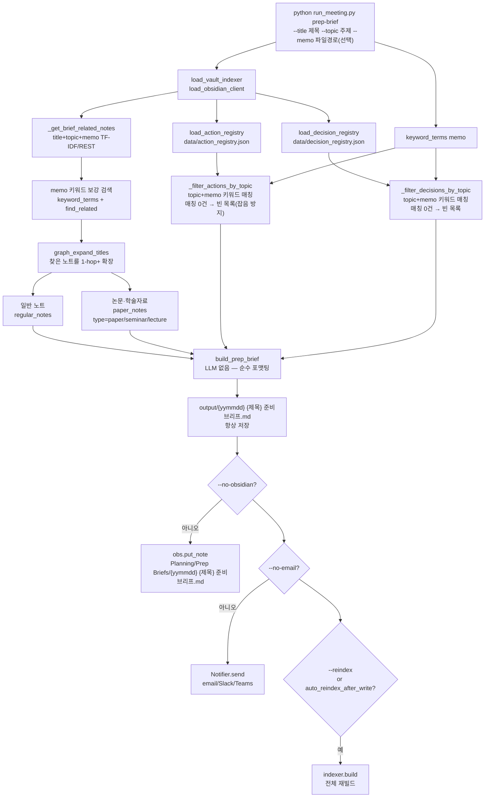

**`--memo` 옵션**(파일 경로, batch의 `--memo`와 동일 방식): 회의 전 아젠다/메모 텍스트를 관련 노트 검색(TF-IDF 쿼리 확장 + 키워드 보강 검색 + 그래프 확장)과 액션/결정 필터링 양쪽에 반영한다. 실제 예정 회의 메모로 검증한 결과, 참석자 이름·회사명이 일치하는 과거 회의록·조직도 노트를 정확히 찾아냈다. `_filter_actions_by_topic()`/`_filter_decisions_by_topic()`은 필터 기준(topic/attendees/memo 키워드)이 있는데 매칭이 하나도 없으면 **전체를 반환하지 않고 빈 목록을 반환**한다 — registry에 여러 프로젝트가 섞여 있을 때 무관한 다른 프로젝트의 액션/결정을 잡음으로 보여주지 않기 위함(과거엔 "매칭 없음 → 전체 반환" 폴백이 있어 이 문제가 있었다).

### Registry 파일

| 파일 | 설명 | git |
|---|---|---|
| `data/action_registry.json` | 오픈 액션 목록 (수동 편집) | ❌ gitignored |
| `data/decision_registry.json` | 결정 사항 누적 (수동 편집) | ❌ gitignored |
| `output/{yymmdd} {제목} wiki_proposal.json/.md` | Wiki 업데이트 후보 (자동 생성, 수동 검토) | output/ 저장, git 미포함 |

첫 실행 시 빈 구조(`{"version":"1.0","actions":[]}`)로 자동 생성. `_atomic_write_json()`으로 원자적 기록.

#### wiki_proposal.json v2

`claim_verify()`가 반환하는 구조화 결과(`claim_results`)가 `build_wiki_update_proposal()`에 전달되면,
기존 `proposals`(관련 노트별 추가 초안) 외에 새 LLM 호출 없이 3개 배열이 함께 생성된다:

| 필드 | 내용 | 파생 조건 |
|---|---|---|
| `new_questions` | `{"text","source_meeting","status":"open"}` | `verdict == "unknown"` |
| `new_claims` | `{"claim","verdict","evidence_notes","status":"unverified"}` | `verdict in ("unknown","conflict")` |
| `conflicts` | `{"claim","existing_note","existing_excerpt","note"}` | `verdict == "conflict"` |

`.md`에는 값이 있을 때만 `## 새 질문 후보` / `## 검증 필요 주장` / `## 충돌 항목` 섹션이 추가된다.
사람이 검토 후 Wiki에 질문 노트·검증 대기 목록으로 직접 반영한다 — 자동 반영 없음.

### 인덱스 갱신 이슈

`obs.put_note()` 후 `data/vault_index.json`은 자동 갱신되지 않는다 (기존 제한). 대응:
- `config.indexing.auto_reindex_after_write=true`(**기본값**) 시 저장 후 자동 재빌드(인덱스+그래프). 임베딩은 증분이라 새 노트만 재계산(저렴·후처리라 대기 없음)
- 대용량 볼트에서 매번 수 초가 부담이면 `false`로 끄고 `python run_meeting.py reindex` 수동 실행

---

## Ask My Wiki (wiki_ask.py)

```bash
python run_meeting.py wiki-ask --question "M365 백업 검토 현황 알려줘" --show-sources
```

`section_index_enabled=true`이면 `WikiQA._gather_context()`가 whole-note 검색 전에
`find_related_sections()`로 heading 단위 근거를 먼저 수집하고(동일 노트는 섹션 히트를 우선),
LLM은 다음 고정 답변 구조를 반드시 따르도록 강제된다:

```md
## 요약 답변
## 상세 답변          (기존 [출처: [[노트#헤딩]]] 인용 규칙 유지)
## 근거               (실제 사용한 [[노트#헤딩]] / [[노트]] 목록)
## 확실한 내용
## 불확실한 내용
## 다음 액션 또는 업데이트 후보
```

`ask()`가 반환하는 dict의 top-level 키(`answer`/`sources`/`has_conflict`/`unverified`)는 이전과
동일하다 — `sources`의 각 항목에 `heading`(nullable)만 추가됐다.

---

## 외부 API 연결

| API | 용도 | 호출 모듈 | 비고 |
|---|---|---|---|
| OpenAI Realtime API | 낮은 지연 실시간 전사 | `realtime_transcription.py` · `web/backend/api/realtime.py` · `web/frontend/src/lib/api.ts` | Realtime은 기본 화자분리 없음. 브라우저/모바일은 직접 연결, 서버 수신 오디오는 WebSocket 프록시 옵션 |
| OpenAI Chat API | 회의록·요약·액션·사실검증 | `LLMClient._gpt()` | gpt-4o 기본, 폴백 역할 |
| Anthropic API | 회의록·요약 생성 (`models.llm=claude` 선택 시) | `LLMClient._claude()` | claude-opus-4-8 기본, web_search tool 지원. **기본 LLM은 GPT**(`models.llm=gpt`) |
| Obsidian REST API | 노트 읽기/쓰기/검색 | `obsidian.ObsidianClient` | https://127.0.0.1:27124 Bearer token |
| Supermemory API | 크로스세션 팩트 메모리 저장·검색 | `supermemory_client.SupermemoryClient` | 클라우드 또는 `npx supermemory local` (MIT, 로컬) |
| SMTP | 회의록 이메일 발송 | `notifier.Notifier` | Gmail/Naver/Outlook 자동 인식 |
| FFmpeg (subprocess) | 오디오 변환·청크 분할 | `meeting_minutes.prepare_audio()` | MP3 변환, 25MB/1200s 청크 제한 |

---

## 주요 config.json 설정

| 키 | 기본값 | 설명 |
|---|---|---|
| `models.llm` | `"gpt"` | LLM 선호 (gpt / claude) |
| `models.stt` | `"gpt-4o-mini-transcribe"` | STT 모델(저렴·빠름). 고정확은 `gpt-4o-transcribe`, 화자분리 배치는 `gpt-4o-transcribe-diarize`(Realtime 미지원) |
| `models.stt_fallback` | `"gpt-4o-transcribe"` | STT 1차 폴백 — 같은 OpenAI 내 재시도 모델 |
| `models.stt_groq` | `"whisper-large-v3-turbo"` | STT 2차 폴백(다른 벤더) — `api.groq_api_key` 필요 |
| `models.stt_local` | `"base"` | STT 최종 백업(로컬 faster-whisper) 모델 크기 |
| `stt.local_fallback` | `false` | 로컬 최종 백업 사용. 가중치는 웹 [설정]에서 미리 준비해야 함(전사 중 다운로드 안 함) |
| `obsidian.enabled` | `false` | Obsidian REST 연동 활성화 |
| `obsidian.meetings_path` | `""` | 회의록 저장 경로 (`{year}`/`{month}`/`{project}` 토큰 지원 — `{project}`로 다중 도메인 분리) |
| `obsidian.project` / `project_domains` | `""` / `{}` | 현재 도메인 + 도메인→폴더 매핑. `--project` CLI로 세션 단위 오버라이드 가능 |
| `obsidian.exe_path` | `""` | Obsidian.exe 경로 (자동 실행용) |
| `obsidian.transcript_mode` | `"separate"` | 전사 저장 방식 (separate / append / off) |
| `indexing.enabled` | `true` | TF-IDF 오프라인 인덱스 사용 |
| `indexing.index_path` | `"data/vault_index.json"` | 인덱스 파일 위치 |
| `wiki.enabled` | `true` | 생성 전 vault 컨텍스트 주입 |
| `wiki.vault_enrich` | `true` | 생성 후 엔티티 기반 관련 노트 추가 |
| `wiki.claim_verify` | `true` | 사실 검증 활성화 |
| `wiki.claim_verify_max` | `8` | 최대 검증 주장 수 (비용 제한용) |
| `wiki.context_max_chars` | `6000` | 노트당 주입 최대 글자 수 (코드 fallback은 2000, 배포 config.example 기본은 6000) |
| `wiki.online_search_enabled` | `false` | 웹 리서치 (Anthropic web_search tool) |
| `wiki.realtime_vault_search` | `true` | 녹음 중 발화별 관련 노트 검색(내부자료 우선). 인덱스/볼트 미설정 시 조용히 비활성 + 웹 UI에 사유 배지 |
| `wiki.realtime_search_interval` | `3` | N개 세그먼트마다 1회 검색(스로틀) |
| `wiki.realtime_search_backend` | `"auto"` | `auto`=인덱스 우선·REST 폴백 / `index` / `rest` |
| `wiki.realtime_note_candidates` / `realtime_paper_candidates` | `10` / `4` | 발화별 내부 후보 수(노트 / 논문폴더 한정 보강). 표시는 상위 N개, 나머지는 종료 후 누적 검토용 |
| `wiki.realtime_display_count` | `3` | 녹음 화면 칩으로 한 번에 표시할 개수 |
| `wiki.realtime_query_chars` | `180` | 검색 쿼리로 쓸 발화 앞부분 길이(교차언어·의미검색 회수에 영향). 웹 보완 검색도 같은 값을 쓴다 |
| `wiki.realtime_paper_dirs` | `["02_이론_학습","01_References","원문추출"]` | 로컬 논문/이론 폴더 — 후보 풀 진입만 보장(점수·순위 우대 없음). 폴더명은 경로 중간 일치 |
| `wiki.related_notes_max_rank` | `0` | 회의록 `🔗 관련 노트`에 실을 순위 상한(1-기반, 0=제한 없음). 화면 표시·누적 목록에는 무영향 |
| `wiki.realtime_web_search_interval` | `0` | 실시간 웹 보완 간격(0=끔). **웹 UI 녹음 전용** — CLI 실시간은 내부 검색만 |
| `wiki.realtime_web_only_if_no_vault_hit` | `true` | 내부에서 후보를 찾은 구간은 웹 호출 생략(웹은 보완재) |
| `wiki.claim_web_verify` | `false` | 불확실·충돌 주장에 웹 전문가 의견 검색 (API 비용 발생) |
| `wiki.domain_relevance_keywords` | `[]`(내장 기본값 사용) | vault 검색 관련도 가산점 마커(`note_domain_score()`). 두 번째 도메인 추가 시 그 도메인 마커도 여기 합쳐야 검색 상위 노출됨 |
| `wiki_knowledge.enabled` | `true` | Wiki 지식 순환 전체 활성화 (registry/context package/proposal/prep-brief 일괄 게이트) |
| `wiki_knowledge.update_proposals_enabled` | `true` | meeting 처리 후 wiki_update_proposals 생성 |
| `wiki_knowledge.action_registry_enabled` | `true` | 회의 후 action_registry.json 누적 |
| `wiki_knowledge.decision_registry_enabled` | `true` | 회의 후 decision_registry.json 누적 |
| `wiki_knowledge.registry_context_max_chars` | `4000` | 생성 프롬프트에 주입되는 이전 결정/미완료 액션 섹션 글자 제한 |
| `wiki_knowledge.embedding_enabled` | `true` | 임베딩 하이브리드 검색 (TF-IDF + 코사인 RRF 융합). 실패 시 TF-IDF 폴백 |
| `wiki_knowledge.embedding_model` | `"text-embedding-3-small"` | 임베딩 모델 (OpenAI) |
| `wiki_knowledge.embedding_dims` | `256` | 임베딩 차원 축소 (인덱스 크기/속도 절충) |
| `wiki_knowledge.embedding_min_cosine` | `0.25` | 의미 검색 인정 최소 코사인 유사도 |
| `wiki_knowledge.section_index_enabled` | `true` | 섹션(heading) 단위 인덱싱. claim_verify/context memo/wiki_ask가 whole-note 대신 관련 섹션을 근거로 우선 사용. 변경 후 `reindex` 필요 |
| `wiki_knowledge.proposal_llm_enabled` | `false` | LLM 기반 proposal 초안 생성 (구현됨 — 기본은 규칙 기반, true 시 노트별 LLM 초안, 실패 시 규칙 폴백) |
| `wiki_knowledge.auto_apply_updates` | `false` | **항상 false — Obsidian 원본 자동 수정 금지** |
| `wiki_knowledge.graph_enabled` | `true` | Wiki Knowledge Graph 동기화(registry/vault 백필 + 세션 실시간 동기화) — 파생 데이터라 기본 활성 |
| `wiki_knowledge.graph_retrieval_expand_enabled` | `true` | 회의록 생성 컨텍스트를 그래프로 1-hop 확장(`graph_expand_titles()`) — 그래프 DB가 비어 있어도 조용히 건너뛰므로 기본 활성. 효과를 보려면 `scripts/graph_backfill.py`로 먼저 백필 |
| `obsidian.reference_note_max_updates` | `5` | 참조 노트가 재언급될 때 "추가 언급 기록"에 유지할 최근 블록 수 — 초과분은 가장 오래된 것부터 제거 |
| `supermemory.enabled` | `false` | Supermemory 팩트 메모리 활성화 — Obsidian 저장 시 동시 저장, 다음 회의 컨텍스트·사실 검증 시 자동 참조 |
| `supermemory.api_key` | `""` | Supermemory API 키 (클라우드) 또는 로컬 서버는 빈 값 허용 |
| `supermemory.base_url` | `"https://api.supermemory.ai"` | 자체 호스팅 시 `http://localhost:6767` |
| `notify.on_finish` | `"none"` | 완료 후 알림 채널 (none/email/slack/teams/all) |
| `email.markdown_attachment` | `"txt"` | 첨부 형식 (txt=UTF-8 BOM 변환 / markdown=원본) |

---

## 신뢰성·추적성 (RunContext)

LLM/STT/API/Vault 검색 단계가 여러 번 이어지므로, 결과가 틀렸을 때 어느 단계에서 틀렸는지 재현할 수 있어야 한다. 모든 실행 단위는 `RunContext`를 갖고 `wiki_context.json`, `*_meta.json`, Obsidian frontmatter에 같은 `run_id`를 남긴다.

```text
RunContext:
  run_id
  source_audio_hash
  source_file_path
  session_date
  stt_provider
  stt_model
  llm_provider
  minutes_model
  prompt_version
  vault_index_version
  retrieved_note_ids
  generated_claim_ids
  cost_estimate
  created_at
```

`run_id`는 회의록 품질 이슈, 비용 이슈, claim 검증 오류, Wiki proposal 오염 가능성을 사후 추적하는 기준 키다.

---

## Structured Outputs 적용 대상

회의록 본문은 자연어를 유지한다. 단, 시스템이 재사용하는 데이터는 자유 텍스트나 느슨한 JSON이 아니라 schema 기반 Structured Outputs로 전환한다.

| 대상 함수 | 현재 위험 | 개선 방향 |
|---|---|---|
| `extract_action_items()` | 담당자/기한 파싱 실패, registry 오염 가능 | `ActionItem[]` schema |
| `extract_entities()` | 인물/회사/용어 혼동, 동명이인·약어 처리 불안정 | `EntityMention[]` schema |
| `_extract_claims()` | 검증 불가능한 주장 섞임 | `Claim[]` schema |
| `_compare_claim_with_notes()` | verdict 파싱 불안정 | `ClaimVerdict` schema |
| `build_wiki_update_proposal()` | 원본 Wiki 오염 위험 | `WikiProposal` schema + diff |

권장 최소 schema:

```text
ActionItem:
  id
  task
  owner
  due_date
  status
  source_quote
  confidence

EntityMention:
  raw_text
  normalized_name
  entity_type
  source_quote
  confidence

Claim:
  text
  claim_type
  verifiable
  source_quote
  related_entities
  confidence

ClaimVerdict:
  claim_id
  verdict
  confidence
  evidence_spans
  reasoning_summary

WikiProposal:
  proposal_id
  target_note
  change_type
  proposed_diff
  source_claim_ids
  evidence_ids
  risk_level
  review_status
```

`ActionItem.id`, `proposal_id`, `evidence_id`처럼 추적 키는 LLM이 생성하지 않고 후처리에서 `run_id + index/hash`로 생성한다.

---

## Vault Retrieval 고도화 계획

과거에는 2패스 Vault 검색이 노트 단위로만 동작해, 긴 노트에서 일부 섹션만 관련 있어도 전체 노트가
주입되고 관련 근거가 긴 컨텍스트 중간에 묻히는 한계가 있었다. **1단계(섹션 단위 인덱스)는 구현
완료됐다** — 아래는 현재 배관과 남은 단계다.

### 1단계: `section_index_enabled` (구현 완료)

`vault_indexer.py`가 `## heading` 단위로 노트를 분리해 섹션별 TF-IDF 인덱스를 저장하고
(`search_sections()`, `find_related_sections()`), `get_section_content(rel_path, heading)`로
스니펫이 아닌 전체 섹션 본문을 다시 읽어온다. 다음 세 곳이 이 인덱스를 소비한다:

- `meeting_workflow.claim_verify()` (`_fetch_vault_notes_for_claim()`) — 섹션 히트를 whole-note보다
  우선하고, 인용 형식을 `[[노트#헤딩]]`으로 통일.
- `meeting_workflow.build_generation_context_memo()` (`build_obsidian_context_memo()`) — 회의록
  생성 memo에 섹션 발췌를 추가 주입하고, 실제 사용된 근거를 `flags["evidence"]`로 반환.
- `wiki_ask.WikiQA._gather_context()` — Ask My Wiki 답변의 `## 근거`에 heading 단위 인용 제공.

Obsidian REST API는 heading/block 단위 읽기를 지원하지 않으므로, 섹션 본문은 항상
`indexing.vault_path` 로컬 파일에서 다시 읽는다 — REST 전용(파일시스템 접근 없음) 환경에서는
whole-note 경로로 자연 폴백한다.

```text
SectionIndex (data/vault_index.json, notes[rel]["sections"]):
  level, heading, snippet(200자), tf(top 50 TF-IDF)
  # 전체 본문은 저장하지 않음 — get_section_content()가 쿼리 시점에 파일에서 재분리
```

### 2단계: Hybrid Retrieval (구현 완료 — 노트 단위)

`vault_indexer.py`에 임베딩 하이브리드 검색이 구현됐다 (`wiki_knowledge.embedding_enabled`):

- **임베딩 인덱스**: `data/vault_index.emb.json` (기존 `vault_index.json`과 별도 파일, 포맷 비침습).
  OpenAI `text-embedding-3-small`, `dimensions=256`으로 축소해 543노트 기준 ~1.2MB.
  콘텐츠 SHA1 해시 캐시로 **증분 빌드** — reindex 시 변경된 노트만 재임베딩.
  빌드: `build()`가 자동 수행, 또는 `python vault_indexer.py --embed`.
- **RRF 융합**: `search()`가 TF-IDF 랭킹과 임베딩 코사인 랭킹(후보 limit×3)을
  Reciprocal Rank Fusion(`_rrf_fuse`, k=60)으로 융합. 결과의 `score`는 하위호환을 위해
  TF-IDF 점수 유지, `cosine`/`rrf` 필드 추가. `embedding_min_cosine`(기본 0.25) 미만은 컷.
- **안정성 폴백**: API 키 없음·네트워크 실패·인덱스 모델 불일치 시 자동으로 TF-IDF 단독 동작
  (기존 동작과 동일). 임베딩 빌드 실패는 TF-IDF 인덱스에 영향 없음.
- `find_related()`는 TF-IDF `min_score` 미달이라도 임베딩 히트는 유지 — 키워드가 겹치지
  않는 의미적 관련 노트 회수용. `_fetch_vault_notes_for_claim()`의 whole-note 경로도 동일.

남은 단계: 섹션 단위 임베딩, Reranker(상위 20 → 최종 5~8). Vault 규모가 커지면
FAISS/SQLite-vec → Qdrant, pgvector 순으로 검토.

### 3단계: Evidence Pack

```text
EvidenceSpan:
  evidence_id
  source_note
  heading
  exact_excerpt
  relevance_reason
```

회의록 생성 prompt에는 긴 노트 전체보다 짧고 명확한 evidence span을 앞쪽 또는 별도 Evidence Table로 제공한다. `wiki_context.json`, claim verify, Wiki proposal은 같은 `evidence_id`를 공유한다.

---

## Wiki Knowledge Graph (구현 완료)

경량 내장형으로 구현됐다 — 별도 Graph DB 서비스 없이 `meeting_minutes_app/wiki_core/graph_db.py`가
전용 SQLite 파일(`data/wiki_graph.db`, `web/meeting_assistant.db`와 별개)에 노드/엣지 테이블로
저장한다. `wiki_core` 패키지 소속이라 `web/backend` 없이도(CLI만으로도) 동작한다.

노드 유형: `meeting`, `person`, `organization`, `topic`, `decision`, `action`, `note`
(`nodes.type` 컬럼 하나로 구분 — 노드 타입별 테이블 분리 없음).

관계(엣지) 유형:

```text
Meeting -[:MENTIONED]-> Entity        (Obsidian frontmatter people/organizations/topics 백필)
Meeting -[:DECIDED]-> Decision
Meeting -[:CREATED]-> Action
Action -[:ASSIGNED_TO]-> Person
Decision -[:AFFECTS]-> Topic
Action -[:AFFECTS]-> Topic
Meeting -[:USED_CONTEXT]-> Note
```

**채우기**:
- `scripts/graph_backfill.py [--dry-run]` — `data/action_registry.json`/`decision_registry.json` +
  Obsidian vault frontmatter를 1회성으로 그래프에 반영.
- 세션 종료 시 실시간 반영 — `web/backend/api/realtime.py::_finalize()`, `api/batch.py`의
  후처리 지점에서 `wiki_core.graph_sync.sync_session_graph()` 호출 (registry JSON 갱신과 별개 로직,
  실패해도 세션 완료에 영향 없음).

**엔티티 정규화 (`graph_sync.resolve_canonical_key()`)**: `wiki_knowledge._norm_key()` 기반
정확 일치에 가벼운 규칙 기반 보정을 얹었다 — 구분자 통일(`_` vs 공백, 예: "260627_5"/"260627 5")과
person 노드의 흔한 직함/존칭 접미사 제거("홍길동 팀장" vs "홍길동")를 지원한다. 세 채널
(registry 백필/vault 백필/세션 실시간 동기화)이 모두 이 함수를 거치므로 어느 경로로 만들어졌든
같은 사람·회의는 하나의 노드로 합쳐진다. 동명이인 구분, 오탈자 교정, LLM 기반 병합은 여전히
범위 밖이다(향후 과제).

**note/entity 이중 정체성 해소**: `backfill_from_vault()`는 과거 모든 노트(참조 노트 포함)를 일단
`note` 타입 노드로 만들었다 — 참조 노트("01_References/공통/양자컴퓨팅.md")가 `note` 노드로,
다른 글이 그 제목을 위키링크할 때는 `topic` 노드로 **별도** 생성돼 같은 실체가 두 행으로
분리됐다. 지금은 노트 자신이 참조 노트(frontmatter `category`로 판정)면 `note` 대신 그
엔티티 타입(person/organization/topic)으로 직접 upsert해, 다른 글의 위키링크가 만드는 노드와
`canonical_key`가 일치해 하나로 합쳐진다. `sync_session_graph()`의 `related_note_titles` 처리도
`_resolve_or_create_note_node()`로 동일 원리를 적용(이미 person/organization/topic 노드가 있으면
재사용, 없으면 `note`로 생성).

이 수정은 **새로 upsert되는 노드에만** 적용된다 — 수정 이전에 이미 "note" 타입으로 잘못
만들어진 행은 재백필해도 저절로 정리되지 않는다(오히려 올바른 타입의 노드가 "추가로" 생겨
중복이 더 늘어난 것처럼 보인다. 실측: 43개 → 재백필 후 64개). 기존 그래프에 이 수정을
적용하려면 1회성 마이그레이션 `graph_sync.merge_note_duplicates_into_entities()`
(`python scripts/graph_backfill.py --merge-duplicates`)를 실행해 중복 note 행을 살아있는
엔티티 노드로 병합(엣지 재연결 + attrs 병합 + note 행 삭제)해야 한다.

또한 실제 그래프 위상에서는 엔티티끼리 직접 연결되지 않고 항상 `note -[:MENTIONED]->
entity`로만 연결된다 — 참조 노트 제목(엔티티 노드) 자신에서 확장을 시작하면 1-hop 이웃은
그 노드를 언급한 `note`들뿐이라 필터링되어 사라진다. `graph_expand_titles()`는 시작 노드가
`note` 타입이 아니면 유효 hop을 `max(hop, 2)`로 자동 상향해 이 문제를 해소한다.

**Decision 노드 rationale**: `extract_decisions_from_minutes()`가 결정 항목 아래 "배경:" 서브라인을
파싱하면, `sync_session_graph()`/`backfill_from_registries()`가 `decision` 노드의 `attributes.rationale`에
그대로 저장한다 — "왜 이렇게 결정했는지"를 그래프 조회로도 확인할 수 있다.

**조회 API** (읽기 전용, `web/backend/api/graph.py`): `GET /api/graph/nodes`,
`/api/graph/nodes/{id}`, `/api/graph/nodes/{id}/neighbors`, `/api/graph/edges`, `/api/graph/path`,
`/api/graph/sessions/{session_id}`. 쓰기 엔드포인트 없음 — 그래프 데이터는 `graph_sync.py`를 통해서만
갱신되며, Obsidian 노트나 registry JSON 원본은 절대 수정하지 않는다.

프론트엔드는 `SessionDetail.tsx`의 새 "Graph" 탭에서 세션이 만든 노드/엣지를 타입별로 묶어 보여주고,
칩을 클릭하면 `neighbors` API로 1-hop 확장한다(별도 그래프 시각화 라이브러리 없음).

목표 질의(지난 회의 이후 바뀐 결정사항, 프로젝트별 미완료 액션, 특정 업체가 언급된 모든 회의)는
`get_neighbors()`/`find_path()`를 조합해 애플리케이션 레벨에서 구성한다.

**검색 품질 연동 (`graph_expand_titles()`, 기본 활성화)**: `wiki_knowledge.graph_retrieval_expand_enabled`
(기본 true)를 켜면 `meeting_workflow.build_generation_context_memo()`가 TF-IDF/RRF로 찾은 관련
노트를 그래프로 1-hop 확장해 연결된 person/organization/topic 라벨을 추가로 끌어온다 — 대부분
People/Organizations/Topics 폴더의 실제 노트 제목과 일치하므로 `build_related_notes_memo()`가
그대로 본문을 찾아 주입한다. 각 제목은 `note`→`person`→`organization`→`topic` 순서로 조회한다 —
회의/세미나 노트 제목뿐 아니라 참조 노트 제목 자신(위 이중 정체성 해소로 person/organization/topic
타입으로 직접 존재)으로도 확장이 동작한다. 그래프 DB가 비어 있거나(백필 전) 조회 실패해도 예외를
삼키고 빈 목록을 반환하므로 기존 TF-IDF/RRF 파이프라인 동작에는 영향이 없다. 효과를 보려면
`python scripts/graph_backfill.py`로 그래프를 먼저 채워야 한다.

---

## 평가 자동화

`evals/fixtures`에 샘플 회의 5~10개와 golden transcript/actions/claims/evidence를 쌓고, 회의록 품질을 회귀 테스트한다.

| 평가 항목 | 측정 방법 |
|---|---|
| STT 품질 | WER/CER, 고유명사 오류율 |
| 화자분리 | DER, speaker confusion rate |
| 액션 추출 | precision / recall / due date accuracy |
| 결정사항 추출 | 결정 누락률, 잘못된 결정 생성률 |
| 사실 검증 | claim support rate, conflict detection accuracy |
| Vault 검색 | context precision@k, evidence recall@k |
| 회의록 품질 | 요약-본문 중복률, 미정사항 보존률, hallucinated decision rate |

RAGAS의 faithfulness 개념은 회의록 claim이 retrieved evidence로 뒷받침되는지 평가하는 방식으로 적용한다.

---

## 보안 거버넌스

- 프론트엔드에 장기 OpenAI API Key 저장 금지
- 브라우저/모바일은 ephemeral credential 사용
- Vault 노트 내용을 외부 LLM에 보낼 때 민감정보 redaction 옵션 제공
- 외부 웹 검증 결과와 Vault 원본 근거를 명확히 분리
- `wiki_knowledge.auto_apply_updates=false` 유지
- proposal apply 시 diff 확인 필수
- 이메일/Slack/Teams 발송 전 민감정보 필터 옵션 제공
- 모든 외부 전송 로그/audit trail 저장

---

## 패키징/배포

`pyproject.toml`(repo root)로 pip 설치 가능한 패키지다 — `meeting_minutes_app`(common/wiki_core/
meeting_pipeline 서브패키지 포함)과 `web`을 하나의 배포판으로 묶고, `[project.scripts]`로
`meeting-minutes` 콘솔 커맨드(`meeting_minutes_app.cli:main`)를 등록한다.
`[tool.setuptools.packages.find]`가 자동 탐색하므로 새 모듈(예: `graph_db.py`)을 추가해도
pyproject.toml을 고칠 필요가 없다.

`run_meeting.py`(repo root)는 `meeting_minutes_app/cli.py`로 위임하는 얇은 하위호환 shim이다 —
기존 `.bat` 런처·문서가 `python run_meeting.py ...`를 그대로 계속 쓸 수 있게 유지한다.
`meeting-minutes init`(`meeting_minutes_app/cli_init.py`)이 새 팀의 최초 설정(Obsidian/API 키
입력 + 연결 확인)을 처리한다.

비개발자용 **기본 배포 채널은 포터블 배포판**(`scripts/build/build_portable.ps1` →
`dist/MeetingMinutesPortable.zip`, 임베디드 파이썬 + `MeetingMinutes.bat` 런처)이다.
PyInstaller `.exe` 배포(`scripts/build/build_exe.spec`)는 원격 MCP 서버(`/mcp`, fastmcp)가
필요한 경우의 **대체 경로**로만 유지된다 — 포터블 빌드는 임베디드 파이썬/`pywin32` 호환 문제로
`fastmcp`를 제외한다. 새 팀 설치 절차 전체(배포 채널 선택, Obsidian 플러그인 설정, 격리 확인,
첫 실행 체크리스트, 업데이트 방법)는 [`docs/SETUP_NEW_TEAM.md`](SETUP_NEW_TEAM.md)에 있다.

---

## 향후 확장 후보 (현재 미구현)

이번 MVP에서 구조적으로 확장 가능하도록 남겨두었으나 실제 구현은 하지 않은 기능 목록.

| 기능 | config 키 | 이유 |
|---|---|---|
| ~~LLM 기반 proposal 초안 생성~~ (구현됨) | `wiki_knowledge.proposal_llm_enabled` | **구현 완료** — 기본은 규칙 기반(비용 절감), `true` 시 노트별 LLM 초안(실패 시 규칙 폴백) |
| Vector DB (FAISS/Qdrant 등) | — | 노트 단위 임베딩 하이브리드 검색은 구현 완료(`wiki_knowledge.embedding_enabled`, RRF 융합) — Vault 규모 증가 시 전용 저장소 검토 |
| 섹션 단위 임베딩 + Reranker | — | 현재는 노트 단위 임베딩 + 섹션 단위 TF-IDF 조합 |
| Graph DB / GraphRAG | `wiki_knowledge.graph_enabled` | 구현 완료 (경량 SQLite, `wiki_core/graph_db.py`) — "Wiki Knowledge Graph" 절 참고 |
| Review Queue / Obsidian Bases 자동 생성 | — | `review_status`/`wiki_proposal.json v2`가 먼저 안정화된 뒤 도입 |
| 엔티티 정규화 (Entity Resolver) 고도화 | — | 구분자·직함 접미사 정규화는 구현 완료(`graph_sync.resolve_canonical_key()`) — 동명이인 구분, 오탈자·약어 교정, LLM 기반 병합은 여전히 미구현 |
| 자동 Wiki 반영 (auto_apply_updates) | `wiki_knowledge.auto_apply_updates=false` | 회의 발언이 원본을 오염시킬 위험 |
| 웹 전문가 검증 (proposal 단위) | — | 외부 API 비용 증가 |
| 로컬 diarization 고도화 (pyannote 등) | — | 설치/운영 부담 별도 과제 |

> 섹션 단위 Vault 검색(`search_sections()`)은 구현 완료됐다 — "Vault Retrieval 고도화 계획" 참고.
