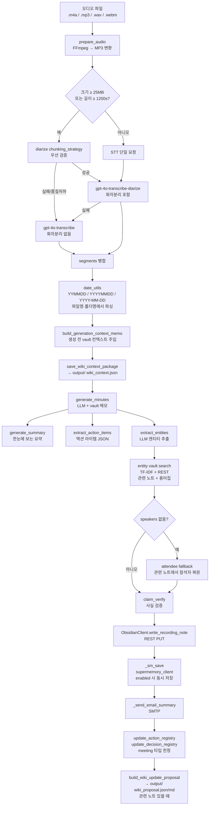
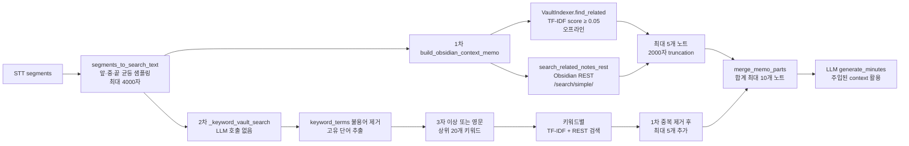
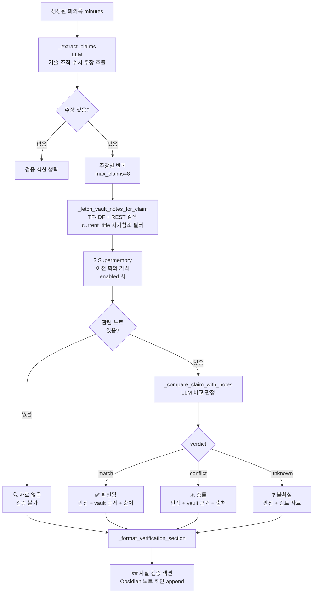
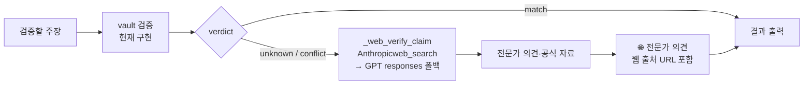
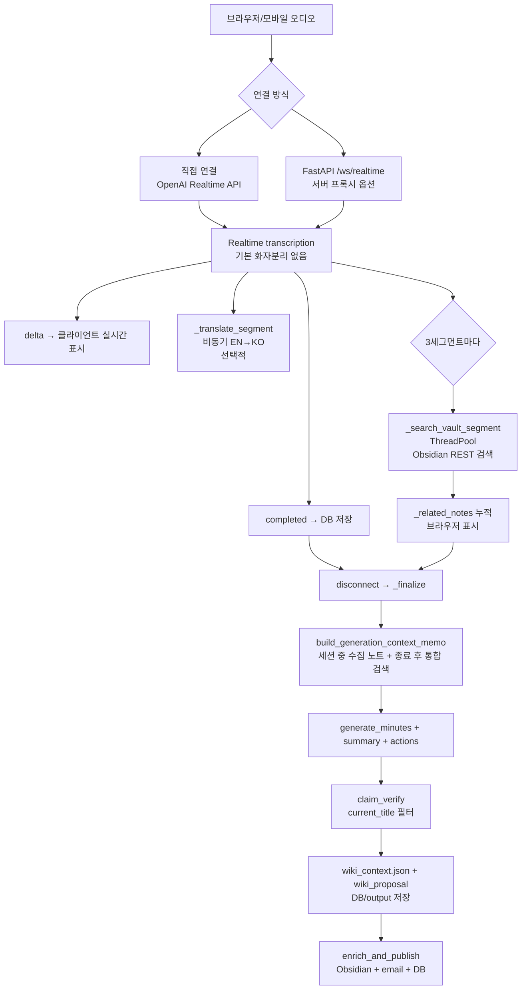
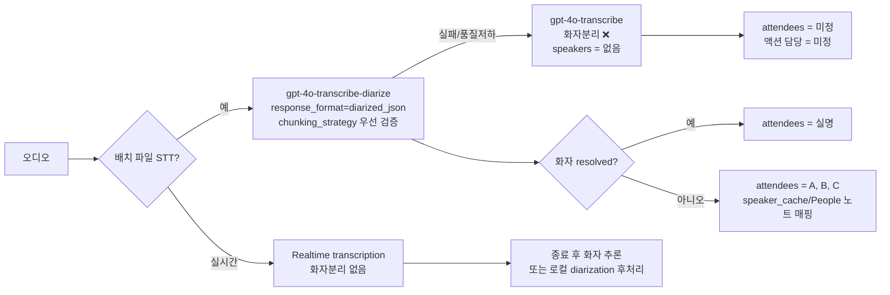
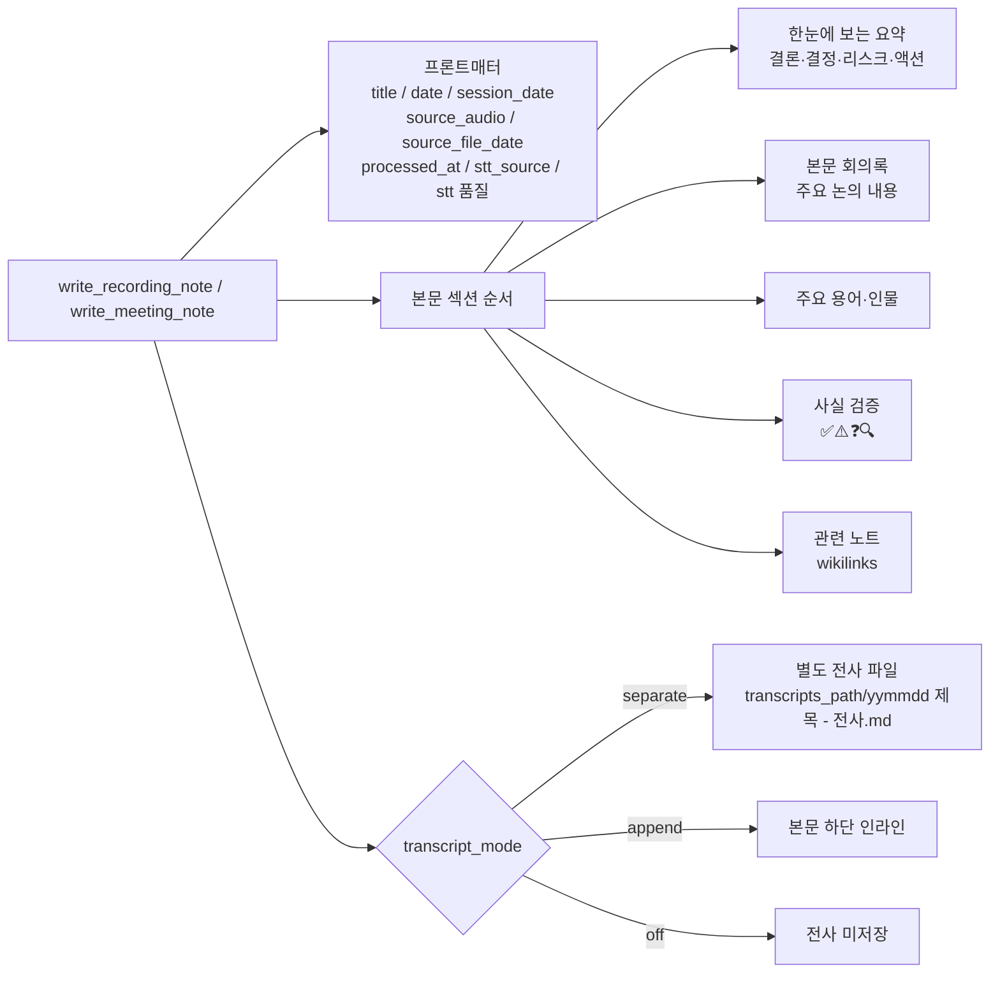
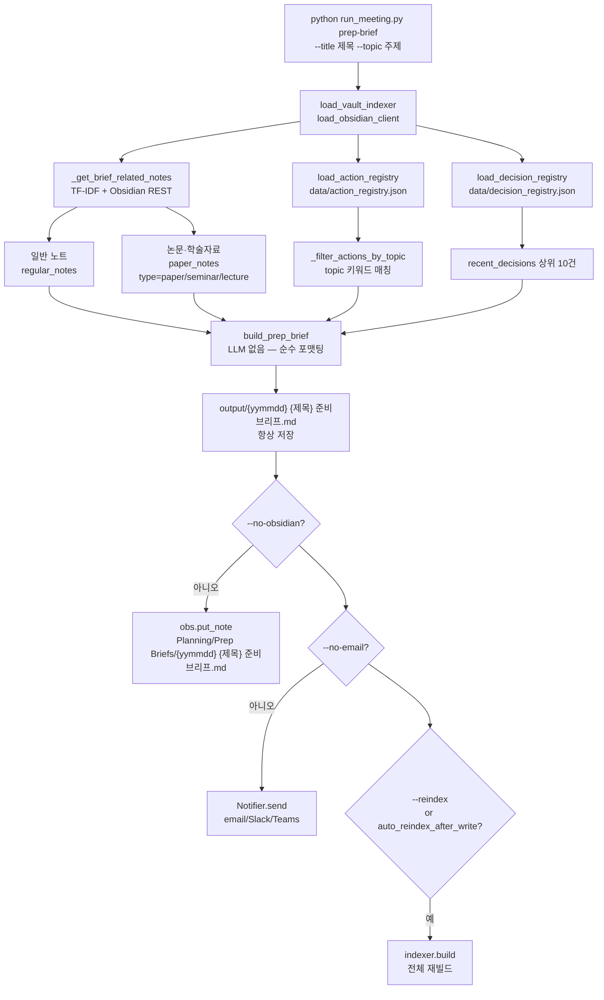

# Meeting Minutes System — Architecture

> 코드 기반 정확한 참조 문서 · 2026-06-29  
> `meeting_minutes_app/` · `web/backend/api/realtime.py` 분석

---

## 진입점 (Entry Points)

네 가지 실행 경로가 있으며, 모두 동일한 핵심 모듈(`meeting_minutes`, `meeting_workflow`)을 공유한다.

| 명령 / 엔드포인트 | 모듈 | 설명 |
|---|---|---|
| `python run_meeting.py ingest <file>` | `ingestion_pipeline.py` | 오디오 파일 → Obsidian 노트 + 이메일 |
| `python run_meeting.py batch <file>` | `meeting_minutes.py` | STT → 회의록 → `output/` 저장 + 설정 시 Obsidian 발행 |
| `WebSocket /ws/realtime` | `web/backend/api/realtime.py` | 서버 프록시형 실시간 전사 옵션 → 스트리밍 전사 → 회의록 |
| `python run_meeting.py vault-audio [args]` | `vault_audio.py` | Obsidian 노트 임베드 오디오 처리 |
| `python run_meeting.py vault-indexer --build` | `vault_indexer.py` | TF-IDF 인덱스 빌드 (오프라인 검색용) |
| `python run_meeting.py prep-brief --title "..."` | `wiki_knowledge.py` | 회의 준비 브리프 생성 — LLM 없이 Vault 검색 + Registry |

> **웹/모바일 프론트엔드 아키텍처 주의**  
> `web/frontend/`는 Capacitor 기반 모바일 앱이다. 브라우저/앱에서 마이크 녹음 시  
> FastAPI의 `/ws/realtime`을 거치지 않고 **OpenAI Realtime API에 직접 연결**한다.  
> (`web/frontend/src/lib/api.ts` — `wss://api.openai.com/v1/realtime` 직접 호출)  
> FastAPI의 `/ws/realtime`은 **서버가 오디오 파이프라인을 제어해야 하는 프록시형 옵션**이다.  
> 장기 보안 목표는 프론트엔드 장기 API Key 저장을 제거하고, FastAPI가 브라우저/모바일용 ephemeral credential을 발급한 뒤 WebRTC로 직접 연결하는 구조다.

---

## 메인 파이프라인 — Ingestion

`ingestion_pipeline.IngestPipeline.ingest()` 실행 시 전체 흐름. 배치, ingest, CLI 실시간, 서버 `/ws/realtime`은 종료 후 동일한 Wiki 품질 루프(컨텍스트 저장, 사실검증, registry/proposal)를 거친다. 단, 프론트 standalone/mobile direct OpenAI 경로는 서버 파이프라인을 우회한다.



### 단계별 함수 참조

| 단계 | 함수 | 모듈 |
|---|---|---|
| 오디오 변환 | `prepare_audio()` · `split_audio()` | `ingestion_pipeline.py` |
| STT | `run_stt()` / `_run_stt_chunk()` | `meeting_minutes.py` |
| 날짜 파싱 | `parse_session_dt_from_path()` · `parse_iso_date_from_text()` | `date_utils.py` |
| 생성 전 vault 주입 | `build_generation_context_memo()` | `meeting_workflow.py` |
| Wiki Context 저장 | `build_wiki_context_package()` · `save_wiki_context_package()` | `wiki_knowledge.py` |
| 회의록 생성 | `generate_minutes()` | `meeting_minutes.py` |
| 요약 생성 | `generate_summary()` | `meeting_minutes.py` |
| 액션 아이템 | `extract_action_items()` | `meeting_minutes.py` |
| 엔티티 추출 | `extract_entities()` | `meeting_minutes.py` |
| 관련 노트 연결 | `enrich_and_link()` | `ingestion_pipeline.py` |
| 사실 검증 | `claim_verify()` | `meeting_workflow.py` |
| Obsidian 저장 | `write_recording_note()` | `obsidian.py` |
| Supermemory 저장 | `_sm_save()` → `SupermemoryClient.save()` | `obsidian.py` → `supermemory_client.py` |
| 이메일 발송 | `send_email_summary()` | `notifier.py` |
| 액션/결정 Registry 갱신 | `update_action_registry_from_actions()` · `update_decision_registry_from_minutes()` | `wiki_knowledge.py` |
| Wiki Update Proposal | `build_wiki_update_proposal()` · `save_wiki_update_proposal()` | `wiki_knowledge.py` |

---

## Vault 검색 2단계 (생성 전)

`build_generation_context_memo()`는 LLM 호출 없이 두 번의 vault 검색으로 생성 전 최대 10개 노트를 주입한다.



**핵심**: 2차 검색은 LLM 추가 호출 없이 `keyword_terms()`(순수 파이썬)만 사용하므로 비용 없이 컨텍스트 2배 확보.

---

## 사실 검증 (Claim Verify) — 상세

회의록에서 기존 vault 지식과 비교 가능한 사실적 주장을 추출해 검증한다. `current_title`로 자기참조를 방지한다.

용어·배경 enrichment는 사실 검증과 별도 단계다. 외부 검색/LLM 리서치가 신뢰 가능한 설명을 주지 못하거나 "죄송합니다/찾을 수 없습니다" 류의 응답을 반환하면, 해당 문장을 그대로 출력하지 않고 `확인 불가: 외부 검색에서 신뢰할 만한 설명을 찾지 못했습니다.`로 정규화한다. 인물 항목은 동명이인 오염을 피하기 위해 정보 없음 응답이면 제외한다.



### 판정 기호 의미

| 기호 | 판정 | 표시 내용 |
|---|---|---|
| ✅ `[확인됨]` | vault 지식과 일치 | 판정 한 문장 + vault 근거 원문 + 출처 노트 |
| ⚠️ `[충돌]` | vault 지식과 충돌 | 무엇이 다른지 + vault 근거 원문 + 출처 노트 |
| ❓ `[불확실]` | vault 검토했으나 불확실 | 왜 불확실한지 + 검토한 노트 목록 |
| 🔍 `[자료 없음]` | 관련 자료 자체 없음 | vault 미검색 (검증 불가) |

### `_extract_claims` 추출 기준

**포함** (vault로 검증 가능):
- 기술/제품의 기능·특성 — 예: "Classiq는 양자회로 자동화 플랫폼"
- 조직·회사 역할·관계 — 예: "메가존은 AWS 파트너"
- 이전 합의/체결 사항 — 예: "NDA를 한빛솔루션와 체결"
- 구체적 수치·규모 — 예: "참가팀 30팀", "예산 1억"

**제외** (vault로 검증 불가):
- 이 회의의 날짜·장소
- 이번 회의 신규 결정사항
- 순수 의견·계획·미래 목표

### 자기참조 방지

`current_title` 파라미터로 현재 생성 중인 노트를 검색 결과에서 제외한다.  
`norm_title()` 정규화(공백·특수문자 제거, 소문자)로 제목 변형도 필터링한다.

### 향후: 웹 전문가 의견 검색

`wiki.claim_web_verify=true` (기본값 false)로 활성화하면, 불확실·충돌 주장에 대해 외부 전문가 의견을 추가 검색한다.



---

## 실시간 파이프라인 (Realtime)

기본 웹/모바일 경로는 `web/frontend/src/lib/api.ts`가 OpenAI Realtime API에 직접 연결한다. 현재 코드는 직접 WebSocket을 사용하지만, 목표 구조는 WebRTC + ephemeral credential이다. `web/backend/api/realtime.py · BrowserRealtimeSession`은 서버 프록시형 옵션이며, 중앙 로깅·회사망 통제·서버 측 오디오 파이프라인이 필요한 경우에 사용한다.



### 배치 vs 실시간 비교

| 항목 | 배치 ingestion | 실시간 WebSocket |
|---|---|---|
| STT | `gpt-4o-transcribe-diarize` 우선 (`/v1/audio/transcriptions`) | Realtime transcription, 기본 화자분리 없음 |
| vault 검색 | 세션 완료 후 2패스 | 세그먼트마다 비동기 + 세션 종료 후 통합 |
| 회의록 생성 | 전체 전사 후 1회 | 세션 종료 후 1회 |
| 사실 검증 | ✅ (current_title 필터) | ✅ CLI/서버 WebSocket, ❌ standalone/mobile direct |
| Wiki Context/Proposal | ✅ | ✅ CLI/서버 WebSocket, ❌ standalone/mobile direct |
| Supermemory 저장 | ✅ `write_recording_note()` 성공 시 | ✅ CLI/서버 WebSocket의 `enrich_and_publish()` 성공 시 |

---

## STT 화자분리 제한 및 개선 계획

### 현재 제한



**핵심 제약**: `gpt-4o-transcribe-diarize`는 `/v1/audio/transcriptions` 배치 전사용이며 Realtime API에서는 지원되지 않는다. 긴 오디오는 `chunking_strategy` 적용 가능성을 먼저 검증하고, 실패·품질 저하·화자 연속성 손실이 확인되면 비화자분리 fallback 또는 로컬 diarization 후처리로 전환한다.

### provider 분리 방향

| provider | 용도 | 화자분리 | 비고 |
|---|---|---|---|
| OpenAI file STT | 배치 파일 전사 | `gpt-4o-transcribe-diarize` | `diarized_json`, `chunking_strategy`, known speaker reference 검토 |
| OpenAI Realtime | 낮은 지연 실시간 전사 | 기본 없음 | 종료 후 화자 추론/후처리로 보강 |
| pyannote/WhisperX | 로컬 후처리 | 가능 | 회사 음성 외부 전송 최소화 |
| Deepgram/AssemblyAI | 외부 managed STT | 가능 | 데이터 거버넌스 확인 필요 |

반복 회의 참석자는 known speaker reference와 `speaker_cache.py`/People 노트 기반 실명 매핑을 함께 검토한다.

### 개선 선택지

#### A. 로컬 오픈소스 — pyannote.audio (+ WhisperX) ★프라이버시 우선

- **장점**: 무료, 오디오가 회사 PC 밖으로 나가지 않음 (회사 회의에 적합)
- **단점**: HuggingFace 토큰 + 모델 라이선스 동의 필요, `torch`·`pyannote.audio` 의존성 (수 GB)
- **연동 방식**: diarization으로 `(시작~끝, 화자)` 구간 추출 → 기존 OpenAI 전사 세그먼트에 타임스탬프로 화자 라벨 부여

#### B. 클라우드 API — Deepgram / AssemblyAI ★도입 난이도 낮음

- **장점**: 오디오 한 번 업로드로 전사+화자 라벨 동시 획득, 코드 최소화
- **단점**: 분당 과금, **회사 회의 음성 외부 전송** → 데이터 거버넌스 확인 필수
- **연동 방식**: STT 자체를 이 API로 교체 (전사+화자 동시 획득)

**권장**: 회사 회의는 **A(로컬 pyannote)** 권장. 빠른 파일럿이 필요하면 허용 범위 내에서 B로 시작 후 A 정착.

---

## 노트 저장 구조 (Obsidian)



### 요약 vs 회의록 역할

| 항목 | 한눈에 보는 요약 | 회의록 본문 |
|---|---|---|
| 목적 | 빠른 판단 (30~60초) | 업무 기록·근거 보관 |
| 포함 | 결론, 결정/합의, 리스크, 액션 | 안건별 상세 논의, 근거와 수치, 미정 사항 |
| 제외 | 상세 발언 흐름, 수치 근거 | (전사는 별도 파일) |

요약과 회의록이 같은 불릿을 반복하면 실패한 출력이다.

---

## Obsidian Markdown Knowledge Graph 운영 모델

본 시스템의 최종 목표는 회의록 자동 생성이 아니라, 회의·세미나·강의에서 발생하는 조직 지식을 Obsidian Markdown 기반 지식 그래프로 축적하고 다음 회의 준비, 실시간 보조, 회의 후 검증, Wiki 업데이트에 재사용하는 것이다.

### 노드 유형

| 노드 유형 | 예시 파일 | 설명 |
|---|---|---|
| Meeting | `회의별/2026/260701 Q3 전략회의.md` | 회의록 |
| Seminar | `세미나/260701 양자컴퓨팅 세미나.md` | 세미나 기록 |
| Transcript | `전사/2026/260701 Q3 전략회의 - 전사.md` | 원문 전사 |
| Person | `People/홍길동.md` | 참석자, 발표자, 담당자 |
| Organization | `Organizations/ABC Corp.md` | 고객사, 파트너, 벤더 |
| Project | `Projects/M365 백업 검토.md` | 프로젝트/업무 주제 |
| Topic | `Topics/양자컴퓨팅.md` | 기술/업무 주제 |
| Decision | `Decisions/260701 백업 솔루션 PoC 결정.md` | 결정사항 |
| Action | `Actions/260701 홍길동 자료조사.md` | 액션 아이템 |
| Reference | `References/논문명.md` | 논문, 기사, 외부 자료 |

### 링크 규칙

- 회의록은 관련 프로젝트, 참석자, 조직, 기술 주제를 wikilink로 연결한다.
- 결정사항과 액션 아이템은 registry와 함께 Markdown 노트 또는 섹션 anchor로 관리한다.
- 세미나 기록은 발표자, 기관, 논문, 기술 주제와 연결한다.
- 자동 생성된 링크는 `## 관련 노트`에 우선 배치하고, 원본 Wiki 수정은 `wiki_proposal.md` 검토 후 수동 반영한다.

권장 meeting frontmatter:

```yaml
---
type: meeting
title: "Q3 전략회의"
date: 2026-07-01
session_date: 2026-07-01
project:
  - "[[M365 백업 솔루션 검토]]"
people:
  - "[[홍길동]]"
organizations:
  - "[[한빛솔루션]]"
topics:
  - "[[M365 백업]]"
decisions:
  - "[[260701 PoC 후보 3개 선정]]"
actions:
  - "[[260701 홍길동 - 벤더별 기술요건 확인]]"
source_audio: "260701_Q3전략회의.m4a"
stt_model: "gpt-4o-transcribe-diarize"
llm_model: "claude"
run_id: "..."
review_status: pending
confidence: medium
source_type: generated
evidence:
  - "[[M365 백업 솔루션 검토#PoC 후보]]"
  - "[[260701 벤더 미팅 메모]]"
---
```

`review_status`/`confidence`/`source_type`/`evidence`는 `write_meeting_note()`/`write_recording_note()`가 매 실행마다 자동 기록하는 **Personal Wiki Schema** 필드다 (`obsidian.py`).
`review_status`는 항상 `pending`으로 시작하며, 사람이 노트를 검토한 뒤 Obsidian에서 직접 `reviewed`로 바꾼다 —
코드가 자동으로 `reviewed`/`curated`로 승격하지 않는다. `evidence`는 회의록 생성에 실제 주입된 근거를
`[[노트#헤딩]]`(섹션 인덱스 히트) 또는 `[[노트]]`(whole-note 히트) 형식으로 기록한 목록이며,
`build_generation_context_memo()`의 `flags["evidence"]`에서 그대로 파생된다.

실시간 중에는 서버 경로 기준으로 발화 → 기존 Obsidian 노드 매칭 → 관련 노트 표시 → 종료 후 `wiki_context.json`/`wiki_proposal` 저장으로 운영한다. 프론트 standalone/mobile direct OpenAI 경로는 로컬 기기 안에서 전사·요약만 수행하므로 Wiki 운영 기록으로 간주하지 않는다. 세미나 후에는 발표자/기관/논문/기술/제품/사례를 추출해 Topic/Reference 노트 업데이트 후보로 남긴다.

---

## QC 프로젝트 볼트 경로 설정

```jsonc
"obsidian": {
  "vault_path":        "D:\\Claude\\QC",
  "meetings_path":     "도메인_아카이브/01_회의_세미나/회의별/{year}",
  "transcripts_path":  "도메인_아카이브/01_회의_세미나/전사/{year}",
  "transcript_mode":   "separate"
},
"indexing": {
  "vault_path": "D:\\Claude\\QC"
}
```

| 저장 위치 | 경로 |
|---|---|
| 회의록 | `D:\Claude\QC\도메인_아카이브\01_회의_세미나\회의별\{year}\yymmdd 제목.md` |
| 전사 | `D:\Claude\QC\도메인_아카이브\01_회의_세미나\전사\{year}\yymmdd 제목 - 전사.md` |
| 로컬 폴백 (Obsidian 꺼짐) | `./output/YYYYMMDD_HHMMSS_제목/recording_note.md` |

**경로 토큰**: `{year}`, `{yyyy}`, `{yy}`, `{month}` — 회의 날짜 기준으로 치환.
파일명 prefix는 회의 날짜 기준 `yymmdd`입니다. `260627_5.m4a`, `20260627_*`, `2026-06-27 14.10_*` 같은 파일명에서 날짜를 추출합니다.

현재 설정 확인:
```bash
python run_meeting.py obsidian --where
```

---

## 모듈 요약

| 모듈 | 역할 | 주요 함수 | 외부 호출 |
|---|---|---|---|
| `meeting_minutes.py` (~2753줄) | STT, LLM 클라이언트, 텍스트 생성 | `LLMClient`, `run_stt()`, `generate_minutes()`, `generate_summary()`, `extract_action_items()`, `translate_segments()` | OpenAI STT, GPT-4o, Claude |
| `date_utils.py` | batch/ingest 공용 날짜 파싱 | `parse_session_dt_from_path()`, `parse_iso_date_from_text()`, `iso_to_yymmdd()` | 표준 라이브러리 |
| `meeting_workflow.py` | 공유 워크플로우 (vault 검색, claim verify) | `build_generation_context_memo()`, `_keyword_vault_search()`, `claim_verify()`, `_extract_claims()`, `_fetch_vault_notes_for_claim()` | VaultIndexer, Obsidian REST, LLM |
| `ingestion_pipeline.py` | 오디오→Obsidian 자동화 파이프라인 | `IngestPipeline.ingest()`, `_detect_type()`, `_detect_meeting_scope()`, `_build_transcript_md()` | 위 모든 모듈 |
| `wiki_knowledge.py` | Wiki 지식 순환 — 준비 브리프 + Registry + Context Package | `build_prep_brief()`, `load_action_registry()`, `load_decision_registry()`, `build_wiki_update_proposal()`, `build_wiki_context_package()`, `save_wiki_context_package()` | VaultIndexer, Obsidian REST (LLM 호출 없음) |
| `vault_indexer.py` (~400줄) | TF-IDF 오프라인 인덱서 | `VaultIndexer.build()` (한국어 바이그램+영어), `.load()` (7일 초과 경고), `.search()`, `.find_related()`, `.get_note_content()` | 파일시스템만 |
| `obsidian.py` (~1213줄) | Obsidian REST API 클라이언트 | `ping()`, `ensure_running()`, `search_simple()`, `get_note()`, `put_note()`, `write_recording_note()`, `write_meeting_note()`, `update_planned_note()`, `find_planned_note()`, `create_reference_note()` | https://127.0.0.1:27124 |
| `supermemory_client.py` | Supermemory SDK 래퍼 — 크로스세션 팩트 메모리 | `SupermemoryClient.save()`, `.search()`, `get_client()` | Supermemory API 또는 로컬 서버 |
| `enrichment.py` (~200줄) | 엔티티 추출 + 참고 노트 생성 | `enrich()` | LLM (웹리서치 선택적) |
| `notifier.py` (~521줄) | 이메일/Slack/Teams 알림 | `_build_html_body()`, `_send_email()`, `_send_email_summary()` | SMTP, Webhooks |
| `vault_audio.py` (~302줄) | 임베드 오디오 처리 | `process_vault()`, `merge_into_note_file()` | meeting_minutes 재사용 |
| `web/backend/api/realtime.py` (~830줄) | WebSocket 실시간 전사 | `BrowserRealtimeSession`, `_handle_event()`, `_search_vault_segment()`, `_finalize()` | OpenAI Realtime API |

---

## Wiki 지식 순환 (prep-brief)

`wiki_knowledge.py`는 회의 **전** 준비 브리프를 LLM 없이 생성하는 독립 모듈이다. 기존 파이프라인에 영향을 주지 않는다.



### Registry 파일

| 파일 | 설명 | git |
|---|---|---|
| `data/action_registry.json` | 오픈 액션 목록 (수동 편집) | ❌ gitignored |
| `data/decision_registry.json` | 결정 사항 누적 (수동 편집) | ❌ gitignored |
| `output/{yymmdd} {제목} wiki_proposal.json/.md` | Wiki 업데이트 후보 (자동 생성, 수동 검토) | output/ 저장, git 미포함 |

첫 실행 시 빈 구조(`{"version":"1.0","actions":[]}`)로 자동 생성. `_atomic_write_json()`으로 원자적 기록.

#### wiki_proposal.json v2

`claim_verify()`가 반환하는 구조화 결과(`claim_results`)가 `build_wiki_update_proposal()`에 전달되면,
기존 `proposals`(관련 노트별 추가 초안) 외에 새 LLM 호출 없이 3개 배열이 함께 생성된다:

| 필드 | 내용 | 파생 조건 |
|---|---|---|
| `new_questions` | `{"text","source_meeting","status":"open"}` | `verdict == "unknown"` |
| `new_claims` | `{"claim","verdict","evidence_notes","status":"unverified"}` | `verdict in ("unknown","conflict")` |
| `conflicts` | `{"claim","existing_note","existing_excerpt","note"}` | `verdict == "conflict"` |

`.md`에는 값이 있을 때만 `## 새 질문 후보` / `## 검증 필요 주장` / `## 충돌 항목` 섹션이 추가된다.
사람이 검토 후 Wiki에 질문 노트·검증 대기 목록으로 직접 반영한다 — 자동 반영 없음.

### 인덱스 갱신 이슈

`obs.put_note()` 후 `data/vault_index.json`은 자동 갱신되지 않는다 (기존 제한). 대응:
- `config.indexing.auto_reindex_after_write=true` 시 저장 후 자동 재빌드
- 기본값 `false` — 매번 수 초 재빌드 비용 방지. `python run_meeting.py reindex` 수동 실행 권장

---

## Ask My Wiki (wiki_ask.py)

```bash
python run_meeting.py wiki-ask --question "M365 백업 검토 현황 알려줘" --show-sources
```

`section_index_enabled=true`이면 `WikiQA._gather_context()`가 whole-note 검색 전에
`find_related_sections()`로 heading 단위 근거를 먼저 수집하고(동일 노트는 섹션 히트를 우선),
LLM은 다음 고정 답변 구조를 반드시 따르도록 강제된다:

```md
## 요약 답변
## 상세 답변          (기존 [출처: [[노트#헤딩]]] 인용 규칙 유지)
## 근거               (실제 사용한 [[노트#헤딩]] / [[노트]] 목록)
## 확실한 내용
## 불확실한 내용
## 다음 액션 또는 업데이트 후보
```

`ask()`가 반환하는 dict의 top-level 키(`answer`/`sources`/`has_conflict`/`unverified`)는 이전과
동일하다 — `sources`의 각 항목에 `heading`(nullable)만 추가됐다.

---

## 외부 API 연결

| API | 용도 | 호출 모듈 | 비고 |
|---|---|---|---|
| OpenAI Realtime API | 낮은 지연 실시간 전사 | `realtime_transcription.py` · `web/backend/api/realtime.py` · `web/frontend/src/lib/api.ts` | Realtime은 기본 화자분리 없음. 브라우저/모바일은 직접 연결, 서버 수신 오디오는 WebSocket 프록시 옵션 |
| OpenAI Chat API | 회의록·요약·액션·사실검증 | `LLMClient._gpt()` | gpt-4o 기본, 폴백 역할 |
| Anthropic API | 회의록·요약 생성 (기본 LLM) | `LLMClient._claude()` | claude-opus-4-6, web_search tool 지원 |
| Obsidian REST API | 노트 읽기/쓰기/검색 | `obsidian.ObsidianClient` | https://127.0.0.1:27124 Bearer token |
| Supermemory API | 크로스세션 팩트 메모리 저장·검색 | `supermemory_client.SupermemoryClient` | 클라우드 또는 `npx supermemory local` (MIT, 로컬) |
| SMTP | 회의록 이메일 발송 | `notifier.Notifier` | Gmail/Naver/Outlook 자동 인식 |
| FFmpeg (subprocess) | 오디오 변환·청크 분할 | `meeting_minutes.prepare_audio()` | MP3 변환, 25MB/1200s 청크 제한 |

---

## 주요 config.json 설정

| 키 | 기본값 | 설명 |
|---|---|---|
| `models.llm` | `"claude"` | LLM 선호 (claude / gpt) |
| `models.stt` | `"gpt-4o-transcribe-diarize"` | 배치 파일 STT 모델. diarize는 `/v1/audio/transcriptions` 전용이며 Realtime 미지원 |
| `obsidian.enabled` | `false` | Obsidian REST 연동 활성화 |
| `obsidian.meetings_path` | `""` | 회의록 저장 경로 (`{year}` 등 토큰 지원) |
| `obsidian.exe_path` | `""` | Obsidian.exe 경로 (자동 실행용) |
| `obsidian.transcript_mode` | `"separate"` | 전사 저장 방식 (separate / append / off) |
| `indexing.enabled` | `true` | TF-IDF 오프라인 인덱스 사용 |
| `indexing.index_path` | `"data/vault_index.json"` | 인덱스 파일 위치 |
| `wiki.enabled` | `true` | 생성 전 vault 컨텍스트 주입 |
| `wiki.vault_enrich` | `true` | 생성 후 엔티티 기반 관련 노트 추가 |
| `wiki.claim_verify` | `true` | 사실 검증 활성화 |
| `wiki.claim_verify_max` | `8` | 최대 검증 주장 수 (비용 제한용) |
| `wiki.context_max_chars` | `2000` | 노트당 주입 최대 글자 수 |
| `wiki.online_search_enabled` | `false` | 웹 리서치 (Anthropic web_search tool) |
| `wiki.claim_web_verify` | `false` | 불확실·충돌 주장에 웹 전문가 의견 검색 (API 비용 발생) |
| `wiki_knowledge.enabled` | `true` | Wiki 지식 순환 전체 활성화 (registry/context package/proposal/prep-brief 일괄 게이트) |
| `wiki_knowledge.update_proposals_enabled` | `true` | meeting 처리 후 wiki_update_proposals 생성 |
| `wiki_knowledge.action_registry_enabled` | `true` | 회의 후 action_registry.json 누적 |
| `wiki_knowledge.decision_registry_enabled` | `true` | 회의 후 decision_registry.json 누적 |
| `wiki_knowledge.registry_context_max_chars` | `2000` | 생성 프롬프트에 주입되는 이전 결정/미완료 액션 섹션 글자 제한 |
| `wiki_knowledge.embedding_enabled` | `false` | 임베딩 하이브리드 검색 (TF-IDF + 코사인 RRF 융합). 실패 시 TF-IDF 폴백 |
| `wiki_knowledge.embedding_model` | `"text-embedding-3-small"` | 임베딩 모델 (OpenAI) |
| `wiki_knowledge.embedding_dims` | `256` | 임베딩 차원 축소 (인덱스 크기/속도 절충) |
| `wiki_knowledge.embedding_min_cosine` | `0.25` | 의미 검색 인정 최소 코사인 유사도 |
| `wiki_knowledge.section_index_enabled` | `true` | 섹션(heading) 단위 인덱싱. claim_verify/context memo/wiki_ask가 whole-note 대신 관련 섹션을 근거로 우선 사용. 변경 후 `reindex` 필요 |
| `wiki_knowledge.proposal_llm_enabled` | `false` | LLM 기반 proposal 초안 생성 (향후 확장 후보) |
| `wiki_knowledge.auto_apply_updates` | `false` | **항상 false — Obsidian 원본 자동 수정 금지** |
| `supermemory.enabled` | `false` | Supermemory 팩트 메모리 활성화 — Obsidian 저장 시 동시 저장, 다음 회의 컨텍스트·사실 검증 시 자동 참조 |
| `supermemory.api_key` | `""` | Supermemory API 키 (클라우드) 또는 로컬 서버는 빈 값 허용 |
| `supermemory.base_url` | `"https://api.supermemory.ai"` | 자체 호스팅 시 `http://localhost:6767` |
| `notify.on_finish` | `"email"` | 완료 후 알림 채널 |
| `email.markdown_attachment` | `"txt"` | 첨부 형식 (txt=UTF-8 BOM 변환 / markdown=원본) |

---

## 신뢰성·추적성 (RunContext)

LLM/STT/API/Vault 검색 단계가 여러 번 이어지므로, 결과가 틀렸을 때 어느 단계에서 틀렸는지 재현할 수 있어야 한다. 모든 실행 단위는 `RunContext`를 갖고 `wiki_context.json`, `*_meta.json`, Obsidian frontmatter에 같은 `run_id`를 남긴다.

```text
RunContext:
  run_id
  source_audio_hash
  source_file_path
  session_date
  stt_provider
  stt_model
  llm_provider
  minutes_model
  prompt_version
  vault_index_version
  retrieved_note_ids
  generated_claim_ids
  cost_estimate
  created_at
```

`run_id`는 회의록 품질 이슈, 비용 이슈, claim 검증 오류, Wiki proposal 오염 가능성을 사후 추적하는 기준 키다.

---

## Structured Outputs 적용 대상

회의록 본문은 자연어를 유지한다. 단, 시스템이 재사용하는 데이터는 자유 텍스트나 느슨한 JSON이 아니라 schema 기반 Structured Outputs로 전환한다.

| 대상 함수 | 현재 위험 | 개선 방향 |
|---|---|---|
| `extract_action_items()` | 담당자/기한 파싱 실패, registry 오염 가능 | `ActionItem[]` schema |
| `extract_entities()` | 인물/회사/용어 혼동, 동명이인·약어 처리 불안정 | `EntityMention[]` schema |
| `_extract_claims()` | 검증 불가능한 주장 섞임 | `Claim[]` schema |
| `_compare_claim_with_notes()` | verdict 파싱 불안정 | `ClaimVerdict` schema |
| `build_wiki_update_proposal()` | 원본 Wiki 오염 위험 | `WikiProposal` schema + diff |

권장 최소 schema:

```text
ActionItem:
  id
  task
  owner
  due_date
  status
  source_quote
  confidence

EntityMention:
  raw_text
  normalized_name
  entity_type
  source_quote
  confidence

Claim:
  text
  claim_type
  verifiable
  source_quote
  related_entities
  confidence

ClaimVerdict:
  claim_id
  verdict
  confidence
  evidence_spans
  reasoning_summary

WikiProposal:
  proposal_id
  target_note
  change_type
  proposed_diff
  source_claim_ids
  evidence_ids
  risk_level
  review_status
```

`ActionItem.id`, `proposal_id`, `evidence_id`처럼 추적 키는 LLM이 생성하지 않고 후처리에서 `run_id + index/hash`로 생성한다.

---

## Vault Retrieval 고도화 계획

과거에는 2패스 Vault 검색이 노트 단위로만 동작해, 긴 노트에서 일부 섹션만 관련 있어도 전체 노트가
주입되고 관련 근거가 긴 컨텍스트 중간에 묻히는 한계가 있었다. **1단계(섹션 단위 인덱스)는 구현
완료됐다** — 아래는 현재 배관과 남은 단계다.

### 1단계: `section_index_enabled` (구현 완료)

`vault_indexer.py`가 `## heading` 단위로 노트를 분리해 섹션별 TF-IDF 인덱스를 저장하고
(`search_sections()`, `find_related_sections()`), `get_section_content(rel_path, heading)`로
스니펫이 아닌 전체 섹션 본문을 다시 읽어온다. 다음 세 곳이 이 인덱스를 소비한다:

- `meeting_workflow.claim_verify()` (`_fetch_vault_notes_for_claim()`) — 섹션 히트를 whole-note보다
  우선하고, 인용 형식을 `[[노트#헤딩]]`으로 통일.
- `meeting_workflow.build_generation_context_memo()` (`build_obsidian_context_memo()`) — 회의록
  생성 memo에 섹션 발췌를 추가 주입하고, 실제 사용된 근거를 `flags["evidence"]`로 반환.
- `wiki_ask.WikiQA._gather_context()` — Ask My Wiki 답변의 `## 근거`에 heading 단위 인용 제공.

Obsidian REST API는 heading/block 단위 읽기를 지원하지 않으므로, 섹션 본문은 항상
`indexing.vault_path` 로컬 파일에서 다시 읽는다 — REST 전용(파일시스템 접근 없음) 환경에서는
whole-note 경로로 자연 폴백한다.

```text
SectionIndex (data/vault_index.json, notes[rel]["sections"]):
  level, heading, snippet(200자), tf(top 50 TF-IDF)
  # 전체 본문은 저장하지 않음 — get_section_content()가 쿼리 시점에 파일에서 재분리
```

### 2단계: Hybrid Retrieval (구현 완료 — 노트 단위)

`vault_indexer.py`에 임베딩 하이브리드 검색이 구현됐다 (`wiki_knowledge.embedding_enabled`):

- **임베딩 인덱스**: `data/vault_index.emb.json` (기존 `vault_index.json`과 별도 파일, 포맷 비침습).
  OpenAI `text-embedding-3-small`, `dimensions=256`으로 축소해 543노트 기준 ~1.2MB.
  콘텐츠 SHA1 해시 캐시로 **증분 빌드** — reindex 시 변경된 노트만 재임베딩.
  빌드: `build()`가 자동 수행, 또는 `python vault_indexer.py --embed`.
- **RRF 융합**: `search()`가 TF-IDF 랭킹과 임베딩 코사인 랭킹(후보 limit×3)을
  Reciprocal Rank Fusion(`_rrf_fuse`, k=60)으로 융합. 결과의 `score`는 하위호환을 위해
  TF-IDF 점수 유지, `cosine`/`rrf` 필드 추가. `embedding_min_cosine`(기본 0.25) 미만은 컷.
- **안정성 폴백**: API 키 없음·네트워크 실패·인덱스 모델 불일치 시 자동으로 TF-IDF 단독 동작
  (기존 동작과 동일). 임베딩 빌드 실패는 TF-IDF 인덱스에 영향 없음.
- `find_related()`는 TF-IDF `min_score` 미달이라도 임베딩 히트는 유지 — 키워드가 겹치지
  않는 의미적 관련 노트 회수용. `_fetch_vault_notes_for_claim()`의 whole-note 경로도 동일.

남은 단계: 섹션 단위 임베딩, Reranker(상위 20 → 최종 5~8). Vault 규모가 커지면
FAISS/SQLite-vec → Qdrant, pgvector 순으로 검토.

### 3단계: Evidence Pack

```text
EvidenceSpan:
  evidence_id
  source_note
  heading
  exact_excerpt
  relevance_reason
```

회의록 생성 prompt에는 긴 노트 전체보다 짧고 명확한 evidence span을 앞쪽 또는 별도 Evidence Table로 제공한다. `wiki_context.json`, claim verify, Wiki proposal은 같은 `evidence_id`를 공유한다.

---

## Wiki Knowledge Graph (구현 완료)

경량 내장형으로 구현됐다 — 별도 Graph DB 서비스 없이 `meeting_minutes_app/wiki_core/graph_db.py`가
전용 SQLite 파일(`data/wiki_graph.db`, `web/meeting_assistant.db`와 별개)에 노드/엣지 테이블로
저장한다. `wiki_core` 패키지 소속이라 `web/backend` 없이도(CLI만으로도) 동작한다.

노드 유형: `meeting`, `person`, `organization`, `topic`, `decision`, `action`, `note`
(`nodes.type` 컬럼 하나로 구분 — 노드 타입별 테이블 분리 없음).

관계(엣지) 유형:

```text
Meeting -[:MENTIONED]-> Entity        (Obsidian frontmatter people/organizations/topics 백필)
Meeting -[:DECIDED]-> Decision
Meeting -[:CREATED]-> Action
Action -[:ASSIGNED_TO]-> Person
Decision -[:AFFECTS]-> Topic
Action -[:AFFECTS]-> Topic
Meeting -[:USED_CONTEXT]-> Note
```

**채우기**:
- `scripts/graph_backfill.py [--dry-run]` — `data/action_registry.json`/`decision_registry.json` +
  Obsidian vault frontmatter를 1회성으로 그래프에 반영.
- 세션 종료 시 실시간 반영 — `web/backend/api/realtime.py::_finalize()`, `api/batch.py`의
  후처리 지점에서 `wiki_core.graph_sync.sync_session_graph()` 호출 (registry JSON 갱신과 별개 로직,
  실패해도 세션 완료에 영향 없음).

**엔티티 정규화 (`graph_sync.resolve_canonical_key()`)**: `wiki_knowledge._norm_key()` 기반
정확 일치에 가벼운 규칙 기반 보정을 얹었다 — 구분자 통일(`_` vs 공백, 예: "260627_5"/"260627 5")과
person 노드의 흔한 직함/존칭 접미사 제거("홍길동 팀장" vs "홍길동")를 지원한다. 세 채널
(registry 백필/vault 백필/세션 실시간 동기화)이 모두 이 함수를 거치므로 어느 경로로 만들어졌든
같은 사람·회의는 하나의 노드로 합쳐진다. 동명이인 구분, 오탈자 교정, LLM 기반 병합은 여전히
범위 밖이다(향후 과제).

**조회 API** (읽기 전용, `web/backend/api/graph.py`): `GET /api/graph/nodes`,
`/api/graph/nodes/{id}`, `/api/graph/nodes/{id}/neighbors`, `/api/graph/edges`, `/api/graph/path`,
`/api/graph/sessions/{session_id}`. 쓰기 엔드포인트 없음 — 그래프 데이터는 `graph_sync.py`를 통해서만
갱신되며, Obsidian 노트나 registry JSON 원본은 절대 수정하지 않는다.

프론트엔드는 `SessionDetail.tsx`의 새 "Graph" 탭에서 세션이 만든 노드/엣지를 타입별로 묶어 보여주고,
칩을 클릭하면 `neighbors` API로 1-hop 확장한다(별도 그래프 시각화 라이브러리 없음).

목표 질의(지난 회의 이후 바뀐 결정사항, 프로젝트별 미완료 액션, 특정 업체가 언급된 모든 회의)는
`get_neighbors()`/`find_path()`를 조합해 애플리케이션 레벨에서 구성한다.

**검색 품질 연동 (`graph_expand_titles()`, 옵트인)**: `wiki_knowledge.graph_retrieval_expand_enabled`
(기본 false)를 켜면 `meeting_workflow.build_generation_context_memo()`가 TF-IDF/RRF로 찾은 관련
노트를 그래프로 1-hop 확장해 연결된 person/organization/topic 라벨을 추가로 끌어온다 — 대부분
People/Organizations/Topics 폴더의 실제 노트 제목과 일치하므로 `build_related_notes_memo()`가
그대로 본문을 찾아 주입한다. 그래프 DB가 비어 있거나(백필 전) 조회 실패해도 예외를 삼키고 빈
목록을 반환하므로 기존 TF-IDF/RRF 파이프라인 동작에는 영향이 없다. 켜기 전에
`python scripts/graph_backfill.py`로 그래프를 먼저 채워야 실제로 확장될 노트가 있다.

---

## 평가 자동화

`evals/fixtures`에 샘플 회의 5~10개와 golden transcript/actions/claims/evidence를 쌓고, 회의록 품질을 회귀 테스트한다.

| 평가 항목 | 측정 방법 |
|---|---|
| STT 품질 | WER/CER, 고유명사 오류율 |
| 화자분리 | DER, speaker confusion rate |
| 액션 추출 | precision / recall / due date accuracy |
| 결정사항 추출 | 결정 누락률, 잘못된 결정 생성률 |
| 사실 검증 | claim support rate, conflict detection accuracy |
| Vault 검색 | context precision@k, evidence recall@k |
| 회의록 품질 | 요약-본문 중복률, 미정사항 보존률, hallucinated decision rate |

RAGAS의 faithfulness 개념은 회의록 claim이 retrieved evidence로 뒷받침되는지 평가하는 방식으로 적용한다.

---

## 보안 거버넌스

- 프론트엔드에 장기 OpenAI API Key 저장 금지
- 브라우저/모바일은 ephemeral credential 사용
- Vault 노트 내용을 외부 LLM에 보낼 때 민감정보 redaction 옵션 제공
- 외부 웹 검증 결과와 Vault 원본 근거를 명확히 분리
- `wiki_knowledge.auto_apply_updates=false` 유지
- proposal apply 시 diff 확인 필수
- 이메일/Slack/Teams 발송 전 민감정보 필터 옵션 제공
- 모든 외부 전송 로그/audit trail 저장

---

## 패키징/배포

`pyproject.toml`(repo root)로 pip 설치 가능한 패키지다 — `meeting_minutes_app`(common/wiki_core/
meeting_pipeline 서브패키지 포함)과 `web`을 하나의 배포판으로 묶고, `[project.scripts]`로
`meeting-minutes` 콘솔 커맨드(`meeting_minutes_app.cli:main`)를 등록한다.
`[tool.setuptools.packages.find]`가 자동 탐색하므로 새 모듈(예: `graph_db.py`)을 추가해도
pyproject.toml을 고칠 필요가 없다.

`run_meeting.py`(repo root)는 `meeting_minutes_app/cli.py`로 위임하는 얇은 하위호환 shim이다 —
기존 `.bat` 런처·문서가 `python run_meeting.py ...`를 그대로 계속 쓸 수 있게 유지한다.
`meeting-minutes init`(`meeting_minutes_app/cli_init.py`)이 새 팀의 최초 설정(Obsidian/API 키
입력 + 연결 확인)을 처리한다.

PyInstaller `.exe` 배포(`scripts/build/build_exe.spec`)는 비개발자용 1차 배포 채널로 유지된다.
새 팀 설치 절차 전체(배포 채널 선택, Obsidian 플러그인 설정, 격리 확인, 첫 실행 체크리스트,
업데이트 방법)는 [`docs/SETUP_NEW_TEAM.md`](SETUP_NEW_TEAM.md)에 있다.

---

## 향후 확장 후보 (현재 미구현)

이번 MVP에서 구조적으로 확장 가능하도록 남겨두었으나 실제 구현은 하지 않은 기능 목록.

| 기능 | config 키 | 이유 |
|---|---|---|
| LLM 기반 proposal 초안 생성 | `wiki_knowledge.proposal_llm_enabled` | 규칙 기반 추출로 MVP 충분, 비용 절감 |
| Vector DB (FAISS/Qdrant 등) | — | 노트 단위 임베딩 하이브리드 검색은 구현 완료(`wiki_knowledge.embedding_enabled`, RRF 융합) — Vault 규모 증가 시 전용 저장소 검토 |
| 섹션 단위 임베딩 + Reranker | — | 현재는 노트 단위 임베딩 + 섹션 단위 TF-IDF 조합 |
| Graph DB / GraphRAG | `wiki_knowledge.graph_enabled` | 구현 완료 (경량 SQLite, `wiki_core/graph_db.py`) — "Wiki Knowledge Graph" 절 참고 |
| Review Queue / Obsidian Bases 자동 생성 | — | `review_status`/`wiki_proposal.json v2`가 먼저 안정화된 뒤 도입 |
| 엔티티 정규화 (Entity Resolver) 고도화 | — | 구분자·직함 접미사 정규화는 구현 완료(`graph_sync.resolve_canonical_key()`) — 동명이인 구분, 오탈자·약어 교정, LLM 기반 병합은 여전히 미구현 |
| 자동 Wiki 반영 (auto_apply_updates) | `wiki_knowledge.auto_apply_updates=false` | 회의 발언이 원본을 오염시킬 위험 |
| 웹 전문가 검증 (proposal 단위) | — | 외부 API 비용 증가 |
| 로컬 diarization 고도화 (pyannote 등) | — | 설치/운영 부담 별도 과제 |

> 섹션 단위 Vault 검색(`search_sections()`)은 구현 완료됐다 — "Vault Retrieval 고도화 계획" 참고.
